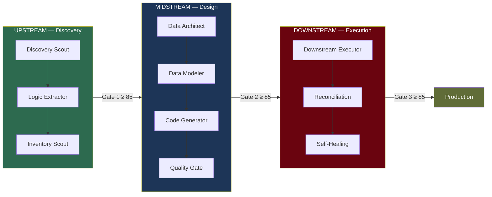
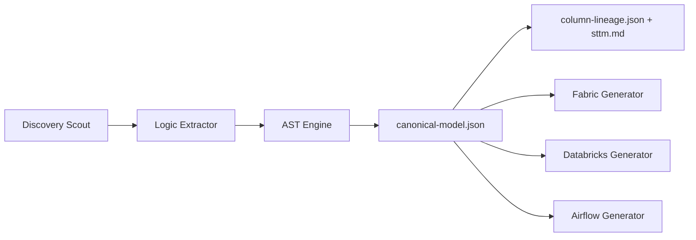
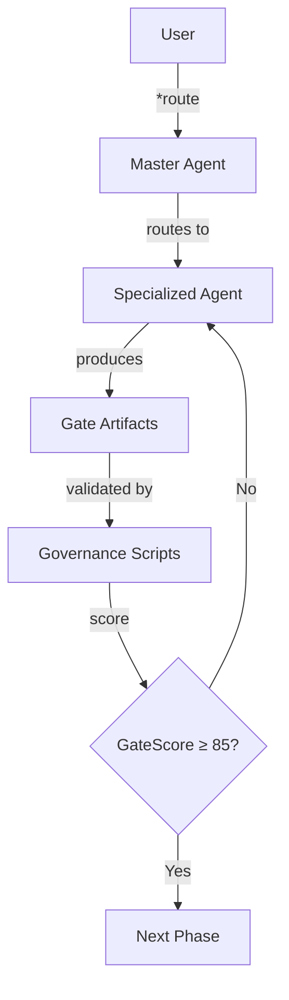

# Data Migration Factory

> **Platform-agnostic, multi-agent migration factory** — 21 specialized AI agents (20 active + 1 deprecated), three quality gates, 23 governance scripts, and an AST Engine (`src/shared/pipeline_ast/`) for deterministic multi-platform generation. Orchestrates the full lifecycle of data platform migrations from legacy discovery to production reconciliation.

---

## Table of Contents

- [Overview](#overview)
- [Key Features](#key-features)
- [Tech Stack](#tech-stack)
- [Architecture](#architecture)
  - [Three-Phase Lifecycle](#three-phase-lifecycle)
  - [AST-Enhanced Flow](#ast-enhanced-flow)
  - [Agent System](#agent-system)
  - [Gate Model](#gate-model)
  - [Directory Structure](#directory-structure)
- [Prerequisites](#prerequisites)
- [Getting Started](#getting-started)
  - [1. Clone the Repository](#1-clone-the-repository)
  - [2. Create Virtual Environment](#2-create-virtual-environment)
  - [3. Install Dependencies](#3-install-dependencies)
  - [4. Run Tests](#4-run-tests)
  - [5. Open Agents in VS Code](#5-open-agents-in-vs-code)
  - [Troubleshooting](#troubleshooting)
- [Using the Agents](#using-the-agents)
  - [Agent Map](#agent-map)
  - [Agent Quick Start](#agent-quick-start)
  - [Skills System](#skills-system)
- [Wave Configuration](#wave-configuration)
- [Governance Scripts](#governance-scripts)
- [Supported Migration Patterns](#supported-migration-patterns)
- [Data Contracts](#data-contracts)
- [Reconciliation Modes](#reconciliation-modes)
- [CI/CD Pipeline](#cicd-pipeline)
- [Key Documents](#key-documents)
- [Contributing](#contributing)
- [Status](#status)
- [Known Limitations](#known-limitations)
- [Future Improvements](#future-improvements)

---

## Overview

The Data Migration Factory is an **agentic framework** that breaks data platform migrations into three sequential phases — each driven by specialized GitHub Copilot Chat agents and validated by mandatory quality gates with measurable scores.



The human operator manually switches between agents and triggers the next phase. This is intentional — it keeps the system auditable and human-in-the-loop during wave pilots.

---

## Key Features

- **21 chatmode agents (20 active + 1 deprecated)** — each with a defined persona, commands, tools, and artifact ownership
- **Three quality gates** — GateScore formula with 4 weighted dimensions; ≥ 85 to promote
- **23 governance scripts** — production Python modules covering gates, KPIs, reconciliation, policy, and data contracts
- **283 automated tests** — full pytest coverage, all green
- **AST Engine module** — canonical model + SQL/SSIS parsers + lineage + generators (Fabric/Databricks/Airflow)
- **91 AST tests** — 89 passing + 2 conditional skips (when `sqlglot` is not installed)
- **26 domain skills** — knowledge packs loaded on demand by agents (agent-governance, data-quality-frameworks, sql-optimization-patterns, etc.)
- **Token optimization** — optional Headroom AI integration reduces LLM token consumption by 30–60% on large artifacts via context compression
- **7-job CI pipeline** — tests, linting (Ruff), security (Bandit), agent contracts, chatmode alignment, gate validation, policy schema
- **Platform agnostic** — no hardcoded target platform; supports Databricks, Fabric, Snowflake, or any target
- **Declarative data contracts** — YAML-based quality expectations per entity with schema validation and metric evaluation
- **Policy-as-code** — governance policies enforce tool restrictions and composition with most-restrictive-wins semantics
- **Wave-based execution** — each migration wave has its own YAML config, entity scope, approvers, and gate thresholds

---

## Tech Stack

| Layer | Technology |
| --- | --- |
| Language | Python 3.13+ |
| Agent Runtime | GitHub Copilot Chat (VS Code `.chatmode.md`) |
| Testing | pytest |
| Linting | Ruff |
| Security Scanning | Bandit |
| CI/CD | GitHub Actions (7 jobs) |
| Config Format | YAML (wave configs, data contracts, policies) |
| Token Optimization | Headroom AI (optional — 30–60% LLM token savings) |
| Dependencies | `pytest`, `pyyaml` (core); `sqlglot` (optional for SQL AST); `headroom-ai` (optional) |

---

## Architecture

### Three-Phase Lifecycle

Every migration wave flows through three sequential phases. Promotion between phases requires passing a quality gate.

| Phase | Name | Purpose | Key Agents | Gate |
| --- | --- | --- | --- | --- |
| **UPSTREAM** | Discovery | Map legacy systems, extract business logic, build STTM | Discovery Scout, Logic Extractor, Inventory Scout | Gate 1 |
| **MIDSTREAM** | Design | Define target architecture, data model, generate code | Data Architect, Data Modeler, Code Generator, Quality Gate | Gate 2 |
| **DOWNSTREAM** | Execution | Deploy artifacts, run migration, reconcile data | Downstream Executor, Reconciliation, Self-Healing | Gate 3 |

### AST-Enhanced Flow

The factory now supports a deterministic AST-centered path between extraction and generation:



AST capabilities implemented in `src/shared/pipeline_ast/`:

- Canonical model (`MigrationPipeline`, `MigrationTable`, `MigrationTransformation`, ...)
- SQL AST parser (with `sqlglot` primary parser + regex fallback)
- SSIS `.dtsx` structured parser
- Column lineage engine (JSON + STTM markdown)
- Multi-platform generators (Fabric, Databricks, Airflow)

Cross-cutting agents operate across all phases:

| Agent | Role |
| --- | --- |
| Migration Coordinator (Orion) | Wave orchestration, gate validation, status tracking |
| Data Steward (Gaia) | Governance, data catalog, quality standards |
| Security Compliance (Shield) | PII detection, compliance checks |
| Documentation (Scribe) | Runbooks, reports, changelogs |
| Master Agent | Entry point, routing to the correct agent |

### Agent System

Each agent is a `.chatmode.md` file in `.github/agents/` with:

- **YAML frontmatter**: description, tools list
- **Persona**: named character with defined expertise
- **Commands**: slash-style commands (e.g., `*discover`, `*validate`, `*reflect`)
- **Artifact ownership**: specific output files the agent owns
- **Activation instructions**: when/how the agent should be invoked



**Coordinator hierarchy:**

- `master-agent` → user triage + knowledge base (entry point)
- `migration-coordinator` (Orion) → wave orchestration + gate validation
- `orchestrator` → **deprecated** — do not use

### Gate Model

| Gate | Trigger | Required Artifacts |
| --- | --- | --- |
| **Gate 1** | End of UPSTREAM | `inventory-report.md`, `sttm.md`, `gate1-kpis.md`, `problem-statement.md`, `dq-initial.md` |
| **Gate 2** | End of MIDSTREAM | `architecture.md`, `data-model.md`, `decisions.md`, `dq-rules.md`, `monitoring-spec.md` |
| **Gate 3** | End of DOWNSTREAM | `ddl/`, `etl/`, `tests/`, `documentation/`, `wave-report.md`, `execution-runbook.md` |

**AST artifacts validation (when AST path is used):**

- **Gate 1:** validates `canonical-model.json` structure (`pipeline_id`, `pipeline_name`, `source_platform`)
- **Gate 2:** validates `canonical-model.json`, `column-lineage.json`, `sttm.md`
- **Gate 3:** validates AST artifacts from Gate 2 + `generated-code/`

**GateScore formula:**

$$GateScore = 0.35 \times Completude + 0.25 \times Qualidade + 0.20 \times RiscoResidual + 0.20 \times Reconciliacao$$

| Score | Decision |
| --- | --- |
| ≥ 85 | **APPROVED** — promote to next phase |
| 70–84 | **APPROVED with caveats** — open items tracked |
| < 70 | **BLOCKED** — must remediate before promotion |

Each gate decision is recorded in `gate{N}-decision.md` with score, approvers, and open items.

### Directory Structure

```text
imfai-ava-fabric-data-agents/
│
├── .github/
│   ├── agents/                 # 21 chatmode agents (20 active + 1 deprecated)
│   │   ├── master-agent.chatmode.md
│   │   ├── migration-coordinator.chatmode.md
│   │   ├── discovery-scout.chatmode.md
│   │   ├── agent-designer.chatmode.md
│   │   └── ...
│   ├── skills/                 # 26 domain skills (knowledge packs)
│   │   ├── ava-dmf-agent-governance/
│   │   ├── ava-dmf-data-quality/
│   │   └── ...
│   └── workflows/
│       └── ci-governance.yml   # 7-job CI pipeline
│
├── src/
│   ├── modules/dmf-fabric-agents/  # Agent modules by phase
│   │   ├── upstream-discovery/     # 5 agents, 21 tasks, 14 templates
│   │   ├── midstream-design/       # 5 agents, 24 tasks, 18 templates
│   │   ├── midstream-quality/      # 2 agents, 10 tasks, 7 templates
│   │   ├── downstream-execution/   # 5 agents, 31 tasks, 17 templates
│   │   └── core-coordination/      # 3 agents, 15 tasks, 6 templates
│   └── shared/
│       ├── ast/                    # AST Engine (model, parsers, lineage, generators, tests)
│       ├── scripts/                # 23 Python governance modules
│       ├── tests/                  # 271 pytest tests (all green)
│       ├── templates/              # Shared cross-module templates
│       ├── schemas/                # JSON schemas for agent outputs
│       ├── tasks/                  # 10 shared project management tasks
│       ├── checklists/             # Pre-kickoff checklists
│       ├── policies/               # Governance policy definitions
│       ├── samples/                # Sample configs (wave-config)
│       └── data/                   # Reference data (patterns)
│
├── projects/                   # Migration project instances
│   ├── _template/              # Project template with config
│   ├── bradesco/               # Active project with outputs
│   └── sample-migration/       # Sample project
│
├── docs/                       # Playbooks, operating model, PRD
│   ├── PRD-Agentic-Data-Migration-Factory.md
│   ├── COPILOT-AGENTS-GUIDE.md
│   ├── PLAYBOOK-ONBOARDING.md
│   ├── PLAYBOOK-MIGRATION-OPERATIONS.md
│   ├── OPERATING-MODEL-CANVAS-v2.md
│   └── SKILLS-BLUEPRINT-BY-GATE.md
│
├── infra/                      # Infrastructure provisioning scripts
│   └── azure-databricks/       # Databricks setup (provision, DDL, ingestion)
│
├── module.yaml                 # Root module definition
└── README.md                   # This file
```

See [src/shared/scripts/README.md](src/shared/scripts/README.md) for detailed documentation on each governance module.

---

## Prerequisites

| Requirement | Version | Purpose |
| --- | --- | --- |
| Python | 3.13+ | Governance scripts and tests |
| VS Code | Latest | Agent runtime (Copilot Chat) |
| GitHub Copilot | Extension | Powers the 21 chatmode agents |
| Git | Any | Version control |

---

## Getting Started

### 1. Clone the Repository

```powershell
git clone <repo-url>
cd "Data-Migration v3"
```

### 2. Create Virtual Environment

```powershell
python -m venv .venv
.\.venv\Scripts\Activate.ps1
```

> **Linux/macOS:** use `source .venv/bin/activate` instead.

### 3. Install Dependencies

```powershell
pip install pytest pyyaml
```

Only two external packages are required. All governance scripts use stdlib beyond these.

For SQL AST extraction (recommended):

```powershell
pip install sqlglot
```

#### Optional: Install Headroom for Token Optimization

```powershell
pip install "headroom-ai[proxy,mcp,code]>=0.26.0"
```

Headroom provides context compression that reduces LLM token usage by 30–60% when agents process large artifacts (inventory JSONs >500KB, gate reports, reconciliation outputs). It integrates via:

- **MCP Server** (`.vscode/settings.json`) — exposes `compress`, `retrieve`, `perf` tools to all agents
- **Script functions** — `gate_score_report.py`, `kpi_dashboard_report.py`, `reconciliation_checks.py` expose `_compressed()` variants
- **Task steps** — `scan-repo` (2.1a) and `generate-inventory` (4a) auto-compress large content
- **Learn config** — `.headroom/learn-config.yaml` maps agent failures to instruction files

All integrations gracefully fall back when Headroom is not installed.

### 4. Run Tests

```powershell
python -m pytest src/shared/tests/ -q
```

Expected output: `283 passed`

Other useful test commands:

```powershell
# Single module
python -m pytest src/shared/tests/test_validate_wave_config.py -v

# Verbose with tracebacks
python -m pytest src/shared/tests/ -v --tb=short

# With coverage (requires pytest-cov)
python -m pytest src/shared/tests/ --cov=scripts --cov-report=term-missing

# AST Engine suite
python -m pytest src/shared/pipeline_ast/tests/ -q
```

### 5. Open Agents in VS Code

1. Open the project folder in VS Code
2. Ensure the **GitHub Copilot** extension is installed and active
3. Open Copilot Chat: `Ctrl+Alt+I` (Windows) / `Cmd+Alt+I` (macOS)
4. Click the mode selector at the top of the chat panel
5. Choose an agent (start with `master-agent`)
6. Type `*route` to let the master agent direct you

### Troubleshooting

| Problem | Solution |
| --- | --- |
| `ModuleNotFoundError: No module named 'yaml'` | Run `pip install pyyaml` — 8 tests depend on it |
| `283 passed` not reached | Ensure `.venv` is activated and both `pytest` and `pyyaml` are installed |
| Agents don't appear in Copilot Chat | Verify `.github/agents/` folder exists and GitHub Copilot extension is enabled |
| `validate_agent_contracts` fails | Run `python -m scripts.validate_agent_contracts --root .` to see which agent has a contract issue |
| Ruff lint errors | Run `ruff check scripts/ tests/` locally before pushing |

---

## Using the Agents

### Agent Map

| Agent | Persona | Phase | Primary Use |
| --- | --- | --- | --- |
| `master-agent` | — | ALL | Entry point — routes to the correct specialist |
| `migration-coordinator` | Orion | CORE | Wave orchestration, gate validation, status |
| `discovery-scout` | Scout | UPSTREAM | Legacy inventory and dependency mapping |
| `logic-extractor` | Logan | UPSTREAM | Business logic extraction from source code |
| `inventory-scout` | — | UPSTREAM | Fallback discovery, inventory catalog |
| `data-strategist` | — | UPSTREAM | Migration strategy definition |
| `business-analyst` | — | UPSTREAM | Requirements gathering, stakeholder analysis |
| `data-architect` | Winston | MIDSTREAM | Architecture design, Gate 2 artifacts |
| `data-modeler` | Sofia | MIDSTREAM | Logical/physical model, data contracts |
| `data-steward` | Gaia | MIDSTREAM | Governance, data catalog, quality standards |
| `code-generator` | Coda | MIDSTREAM | DDL/ETL code generation |
| `quality-gate` | Vera | MIDSTREAM | Code validation, GateScore calculation |
| `security-compliance` | Shield | MIDSTREAM | PII detection, compliance checks |
| `bi-semantic` | — | MIDSTREAM | BI semantic layer, measures, KPIs |
| `downstream-executor` | Diego | DOWNSTREAM | Wave execution, Gate 3 delivery |
| `reconciliation` | Balance | DOWNSTREAM | Row count, checksums, parity |
| `self-healing` | Phoenix | DOWNSTREAM | Error diagnosis, auto-fix, `*reflect` self-critique |
| `documentation` | Scribe | DOWNSTREAM | Runbooks, reports, changelogs |
| `iteration-improvement` | — | META | Continuous improvement, retrospectives |

> **Note:** `orchestrator` is **deprecated** — always use `migration-coordinator` (Orion) instead.

### Agent Quick Start

```text
User → master-agent: *route
       "I need to start discovery for WAVE-002"

Master Agent → routes to discovery-scout

User → discovery-scout: *discover
       "Source system: SQL Server, schema: dbo, tables: orders, customers"

Discovery Scout → produces inventory-report.md, sttm.md

User → migration-coordinator: *gate1
       "Validate Gate 1 for WAVE-002"

Migration Coordinator → runs gate_score_report.py → GateScore: 88 → APPROVED
```

AST-specific command path:

```text
User → logic-extractor: *extract-ast
  "Legacy SQL/SSIS path: ..."

Logic Extractor → produces canonical-model.json, column-lineage.json, sttm.md

User → code-generator: *generate-from-ast
  "Target platforms: fabric, databricks, airflow"

Code Generator → produces generated-code/{fabric|databricks|airflow}/
```

### Skills System

Agents load **26 domain skills** on demand from `.github/skills/`. Skills are knowledge packs that provide specialized context:

| Category | Skills |
| --- | --- |
| Agent Governance | `agent-governance`, `agent-evaluation`, `agentic-eval`, `agents-md` |
| Agent Orchestration | `agent-orchestration`, `agent-orchestration-improve-agent`, `agent-orchestration-multi-agent-optimize`, `agent-orchestrator` |
| Agent Development | `agentic-development-principles`, `ai-agent-development`, `ai-agents-architect`, `agent-manager-skill`, `agent-memory-mcp`, `agent-memory-systems` |
| Patterns | `autonomous-agent-patterns`, `autonomous-agents`, `multi-agent-brainstorming`, `multi-agent-patterns` |
| Data Engineering | `data-engineering-data-pipeline`, `data-quality-frameworks`, `sql-optimization-patterns` |
| Migration | `framework-migration-legacy-modernize` |
| Operations | `observability-monitoring-slo-implement`, `production-code-audit`, `tdd-orchestrator` |
| Brand | `avanade-brand-guidelines` |

See [docs/SKILLS-BLUEPRINT-BY-GATE.md](docs/SKILLS-BLUEPRINT-BY-GATE.md) for which skills map to each gate.

---

## Wave Configuration

Every migration wave requires a `wave-config.yaml` validated before Gate 1. A sample template is provided:

```yaml
# wave-config-sample.yaml (abbreviated)
wave_id: "WAVE-001"
wave_name: "Orders & Customers migration"
project_name: "orders-migration"
context_base_path: "projects/{project_name}/context"
outputs_base_path: "projects/{project_name}/outputs"
environment: "DEV"               # DEV | UAT | PROD
dry_run: true

discovery_owner_primary: "discovery-scout"
discovery_owner_fallback: "inventory-scout"

entities:
  - name: "orders"
    tier: "CRITICAL"             # CRITICAL | STANDARD | REFERENCE
    source_system: "SQL Server"
    target_layer: "gold"
    estimated_rows: 5000000

target_platform: "(inform target platform)"

gate_thresholds:
  gate_1: 80.0
  gate_2: 85.0
  gate_3: 85.0

approvers:
  gate_1: "data-strategist"
  gate_2: "data-architect"
  gate_3: "migration-coordinator"
```

Validate with:

```powershell
.\.venv\Scripts\python.exe -m src.shared.scripts.validate_wave_config projects\orders-migration\wave-config.yaml
```

See [src/shared/samples/wave-config-sample.yaml](src/shared/samples/wave-config-sample.yaml) for the full template with all fields documented.

---

## Governance Scripts

23 Python modules in `scripts/` implement the governance control plane. Each has full pytest coverage.

| Module | Purpose |
| --- | --- |
| `validate_wave_config.py` | Validates wave YAML config (discovery owner, runbook path) |
| `validate_gate1_artifacts.py` | Gate 1 artifact presence check |
| `validate_gate2_artifacts.py` | Gate 2 artifact presence check |
| `validate_gate3_artifacts.py` | Gate 3 artifact presence check + generic `validate_gate_requirements()` |
| `gate_score_report.py` | GateScore calculation and report generation |
| `wave_status_tracker.py` | Consolidated wave status across all three gates |
| `kpi_dashboard_report.py` | Wave KPI dashboard (execution KPIs + optional AST KPIs: coverage, transformation accuracy, code generation accuracy) |
| `kpi_dictionary.py` | KPI definitions with owners and measurement methods |
| `quality_thresholds.py` | Entity-tier quality thresholds (CRITICAL/STANDARD/REFERENCE) |
| `reconciliation_checks.py` | Row count + checksum reconciliation evidence |
| `reconciliation_tolerance.py` | Tolerance bands per entity tier |
| `mismatch_taxonomy.py` | Mismatch root cause categorization |
| `performance_benchmark.py` | Rows/second benchmark with baseline comparison |
| `audit_logger.py` | Gate decision audit trail |
| `review_workflow.py` | Human approval workflow for high-risk actions |
| `decision_log.py` | Governance exception log |
| `slo_workflow.py` | SLO baseline and breach action workflow |
| `prd_traceability.py` | Story ↔ PRD traceability mapping |
| `generate_github_issues.py` | Backlog → GitHub Issue template generator |
| `check_chatmode_alignment.py` | Chatmode ↔ agent-folder alignment check |
| `validate_agent_contracts.py` | Structural contract validator for chatmode agents |
| `governance_policy.py` | Policy-as-code engine (allowed/blocked tools, composition) |
| `data_contract_validator.py` | Declarative data contract validation (YAML-based) |

Recent additions:

- `validate_gate3_artifacts.validate_ast_artifacts(gate, path)` for AST artifact validation by gate
- AST KPI fields in `WaveExecutionMetrics`:
  - `ast_coverage_pct`
  - `transformation_accuracy_pct`
  - `code_generation_accuracy_pct`

See [scripts/README.md](scripts/README.md) for detailed API docs and usage examples for each module.

---

## Data Contracts

Entities can have declarative data contracts defined in YAML:

```yaml
entity: orders
version: "1.0"
owner: data-steward
tier: CRITICAL

fields:
  - name: order_id
    dtype: bigint
    nullable: false
    pii: false
  - name: customer_email
    dtype: string
    nullable: true
    pii: true

quality:
  - metric: completeness
    operator: ">="
    threshold: 0.99
  - metric: row_parity
    operator: "=="
    threshold: 1.0
  - metric: dq_score
    operator: ">="
    threshold: 0.95
```

Validate and evaluate contracts programmatically:

```python
from scripts.data_contract_validator import load_contract, validate_contract_schema, evaluate_contract

contract = load_contract(Path("contracts/orders.yaml"))
schema_result = validate_contract_schema(contract)
eval_result = evaluate_contract(contract, completeness=0.99, row_parity=1.0, dq_score=0.98)
```

Supported metrics: `completeness`, `uniqueness`, `freshness`, `row_parity`, `dq_score`, `null_rate`

---

## Supported Migration Patterns

The factory is **platform-agnostic** — it does not hardcode any source or target technology. All agents operate based on what you declare in `wave-config.yaml` (`target_platform` field) and the context you provide in each chat session.

### Pattern 1 — SSIS → ADF + Databricks

The most common enterprise modernization path: replace a SQL Server Integration Services pipeline with Azure Data Factory as the orchestration layer and Azure Databricks as the execution layer.

| SSIS Concept | Target Equivalent | Agent Responsible |
| --- | --- | --- |
| SSIS Package (Control Flow) | ADF Pipeline (activities + triggers) | `data-architect`, `code-generator` |
| SSIS Data Flow Task | Databricks Notebook / PySpark job | `code-generator` |
| SSIS Expression | Python / PySpark expression | `logic-extractor` |
| OLE DB / Flat File Connection | ADF Linked Service + Databricks mount | `data-architect` |
| SSIS Variables / Parameters | ADF Pipeline Parameters | `code-generator` |
| SSIS Precedence Constraints | ADF dependency conditions | `code-generator` |

**wave-config.yaml:**

```yaml
target_platform: "Azure Data Factory (orchestration) + Azure Databricks (execution)"
```

**Key agent for `.dtsx` files:** `logic-extractor` — use `*extract-ast` to parse SSIS package XML into `canonical-model.json` and lineage artifacts.

```text
[Selecione: logic-extractor]
*extract-ast
Pacote SSIS (XML):
[cole o conteúdo do arquivo .dtsx aqui]

Extraia:
- Control Flow → sequência de atividades ADF
- Data Flow Tasks → notebooks Databricks
- Expressões SSIS → equivalente Python/PySpark
- Conexões OLE DB → Linked Services ADF
```text

### Pattern 2 — SSIS → Airflow + Databricks

Same source, open-source orchestrator. Use when the target environment is not Azure-native or when the team prefers Airflow DAGs over ADF pipelines.

| SSIS Concept | Target Equivalent | Agent Responsible |
| --- | --- | --- |
| SSIS Package (Control Flow) | Airflow DAG (operators + sensors) | `data-architect`, `code-generator` |
| SSIS Data Flow Task | Databricks job / DatabricksSubmitRunOperator | `code-generator` |
| SSIS Sequence Container | Airflow TaskGroup | `code-generator` |
| SSIS For Each Loop | Airflow dynamic task mapping | `data-architect` |

**wave-config.yaml:**

```yaml
target_platform: "Apache Airflow (orchestration) + Azure Databricks (execution)"
```

### Pattern 3 — Any Source → Any Target (Generic)

The factory works for any source/target combination. Common patterns used in the project:

| Source | Orchestration | Execution / Storage | Notes |
| --- | --- | --- | --- |
| SQL Server / SSIS | ADF | Databricks Delta Lake | Pattern 1 (see above) |
| SQL Server / SSIS | Airflow | Databricks Delta Lake | Pattern 2 (see above) |
| PostgreSQL | Airflow + Sqoop | Spark + Hive / HDFS | Big data migration |
| Any RDBMS | ADF / Airflow | Microsoft Fabric | Declare in `target_platform` |
| Any RDBMS | ADF / Airflow | Snowflake | Declare in `target_platform` |
| Flat files (CSV/TSV) | Airflow | Databricks / Delta | Multi-format ingestion |

### How Two-Service Targets Are Handled

When the target uses **two separate services** (orchestrator + executor), the MIDSTREAM phase produces **two sets of artifacts**:

```text
MIDSTREAM outputs for a two-service target
├── etl/
│   ├── orchestration/          ← ADF ARM templates OR Airflow DAG Python files
│   │   ├── pipeline_orders.json       (ADF) / dag_orders.py (Airflow)
│   │   └── pipeline_customers.json    (ADF) / dag_customers.py (Airflow)
│   └── execution/              ← Databricks notebooks / PySpark scripts
│       ├── bronze_extract.py
│       ├── silver_transform.py
│       └── gold_load.py
└── ddl/
    └── *.sql                   ← DDL executed on Databricks
```

The `data-architect` agent documents both layers in `architecture.md` and registers the split as an ADR (`decisions.md`). The `code-generator` agent generates both the orchestration definition and the execution scripts in a single `*generate-etl` invocation when the target platform is declared correctly.

---

## Reconciliation Modes

`scripts/reconciliation_checks.py` supports **DISCONNECTED** and **CONNECTED** modes:

| Mode | Data Source | Use Case |
| --- | --- | --- |
| **DISCONNECTED** | Python lists (in-memory) | Unit tests, quick validation |
| **DISCONNECTED** | CSV file exports | Air-gapped environments, manual extracts |
| **CONNECTED** | Callable adapters | Automated pipelines with live DB access |

### DISCONNECTED — In-memory (default)

No database connection needed. Pass rows as Python lists:

```python
from scripts.reconciliation_checks import reconcile_checksums

report = reconcile_checksums(
    entity="orders",
    source_rows=[{"id": 1, "amount": 100}],
    target_rows=[{"id": 1, "amount": 100}],
)
# Reconciliation [orders] (DISCONNECTED): PASS
```

### DISCONNECTED — CSV export

Export data from source and target as CSV files, then reconcile without any live connection:

```python
from scripts.reconciliation_checks import reconcile_from_sources, ReconciliationMode
from pathlib import Path

report = reconcile_from_sources(
    entity="orders",
    source_loader=Path("exports/source_orders.csv"),
    target_loader=Path("exports/target_orders.csv"),
    mode=ReconciliationMode.DISCONNECTED,
)
print(report.status)       # PASS or FAIL
print(report.source_count) # number of source rows
```

### CONNECTED — Callable adapters

Provide functions that fetch rows from live systems. No SQL driver is bundled — use any library available in your execution environment:

```python
from scripts.reconciliation_checks import reconcile_from_sources, ReconciliationMode

report = reconcile_from_sources(
    entity="orders",
    source_loader=lambda: source_db.execute("SELECT * FROM orders").fetchall(),
    target_loader=lambda: target_db.execute("SELECT * FROM orders").fetchall(),
    mode=ReconciliationMode.CONNECTED,
)
```

The callable receives no arguments and must return `list[dict]`. Any library (pyodbc, psycopg2, pyspark, REST client) can be used — the module has no runtime dependency on any of them.

---

GitHub Actions workflow (`.github/workflows/ci-governance.yml`) runs **7 jobs** on every push/PR to `main` or `develop`:

| # | Job | What It Checks |
| --- | --- | --- |
| 1 | **Unit Tests** | `python -m pytest src/shared/tests/ -v --tb=short` — all 271 tests must pass |
| 2 | **Lint (Ruff)** | `ruff check scripts/ tests/` — code style and static analysis |
| 3 | **Security Scan (Bandit)** | `bandit -r scripts/ -ll` — detects common security issues |
| 4 | **Agent Contracts** | `python -m scripts.validate_agent_contracts --root .` — all 21 chatmodes valid |
| 5 | **Chatmode Alignment** | `python -m scripts.check_chatmode_alignment --root .` — no orphaned agents |
| 6 | **Gate 3 Validation** | `python -m scripts.validate_gate3_artifacts` — artifact presence check |
| 7 | **Policy Schema** | Checks `.avanade-core/policies/` schema files are present |

---

## Key Documents

### Core Documentation

| Document | Purpose |
| --- | --- |
| [docs/PRD-Agentic-Data-Migration-Factory.md](docs/PRD-Agentic-Data-Migration-Factory.md) | Product requirements, KPIs, acceptance criteria |
| [docs/COPILOT-AGENTS-GUIDE.md](docs/COPILOT-AGENTS-GUIDE.md) | Complete command reference for all 21 agents |
| [docs/SKILLS-BLUEPRINT-BY-GATE.md](docs/SKILLS-BLUEPRINT-BY-GATE.md) | Skills mapped to each gate with ready-to-use prompts |
| [docs/PLAYBOOK-ONBOARDING.md](docs/PLAYBOOK-ONBOARDING.md) | New team member setup guide |
| [docs/TUTORIAL-LAB-MIGRACAO.md](docs/TUTORIAL-LAB-MIGRACAO.md) | Hands-on lab tutorial — end-to-end migration using a public ETL repo (10 options, copy-paste prompts) |
| [docs/PLAYBOOK-MIGRATION-OPERATIONS.md](docs/PLAYBOOK-MIGRATION-OPERATIONS.md) | Step-by-step migration wave execution |
| [docs/AGENT-RATIONALIZATION-PLAN.md](docs/AGENT-RATIONALIZATION-PLAN.md) | Agent ownership decisions and rationale |
| [docs/OPERATING-MODEL-CANVAS-v2.md](docs/OPERATING-MODEL-CANVAS-v2.md) | Agent roles, governance policy, 30-day roadmap |

### Reference

| Document | Purpose |
| --- | --- |
| [AGENTS.md](AGENTS.md) | Canonical agent reference (commands, conventions, structure) |
| [scripts/README.md](scripts/README.md) | Detailed API docs for all 23 governance scripts |
| [wave-config-sample.yaml](wave-config-sample.yaml) | Wave configuration template with all fields documented |

### Agent Workspaces

Each agent has a workspace folder with a README covering its persona, commands, and artifact ownership. Agents with extended manuals are noted.

| Agent | Workspace README | Extended Docs |
| --- | --- | --- |
| Master Agent | _(entry point — see AGENTS.md)_ | [docs/COPILOT-AGENTS-GUIDE.md](docs/COPILOT-AGENTS-GUIDE.md) |
| Migration Coordinator (Orion) | [migration-coordinator-agent/README.md](migration-coordinator-agent/README.md) | — |
| Discovery Scout | [discovery-scout-agent/README.md](discovery-scout-agent/README.md) | — |
| Logic Extractor (Logan) | [logic-extractor-agent/README.md](logic-extractor-agent/README.md) | — |
| Inventory Scout | [inventory-scout-agent/README.md](inventory-scout-agent/README.md) | [INVENTORY-SCOUT-MANUAL.md](inventory-scout-agent/INVENTORY-SCOUT-MANUAL.md) |
| Data Strategist | [data-strategist-agent/README.md](data-strategist-agent/README.md) | — |
| Business Analyst | [business-analyst-agent/README.md](business-analyst-agent/README.md) | — |
| Data Architect (Winston) | [data-architect-agent/README.md](data-architect-agent/README.md) | — |
| Data Modeler (Sofia) | [data-modeler-agent/README.md](data-modeler-agent/README.md) | — |
| Data Steward (Gaia) | [data-steward-agent/README.md](data-steward-agent/README.md) | — |
| Code Generator (Coda) | [code-generator-agent/README.md](code-generator-agent/README.md) | — |
| Quality Gate (Vera) | [quality-gate-agent/README.md](quality-gate-agent/README.md) | — |
| Security Compliance (Shield) | [security-compliance-agent/README.md](security-compliance-agent/README.md) | — |
| BI Semantic (Bianca) | [bi-semantic-agent/README.md](bi-semantic-agent/README.md) | [BI-DEVELOPER-AGENT-MANUAL.md](bi-semantic-agent/BI-DEVELOPER-AGENT-MANUAL.md) |
| Downstream Executor (Diego) | [downstream-executor-agent/README.md](downstream-executor-agent/README.md) | — |
| Reconciliation (Balance) | [reconciliation-agent/README.md](reconciliation-agent/README.md) | — |
| Self-Healing (Phoenix) | [self-healing-agent/README.md](self-healing-agent/README.md) | — |
| Documentation (Scribe) | [documentation-agent/README.md](documentation-agent/README.md) | — |
| Iteration Improvement (Kai) | [iteration-improvement-agent/README.md](iteration-improvement-agent/README.md) | — |
| Agent Designer | [agent-designer-agent/README.md](agent-designer-agent/README.md) | — |
| Orchestrator _(deprecated)_ | [orchestrator-agent/README.md](orchestrator-agent/README.md) | — |

### Azure Databricks Integration

Reference guides for the Azure + Databricks integration sub-project:

| Document | Purpose |
| --- | --- |
| [azure-databricks-integration/README.md](azure-databricks-integration/README.md) | Integration overview |
| [azure-databricks-integration/ARCHITECTURE.md](azure-databricks-integration/ARCHITECTURE.md) | Reference architecture |
| [azure-databricks-integration/INDEX.md](azure-databricks-integration/INDEX.md) | Full document index |
| [azure-databricks-integration/QUICKSTART.md](azure-databricks-integration/QUICKSTART.md) | Quick start guide |
| [azure-databricks-integration/SUMMARY.md](azure-databricks-integration/SUMMARY.md) | Project summary |
| [azure-databricks-integration/GUIA-SCRIPTS.md](azure-databricks-integration/GUIA-SCRIPTS.md) | Scripts usage guide |
| [azure-databricks-integration/CHECKLIST-EXECUCAO.md](azure-databricks-integration/CHECKLIST-EXECUCAO.md) | Execution checklist |
| [azure-databricks-integration/CHOOSE-ENVIRONMENT.md](azure-databricks-integration/CHOOSE-ENVIRONMENT.md) | Environment selection guide |
| [azure-databricks-integration/COMMUNITY-EDITION.md](azure-databricks-integration/COMMUNITY-EDITION.md) | Community edition setup |
| [azure-databricks-integration/QUICK-TEST-COMMUNITY.md](azure-databricks-integration/QUICK-TEST-COMMUNITY.md) | Quick test for community edition |
| [azure-databricks-integration/HISTORICO-DO-PROJETO.md](azure-databricks-integration/HISTORICO-DO-PROJETO.md) | Project history and decisions |

---

## Contributing

### Workflow

1. Create a feature branch from `develop`
2. Make changes — always run tests after editing scripts:

   ```powershell
   python -m pytest src/shared/tests/ -q     # Must show: 271 passed
   ruff check scripts/ tests/     # Must show: no errors
   ```

3. Validate agent contracts if you changed any `.chatmode.md` file:

   ```powershell
  .\.venv\Scripts\python.exe -m src.shared.scripts.validate_agent_contracts --root .
   ```

4. Commit with AI attribution:

   ```text
   Co-Authored-By: GitHub Copilot <noreply@github.com>
   ```

5. Open a PR to `develop` — all 7 CI jobs must pass

### Rules

- **Platform agnostic** — never hardcode Databricks, Fabric, or Snowflake in agents or scripts
- **Artifact ownership** — Winston (DataArchitect) owns `architecture.md`, `decisions.md`, `monitoring-spec.md`; Sofia (DataModeler) owns `data-model.md`, `data-contracts.md`
- **Wave context** — load from `projects/<project_name>/context/`
- **Agent outputs** — store only below `projects/<project_name>/outputs/{upstream|midstream|downstream|summary}/`
- **Gate decisions** — record in `gate{N}-decision.md` with score, approvers, and open items
- **Entry point** — start with `master-agent` → `*route`
- **Coordinator** — use `migration-coordinator` (Orion), not `orchestrator` (deprecated)

---

## Status

- All 4 sprints complete: B-001 → B-019 implemented
- 283/283 tests GREEN across 23 governance scripts
- AST Engine test suite: 89 passed, 2 skipped (`sqlglot`-dependent)
- 21 chatmode agents (20 active + 1 deprecated), platform-agnostic
- 26 skills installed in `.github/skills/`
- 7-job CI pipeline (tests, lint, security, contracts, alignment, gate validation, policy)
- Pilot WAVE-001 dry run: Gate 3 flow validated end-to-end
- Reconciliation module supports DISCONNECTED (in-memory + CSV) and CONNECTED (callable adapter) modes

---

## Known Limitations

| Area | Limitation | Impact |
| --- | --- | --- |
| **Agent execution** | All agents are GitHub Copilot chatmodes — the operator manually switches agents and triggers each step. There is no automated agent-to-agent handoff | Suitable for pilot waves; does not scale to parallel or CI/CD-triggered migrations |
| **Reconciliation connectivity** | `scripts/reconciliation_checks.py` supports two modes: **DISCONNECTED** (in-memory lists or CSV files — no DB connection needed) and **CONNECTED** (callable adapters that fetch rows from live systems). In both cases, data extraction from the legacy environment is the operator's responsibility | Connected mode requires the operator to provide adapter functions; no out-of-the-box SQL connectors are included |
| **No runtime dependencies for PySpark / Great Expectations** | The reconciliation agent references PySpark and Great Expectations in its commands (`*profile-data`, `*checksum`), but these are **not** in the project's `requirements` (only `pytest` + `pyyaml` are). These tools must be installed separately in the execution environment | Scripts work in isolation; PySpark-based profiling requires an external cluster or local Spark install |
| **Sequential wave execution** | One wave at a time. There is no built-in support for running WAVE-001 and WAVE-002 in parallel — each `wave-config.yaml` is processed independently | Manual coordination required for multi-wave projects |
| **No persistent session state** | Each Copilot Chat session starts from zero. Agent context (conversation history, prior decisions) is not persisted between sessions | Decisions and gate scores must be recorded in `gate{N}-decision.md` files manually |
| **Unit tests only** | The tests cover governance script logic with in-memory fixtures. There are no integration tests against real databases, live pipelines, or target platforms | Functional correctness at the logic layer is validated; end-to-end pipeline runs are not |
| **Platform agnostic = nothing pre-configured** | No connectors, DDL templates, or ETL stubs are pre-wired for any platform. Every migration requires configuring the target platform from scratch | This is intentional for flexibility but adds setup effort per wave |
| **Gate scoring is advisory** | GateScore is computed by `gate_score_report.py` but there is no hard runtime block preventing promotion — gate decisions are recorded in markdown files and enforced by the human operator | Governance relies on process discipline, not technical enforcement |

---

## Future Improvements

### Programmatic Orchestration Runtime

Currently all agents operate as **GitHub Copilot Chat modes** (prompt-only). The human manually switches between agents and triggers the next step. This is intentional for the current phase — it keeps the system simple, auditable, and human-in-the-loop.

**Future consideration:** when the factory needs to scale to parallel waves or CI/CD-triggered migrations, consider adding a programmatic orchestration layer (e.g., LangGraph, CrewAI, or a custom state machine) that can:

- Automatically route between agents based on gate outcomes
- Persist conversation state across agent handoffs
- Execute waves in parallel with centralized status tracking
- Enforce policy-as-code gates as hard blocks (not just advisory)

This is a **v2.0+ enhancement** — not planned for the current MVP phase. The current chatmode-based approach is sufficient for the initial wave pilots and provides better human oversight during the learning period.

### Reconciliation — Pre-built Connectors

The current CONNECTED mode uses a callable protocol — the operator provides any function that returns `list[dict]`. Future improvements could include:

- Ready-to-use connector adapters for common platforms (pyodbc, psycopg2, Databricks SDK, Fabric REST API)
- A connector registry so adapters are selected by `target_platform` in `wave-config.yaml`
- Streaming reconciliation for very large entities (chunk-based checksums)
