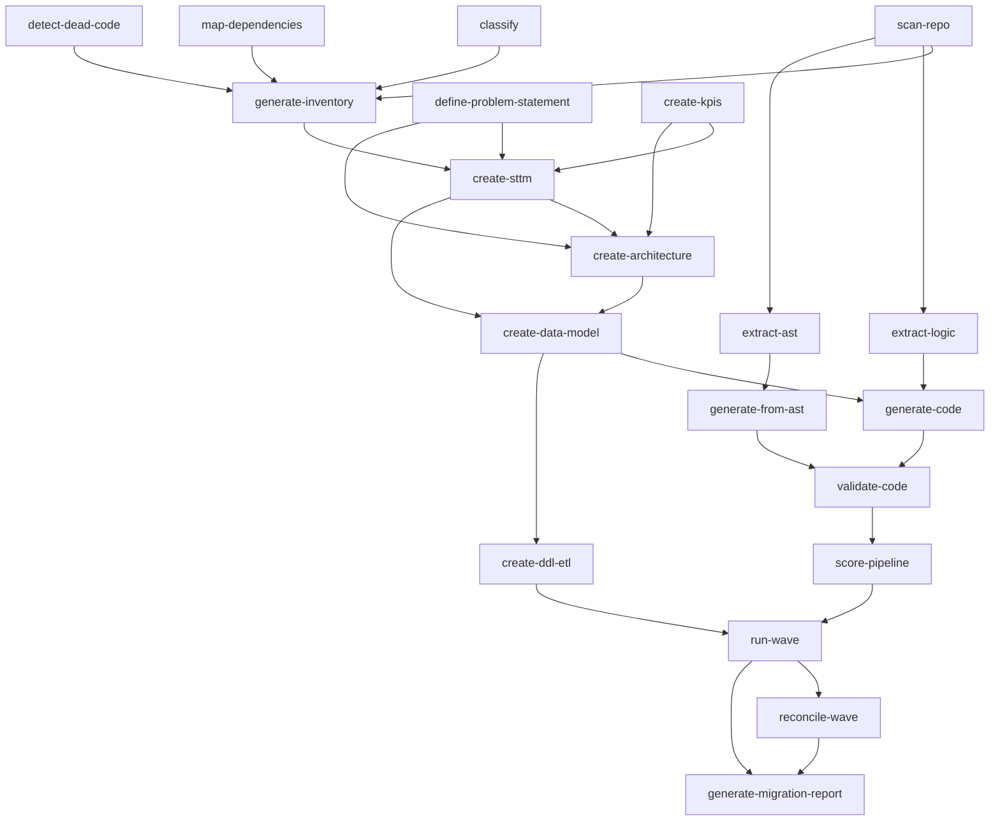

# Artifact Reference — Data Migration Factory v3

> **Tipo:** Reference Guide  
> **Data:** 2026-06-08  
> **Escopo:** Catálogo completo de todos os outputs gerados pelo sistema de agentes  
> **Público:** Desenvolvedores, migration coordinator, QA

---

## Tabela de Conteúdo

- [1. Visão Geral](#1-visão-geral)
- [2. UPSTREAM — Discovery (Gate 1)](#2-upstream--discovery-gate-1)
- [3. MIDSTREAM — Design (Gate 2)](#3-midstream--design-gate-2)
- [4. MIDSTREAM — Quality (Gate 2)](#4-midstream--quality-gate-2)
- [5. DOWNSTREAM — Execution (Gate 3)](#5-downstream--execution-gate-3)
- [6. CORE — Coordination (Cross-Gate)](#6-core--coordination-cross-gate)
- [7. Shared Tasks (Project Management)](#7-shared-tasks-project-management)
- [8. Dependências entre Tasks](#8-dependências-entre-tasks)
- [9. Regras de Validação](#9-regras-de-validação)

---

## 1. Visão Geral

O sistema gera artefatos em **4 formatos primários**:

| Formato | Uso | Consumidor |
|---------|-----|------------|
| **JSON** | Source of truth canônico; consumido programaticamente por outros agentes | Agents, scripts de validação, CI |
| **Markdown** | Relatórios legíveis para revisão humana e archival | Reviewers, Gate decisions |
| **HTML** | Dashboards visuais interativos para stakeholders | Executivos, apresentações Gate |
| **CSV** | Dados tabulares para análise em Excel/BI | Analistas, import tools |

**Regra geral:** Quando um task gera múltiplos formatos, o **JSON é sempre o source of truth**. MD e HTML são derivados do JSON e devem ser consistentes.

---

## 2. UPSTREAM — Discovery (Gate 1)

### 2.1 generate-inventory (discovery-scout)

**Command:** `*generate-inventory`  
**Output folder:** `projects/{project_name}/outputs/upstream/inventory/`

| Arquivo | Formato | Template | Descrição |
|---------|---------|----------|-----------|
| `inventory-enriched.json` | JSON | — | Inventário enriquecido com classificações, waves e dependências |
| `inventory-report.md` | Markdown | `inventory-tmpl.md` | Relatório legível baseado no template |
| `asis-platform-landscape.html` | HTML | `asis-platform-landscape-tmpl.html` | Relatório visual executivo para Gate 1 |
| `all-objects-inventory.csv` | CSV | — | Listagem completa por objeto com metadados |

**Dependências de entrada:**
- `inventory.json` (de `*scan-repo`) — obrigatório
- `classification.json` (de `*classify`) — opcional
- `dependency-graph.json` (de `*map-dependencies`) — opcional
- `dead-code-report.md` (de `*detect-dead-code`) — opcional

---

### 2.2 create-sttm (business-analyst)

**Command:** `*create-sttm`  
**Output folder:** `projects/{project_name}/outputs/upstream/sttm/`

| Arquivo | Formato | Template | Descrição |
|---------|---------|----------|-----------|
| `sttm.json` | JSON | `sttm-tmpl.json` | Source of truth canônico (consumido por Winston, Sofia, Gaia, Coda) |
| `sttm.md` | Markdown | `sttm-tmpl.md` | Renderização legível para Gate 1 review |
| `sttm-visual.html` | HTML | `sttm-visual-tmpl.html` | Dashboard filtrável para stakeholders |

**Dependências de entrada:**
- `problem-statement.md` (de data-strategist) — obrigatório
- `kpis.md` (de data-strategist) — obrigatório
- `inventory-enriched.json` (de discovery-scout) — opcional

---

### 2.3 define-problem-statement (data-strategist)

**Command:** `*define-problem`  
**Output folder:** `projects/{project_name}/outputs/upstream/strategy/`

| Arquivo | Formato | Template | Descrição |
|---------|---------|----------|-----------|
| `problem-statement.md` | Markdown | `problem-statement-tmpl.md` | Definição do problema de negócio |

---

### 2.4 create-kpis (data-strategist)

**Command:** `*create-kpis`  
**Output folder:** `projects/{project_name}/outputs/upstream/strategy/`

| Arquivo | Formato | Template | Descrição |
|---------|---------|----------|-----------|
| `kpis.md` | Markdown | `kpis-tmpl.md` | KPIs mensuráveis para sucesso da migração |

---

### 2.5 extract-logic (logic-extractor)

**Command:** `*extract-logic`  
**Output folder:** `projects/{project_name}/outputs/upstream/logic/`

| Arquivo | Formato | Template | Descrição |
|---------|---------|----------|-----------|
| `digital-twin.json` | JSON | `digital-twin-tmpl.md` | Representação digital do sistema legado |
| `pseudocode/{pipeline_id}.json` | JSON | `pseudocode-tmpl.md` | Pseudocódigo por pipeline |
| `logic-report.md` | Markdown | `logic-report-tmpl.md` | Relatório de extração de lógica |

---

### 2.6 scan-repo (discovery-scout)

**Command:** `*scan-repo`  
**Output folder:** `projects/{project_name}/outputs/upstream/discovery/`

| Arquivo | Formato | Template | Descrição |
|---------|---------|----------|-----------|
| `inventory.json` | JSON | — | Inventário bruto de objetos descobertos |

---

### 2.7 classify-pipelines (discovery-scout)

**Command:** `*classify`  
**Output folder:** `projects/{project_name}/outputs/upstream/discovery/`

| Arquivo | Formato | Template | Descrição |
|---------|---------|----------|-----------|
| `classification.json` | JSON | — | Classificação de objetos por complexidade |

---

### 2.8 map-dependencies (discovery-scout)

**Command:** `*map-dependencies`  
**Output folder:** `projects/{project_name}/outputs/upstream/discovery/`

| Arquivo | Formato | Template | Descrição |
|---------|---------|----------|-----------|
| `dependency-graph.json` | JSON | `dependency-graph-tmpl.md` | Grafo de dependências entre objetos |

---

### 2.9 detect-dead-code (discovery-scout)

**Command:** `*detect-dead-code`  
**Output folder:** `projects/{project_name}/outputs/upstream/discovery/`

| Arquivo | Formato | Template | Descrição |
|---------|---------|----------|-----------|
| `dead-code-report.md` | Markdown | `dead-code-report-tmpl.md` | Lista de código não utilizado |

---

### 2.10 generate-knowledge-graph (inventory-scout)

**Command:** `*generate-knowledge-graph`  
**Output folder:** `projects/{project_name}/outputs/upstream/knowledge-graph/`

| Arquivo | Formato | Template | Descrição |
|---------|---------|----------|-----------|
| `knowledge-graph.json` | JSON | — | Grafo de conhecimento (Neo4j/Gephi import) |
| `inventory-graph.html` | HTML | `inventory-graph-tmpl.html` | Visualização interativa do grafo |

---

### 2.11 extract-ast (logic-extractor)

**Command:** `*extract-ast`  
**Output folder:** `projects/{project_name}/outputs/upstream/logic/`
**Output folder:** `projects/{project_name}/outputs/midstream/`
| Arquivo | Formato | Template | Descrição |
|---------|---------|----------|-----------|
| `canonical-model.json` | JSON | — | Source of truth canônico da pipeline migrada (AST) |
| `column-lineage.json` | JSON | — | Rastreabilidade coluna-a-coluna (source → transform → target) |
| `sttm.md` | Markdown | — | STTM derivado automaticamente da extração AST |

**Dependências de entrada:**
- SQL (`.sql`) ou SSIS (`.dtsx`)
- Dialeto SQL (quando aplicável)
- Plataforma alvo informada no comando
**Output folder:** `projects/{project_name}/outputs/midstream/generated-code/`
---

## 3. MIDSTREAM — Design (Gate 2)

### 3.1 create-architecture (data-architect)

**Command:** `*create-architecture`  
**Output folder:** `projects/{project_name}/outputs/midstream/`

**Output folder:** `projects/{project_name}/outputs/midstream/generated-tests/`
|---------|---------|----------|-----------|
| `architecture-spec.json` | JSON | — | Especificação machine-readable (layers, stack, SLAs, ADRs) |
| `architecture.md` | Markdown | `architecture-tmpl.md` | Documento de arquitetura legível |
| `tobe-target-architecture.html` | HTML | `tobe-target-architecture-tmpl.html` | Apresentação visual para Gate 2 |

**Dependências de entrada:**
- STTM (de business-analyst)
- Analytical questions
**Output folder:** `projects/{project_name}/outputs/midstream/quality/`
- KPIs

---

### 3.2 create-data-model (data-modeler)

**Command:** `*data-model` / `*DM`  
**Output folder:** `projects/{project_name}/outputs/midstream/`

| Arquivo | Formato | Template | Descrição |
**Output folder:** `projects/{project_name}/outputs/midstream/compliance/`
| `data-model.json` | JSON | `data-model-tmpl.json` | Source of truth canônico (consumido por Coda, Diego, Gaia, Bianca) |
| `data-model.md` | Markdown | `data-model-tmpl.md` | Relatório derivado do modelo |
| `data-model-er.html` | HTML | `data-model-er-tmpl.html` | Diagrama ER visual para Gate 2 |

**Dependências de entrada:**
- STTM document
- Architecture document
- KPIs
**Output folder:** `projects/{project_name}/outputs/downstream/execution/`

---

### 3.3 create-data-contracts (data-modeler)

**Command:** `*data-contracts` / `*DC`  
**Output folder:** `projects/{project_name}/outputs/midstream/`

| Arquivo | Formato | Template | Descrição |
|---------|---------|----------|-----------|
**Output folder:** `projects/{project_name}/outputs/downstream/documentation/migration-reports/`

---

### 3.4 generate-code (code-generator)

**Command:** `*generate-code`  
**Output folder:** `projects/{project_name}/outputs/midstream/generated-code/`

| Arquivo | Formato | Template | Descrição |
|---------|---------|----------|-----------|
| `{pipeline_id}.py` | Python | `pyspark-notebook-tmpl.md` | Código PySpark gerado |
| `{pipeline_id}.sql` | SQL | `delta-merge-tmpl.md` | DDL/DML para Delta Lake |

**Output folder:** `projects/{project_name}/outputs/summary/gate-decisions/`

### 3.5 generate-tests (code-generator)

**Command:** `*generate-tests`  
**Output folder:** `projects/{project_name}/outputs/midstream/generated-tests/`

| Arquivo | Formato | Template | Descrição |
|---------|---------|----------|-----------|
| `{pipeline_id}_test.py` | Python | `pytest-tmpl.md` | Testes pytest para o código gerado |

---

### 3.6 document-decisions (data-architect)

**Command:** `*document-decisions`  
**Output folder:** `projects/{project_name}/outputs/midstream/`

| Arquivo | Formato | Template | Descrição |
|---------|---------|----------|-----------|
| `decisions.md` | Markdown | `adr-tmpl.md` | Architecture Decision Records |

---

### 3.7 create-governance (data-steward)

**Command:** `*create-governance`  
**Output folder:** `projects/{project_name}/outputs/midstream/`

| Arquivo | Formato | Template | Descrição |
|---------|---------|----------|-----------|
| `governance.md` | Markdown | `governance-tmpl.md` | Framework de governança |
| `monitoring-spec.md` | Markdown | — | Especificação de monitoramento |

---

### 3.8 create-dq-rules (data-steward)

**Command:** `*create-dq-rules`  
**Output folder:** `projects/{project_name}/outputs/midstream/`

| Arquivo | Formato | Template | Descrição |
|---------|---------|----------|-----------|
| `dq-rules.md` | Markdown | `dq-rules-tmpl.md` | Regras de qualidade de dados |

---

### 3.9 create-metrics-catalog (data-modeler)

**Command:** `*create-metrics-catalog`  
**Output folder:** `projects/{project_name}/outputs/midstream/`

| Arquivo | Formato | Template | Descrição |
|---------|---------|----------|-----------|
| `metrics-catalog.md` | Markdown | `metrics-catalog-tmpl.md` | Catálogo de métricas de negócio |

---

### 3.10 create-agent-blueprint (agent-designer)

**Command:** `*create-agent-blueprint`  
**Output folder:** `projects/{project_name}/outputs/midstream/`

| Arquivo | Formato | Template | Descrição |
|---------|---------|----------|-----------|
| `agent-blueprint.md` | Markdown | `agent-blueprint-tmpl.md` | Blueprint de agente novo |

---

### 3.11 create-orchestration-flow (data-architect)

**Command:** `*create-orchestration-flow`  
**Output folder:** `projects/{project_name}/outputs/midstream/`

| Arquivo | Formato | Template | Descrição |
|---------|---------|----------|-----------|
| `orchestration-flow.md` | Markdown | `orchestration-flow-tmpl.md` | Fluxo de orquestração de pipelines |

---

### 3.12 generate-job-definition (code-generator)

**Command:** `*generate-job-definition`  
**Output folder:** `projects/{project_name}/outputs/midstream/generated-code/`

| Arquivo | Formato | Template | Descrição |
|---------|---------|----------|-----------|
| `job-definition.yaml` | YAML | `job-definition-tmpl.yaml` | Definição de job para scheduler |

---

### 3.13 generate-from-ast (code-generator)

**Command:** `*generate-from-ast`  
**Output folder:** `projects/{project_name}/outputs/midstream/generated-code/`

| Arquivo | Formato | Template | Descrição |
|---------|---------|----------|-----------|
| `fabric/pipeline_{pipeline}.json` | JSON | — | Pipeline Fabric/ADF gerado do modelo canônico |
| `fabric/bronze_extract.py` | Python | — | Extração Bronze para Fabric |
| `fabric/silver_transform.py` | Python | — | Transformações Silver para Fabric |
| `fabric/gold_load.py` | Python | — | Carga Gold para Fabric |
| `fabric/create_{pipeline}.sql` | SQL | — | DDL Fabric Warehouse |
| `databricks/bronze_extract.py` | Python | — | Notebook/script Bronze Databricks |
| `databricks/silver_transform.py` | Python | — | Notebook/script Silver Databricks |
| `databricks/gold_load.py` | Python | — | Notebook/script Gold Databricks |
| `databricks/create_{pipeline}.sql` | SQL | — | DDL Delta + MERGE + OPTIMIZE |
| `databricks/job_{pipeline}.json` | JSON | — | Workflow Databricks |
| `airflow/dag_{pipeline}.py` | Python | — | DAG Airflow derivada do grafo canônico |

**Dependências de entrada:**
- `canonical-model.json` (de `*extract-ast`)
- Opcional: `column-lineage.json`, `sttm.md` para documentação complementar

---

## 4. MIDSTREAM — Quality (Gate 2)

### 4.1 validate-code (quality-gate)

**Command:** `*validate`  
**Output folder:** `projects/{project_name}/outputs/midstream/quality/`

| Arquivo | Formato | Template | Descrição |
|---------|---------|----------|-----------|
| `validation-report.md` | Markdown | `validation-report-tmpl.md` | Relatório completo de validação |
| `validation-scorecard.html` | HTML | `validation-scorecard-tmpl.html` | Scorecard visual de qualidade |
| `quality-scores.json` | JSON | `quality-scores-tmpl.json` | Scores numéricos por dimensão |

---

### 4.2 score-pipeline (quality-gate)

**Command:** `*score-pipeline`  
**Output folder:** `projects/{project_name}/outputs/midstream/quality/`

| Arquivo | Formato | Template | Descrição |
|---------|---------|----------|-----------|
| `quality-scores.json` | JSON | `quality-scores-tmpl.json` | Score final ponderado com decisão |

---

### 4.3 scan-pii (security-compliance)

**Command:** `*scan-pii`  
**Output folder:** `projects/{project_name}/outputs/midstream/compliance/`

| Arquivo | Formato | Template | Descrição |
|---------|---------|----------|-----------|
| `pii-findings.md` | Markdown | `pii-findings-tmpl.md` | Resultados de scan PII |

---

### 4.4 check-compliance (security-compliance)

**Command:** `*check-compliance`  
**Output folder:** `projects/{project_name}/outputs/midstream/compliance/`

| Arquivo | Formato | Template | Descrição |
|---------|---------|----------|-----------|
| `compliance-report.md` | Markdown | `compliance-report-tmpl.md` | Relatório de compliance |

---

### 4.5 run-tests (quality-gate)

**Command:** `*run-tests`  
**Output folder:** `projects/{project_name}/outputs/midstream/quality/`

| Arquivo | Formato | Template | Descrição |
|---------|---------|----------|-----------|
| `test-results.md` | Markdown | `test-results-tmpl.md` | Resultado de execução de testes |

---

### 4.6 generate-audit-log (quality-gate)

**Command:** `*generate-audit-log`  
**Output folder:** `projects/{project_name}/outputs/midstream/quality/`

| Arquivo | Formato | Template | Descrição |
|---------|---------|----------|-----------|
| `audit-trail.md` | Markdown | `audit-trail-tmpl.md` | Log de auditoria de decisões |

---

## 5. DOWNSTREAM — Execution (Gate 3)

### 5.1 run-wave (downstream-executor)

**Command:** `*run-wave`  
**Output folder:** `projects/{project_name}/outputs/downstream/execution/`

| Arquivo | Formato | Template | Descrição |
|---------|---------|----------|-----------|
| `wave-report.json` | JSON | `wave-report-tmpl.json` | Source of truth canônico (Gate 3 decision) |
| `wave-report.md` | Markdown | `wave-report-tmpl.md` | Relatório legível derivado do JSON |
| `wave-execution-report.html` | HTML | `wave-execution-report-tmpl.html` | Dashboard visual Gate 3 |

**Dependências de entrada:**
- Gate 2 approved
- `wave-config.yaml` validado
- DDL package (`ddl/`)
- ETL package (`etl/`)
- reconciliation-report.json (de Balance)

---

### 5.2 reconcile-wave (reconciliation)

**Command:** `*reconcile-wave`  
**Output folder:** `projects/{project_name}/outputs/downstream/reconciliation/`

| Arquivo | Formato | Template | Descrição |
|---------|---------|----------|-----------|
| `reconciliation-report.json` | JSON | `reconciliation-report-tmpl.json` | Source of truth (parity, status, sign-off) |
| `reconciliation-report.md` | Markdown | `reconciliation-report-tmpl.md` | Relatório legível derivado |
| `reconciliation-dashboard.html` | HTML | `reconciliation-dashboard-tmpl.html` | Dashboard com gauge de paridade |

**Dependências de entrada:**
- Tables migrated to target
- Source/target connections verified
- Wave definition (table list, scope)

---

### 5.3 generate-migration-report (documentation)

**Command:** `*generate-report`  
**Output folder:** `projects/{project_name}/outputs/downstream/documentation/migration-reports/`

| Arquivo | Formato | Template | Descrição |
|---------|---------|----------|-----------|
| `migration-report.md` | Markdown | `migration-report-tmpl.md` | Relatório completo (50+ páginas) |
| `migration-report-executive.md` | Markdown | — | Extrato executivo (≤5 páginas) |
| `migration-report-technical.md` | Markdown | — | Extrato técnico detalhado |
| `migration-report.en.md` | Markdown | — | Full report EN-US |
| `migration-report-executive.en.md` | Markdown | — | Executive EN-US |
| `migration-report-technical.en.md` | Markdown | — | Technical EN-US |

---

### 5.4 generate-runbook (documentation)

**Command:** `*generate-runbook`  
**Output folder:** `projects/{project_name}/outputs/downstream/documentation/runbooks/`

| Arquivo | Formato | Template | Descrição |
|---------|---------|----------|-----------|
| `runbook-monitoring.md` | Markdown | `runbook-tmpl.md` | Procedimentos de monitoramento |
| `runbook-incident-response.md` | Markdown | `runbook-tmpl.md` | Playbook de incidentes |
| `runbook-troubleshooting.md` | Markdown | `runbook-tmpl.md` | Guias de troubleshooting |
| `runbook-maintenance.md` | Markdown | `runbook-tmpl.md` | Manutenção programada |
| `runbook-index.md` | Markdown | — | Índice de todos os runbooks |

---

### 5.5 generate-changelog (documentation)

**Command:** `*generate-changelog`  
**Output folder:** `projects/{project_name}/outputs/downstream/documentation/changelogs/`

| Arquivo | Formato | Template | Descrição |
|---------|---------|----------|-----------|
| `changelog.md` | Markdown | `changelog-tmpl.md` | Changelog completo (Keep a Changelog) |
| `changelog-summary.md` | Markdown | — | Resumo com estatísticas |

---

### 5.6 generate-lineage-diagrams (documentation)

**Command:** `*generate-lineage`  
**Output folder:** `projects/{project_name}/outputs/downstream/documentation/lineage-diagrams/`

| Arquivo | Formato | Template | Descrição |
|---------|---------|----------|-----------|
| `lineage-overview.md` | Markdown | `lineage-diagram-tmpl.md` | Diagrama master de lineage |
| `lineage-{domain}.md` | Markdown | `lineage-diagram-tmpl.md` | Diagrama por domínio de negócio |
| `lineage-cross-domain.md` | Markdown | — | Relacionamentos cross-domain |
| `lineage-index.md` | Markdown | — | Índice de diagramas |

---

### 5.7 generate-all (documentation)

**Command:** `*generate-all`  
**Output folder:** `projects/{project_name}/outputs/downstream/documentation/`

| Arquivo | Formato | Template | Descrição |
|---------|---------|----------|-----------|
| `documentation-index.md` | Markdown | — | Índice master de toda documentação |
| `documentation-statistics.json` | JSON | — | Estatísticas de geração |

Orquestra: `*generate-report` → `*generate-lineage` → `*generate-runbook` → `*generate-changelog`

---

### 5.8 generate-healing-report (self-healing)

**Command:** `*generate-healing-report`  
**Output folder:** `projects/{project_name}/outputs/downstream/healing/`

| Arquivo | Formato | Template | Descrição |
|---------|---------|----------|-----------|
| `healing-report.md` | Markdown | `healing-report-tmpl.md` | Relatório de auto-correções |

---

### 5.9 create-ddl-etl (downstream-executor)

**Command:** `*create-ddl-etl`  
**Output folder:** `projects/{project_name}/outputs/downstream/`

| Arquivo | Formato | Template | Descrição |
|---------|---------|----------|-----------|
| `ddl/*.sql` | SQL | — | Scripts DDL por layer |
| `etl/*.sql` | SQL | — | Scripts ETL por domínio |
| `tests/*` | Python/SQL | — | Assertions de qualidade |
| `documentation/execution-notes.md` | Markdown | — | Notas de execução |

---

### 5.10 generate-dashboard-html (bi-semantic)

**Command:** `*generate-dashboard-html`  
**Output folder:** `projects/{project_name}/outputs/downstream/bi/dashboards/`

| Arquivo | Formato | Template | Descrição |
|---------|---------|----------|-----------|
| `dashboard-preview_{timestamp}.html` | HTML | (inline) | Dashboard interativo com Chart.js |

---

### 5.11 create-semantic-model (bi-semantic)

**Command:** `*create-semantic-model`  
**Output folder:** `projects/{project_name}/outputs/downstream/bi/`

| Arquivo | Formato | Template | Descrição |
|---------|---------|----------|-----------|
| `semantic-model.yaml` | YAML | `semantic-model-tmpl.yaml` | Modelo semântico para BI |

---

## 6. CORE — Coordination (Cross-Gate)

### 6.1 validate-gate-1 (migration-coordinator)

**Command:** `*validate-gate-1`  
**Output folder:** `projects/{project_name}/outputs/summary/gate-decisions/`

| Arquivo | Formato | Template | Descrição |
|---------|---------|----------|-----------|
| `gate1-decision.md` | Markdown | `gate-report-tmpl.md` | Decisão do Gate 1 com score |

---

### 6.2 validate-gate-2 (migration-coordinator)

**Command:** `*validate-gate-2`  
**Output folder:** `projects/{project_name}/outputs/summary/gate-decisions/`

| Arquivo | Formato | Template | Descrição |
|---------|---------|----------|-----------|
| `gate2-decision.md` | Markdown | `gate-report-tmpl.md` | Decisão do Gate 2 com score |

---

### 6.3 validate-gate-3 (migration-coordinator)

**Command:** `*validate-gate-3`  
**Output folder:** `projects/{project_name}/outputs/summary/gate-decisions/`

| Arquivo | Formato | Template | Descrição |
|---------|---------|----------|-----------|
| `gate3-decision.md` | Markdown | `gate-report-tmpl.md` | Decisão do Gate 3 com score |

---

### 6.4 start-wave (migration-coordinator)

**Command:** `*start-wave`  
**Required input:** `wave_config_path: projects/{project_name}/wave-config.yaml`  
**Output folder:** `projects/{project_name}/outputs/summary/`

| Arquivo | Formato | Template | Descrição |
|---------|---------|----------|-----------|
| `wave-status.md` | Markdown | `wave-status-report-tmpl.md` | Status consolidado |

---

### 6.5 run-retrospective (migration-coordinator)

**Command:** `*run-retrospective`  
**Output folder:** `projects/{project_name}/outputs/summary/`

| Arquivo | Formato | Template | Descrição |
|---------|---------|----------|-----------|
| `retrospective.md` | Markdown | `retrospective-tmpl.md` | Retrospectiva da wave |

---

### 6.6 create-improvement-backlog (iteration-improvement)

**Command:** `*create-improvement-backlog`  
**Output folder:** `projects/{project_name}/outputs/summary/`

| Arquivo | Formato | Template | Descrição |
|---------|---------|----------|-----------|
| `improvement-backlog.md` | Markdown | `improvement-backlog-tmpl.md` | Backlog de melhorias |

---

## 7. Shared Tasks (Project Management)

Localizados em `src/shared/tasks/`, disponíveis para qualquer agente:

| Task | Arquivo | Output esperado |
|------|---------|-----------------|
| `executive-summary` | `executive-summary.md` | Relatório executivo para stakeholders |
| `analyze-issues` | `analyze-issues.md` | Análise de causa-raiz |
| `create-roadmap` | `create-roadmap.md` | Roadmap com fases e milestones |
| `estimate-project` | `estimate-project.md` | Estimativa de custo e timeline |
| `assess-risks` | `assess-risks.md` | Risk register com mitigações |
| `create-delivery-plan` | `create-delivery-plan.md` | WBS e planejamento de sprints |
| `forecast-budget` | `forecast-budget.md` | Projeção de budget e burn rate |
| `project-health-check` | `project-health-check.md` | Health check RAG status |
| `resource-planning` | `resource-planning.md` | Planejamento de recursos |
| `execute-checklist` | `execute-checklist.md` | Execução de checklists |

---

## 8. Dependências entre Tasks

---

## 9. Regras de Validação

### Regras gerais para todos os outputs

1. **Nenhum placeholder** — pattern `{{...}}` nunca deve existir no output final
2. **Encoding** — todos os arquivos devem ser UTF-8
3. **Formato válido** — JSON deve ser parseable, HTML deve ser bem-formado, CSV deve ter headers
4. **Completude** — todos os campos obrigatórios preenchidos
5. **Consistência** — dados derivados (MD, HTML) devem corresponder ao JSON canônico

### Regras por formato

| Formato | Validações obrigatórias |
|---------|-------------------------|
| JSON | Parseable, required keys presentes, values não-nulos para campos obrigatórios |
| Markdown | Seções obrigatórias presentes (H1, H2), sem placeholders |
| HTML | Tags abertas/fechadas corretamente, sem placeholders, CSS inline presente |
| CSV | Header row presente, número de colunas consistente, encoding UTF-8 |
| YAML | Parseable, required keys presentes |

### Regras de nomeação

- JSON canônicos: `{artifact-name}.json` (lowercase, hifenizado)
- Markdown derivados: `{artifact-name}.md` (mesmo nome-base do JSON)
- HTML visuais: `{artifact-name}.html` ou `{artifact-name}-{type}.html`
- CSV tabulares: `{scope}-{artifact}.csv`

### Regras AST por gate

Quando a trilha AST é utilizada, as validações adicionais por gate são:

- **Gate 1**: `canonical-model.json` presente e com chaves mínimas (`pipeline_id`, `pipeline_name`, `source_platform`)
- **Gate 2**: `canonical-model.json`, `column-lineage.json`, `sttm.md` presentes
- **Gate 3**: artefatos do Gate 2 + pasta `generated-code/` presente

Essas regras são implementadas em `validate_ast_artifacts(gate, artifact_root)` no módulo `src/shared/scripts/validate_gate3_artifacts.py`.

### Templates

Todos os templates estão em:
- `src/modules/dmf-fabric-agents/{module}/templates/` — por módulo
- `src/shared/templates/` — compartilhados cross-módulo

Template files usam sufixo `-tmpl` antes da extensão: `sttm-tmpl.json`, `architecture-tmpl.md`, etc.
