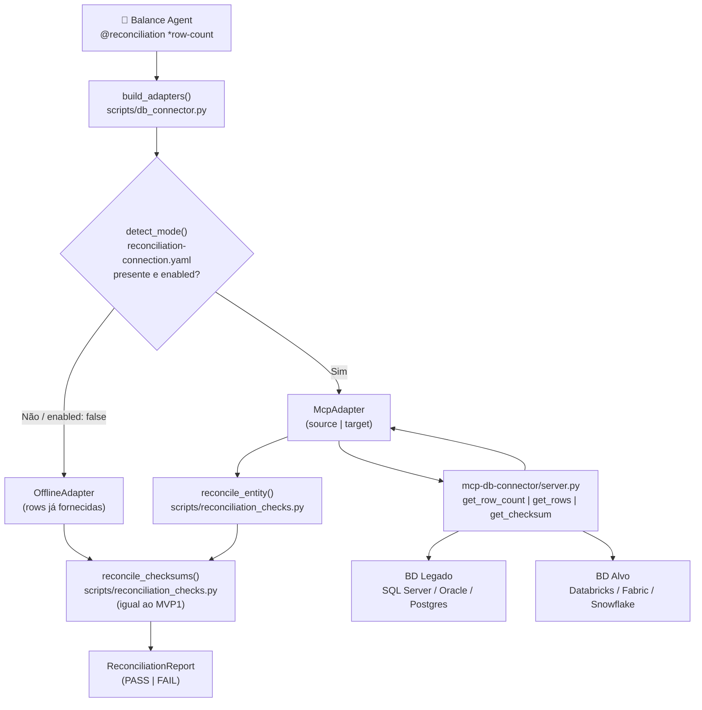

# MVP2 — Hybrid Reconciliation: Connected + Offline Mode

> **Status:** Planejado | **Autor:** GitHub Copilot | **Data:** 2026-03-21
> **Contexto:** Evolução do modo de reconciliação do MVP1 (sempre offline/in-memory) para suporte
> a um modo conectado via MCP Server, mantendo compatibilidade total com o fluxo atual.

---

## Sumário

| Seção | |
| --- | --- |
| [Motivação](#motivação) | Por que este MVP existe |
| [Decisões de Design](#decisões-de-design) | Princípios não-negociáveis |
| [Arquitetura](#arquitetura) | Visão geral da solução |
| [Fases de Implementação](#fases-de-implementação) | 5 fases, 16 stories |
| [Arquivos Afetados](#arquivos-afetados) | Mapa completo de mudanças |
| [Critérios de Aceitação](#critérios-de-aceitação) | Definição de Done |
| [Ativação por Fase](#ativação-por-fase) | Como habilitar cada modo |

---

## Motivação

No MVP1, `scripts/reconciliation_checks.py` opera completamente **in-memory**: recebe
`source_rows` e `target_rows` como listas Python já extraídas pelo operador. Não há
conexão direta com ambientes legados ou de destino.

Esta limitação:

- Exige extração manual dos dados antes de cada reconciliação
- Bloqueia automação do ciclo `*row-count` e `*checksum` do agente Balance
- Impede validação em tempo real durante a execução da wave

**Objetivo do MVP2:** permitir que o agente Balance opere de dois modos sem
nenhuma mudança de comportamento para quem já usa o modo offline.

```
OFFLINE mode (MVP1, mantido intacto)
  ┌───────────────────────────────────┐
  │  Operador extrai rows manualmente │
  │  → passa como list[dict]          │
  │  → reconcile_checksums() igual    │
  └───────────────────────────────────┘

CONNECTED mode (MVP2, novo)
  ┌──────────────────────────────────────────────────────┐
  │  reconciliation-connection.yaml presente e enabled   │
  │  → McpAdapter chama mcp-db-connector server          │
  │  → server executa queries parametrizadas nos BDs     │
  │  → rows retornam para reconcile_checksums() igual    │
  └──────────────────────────────────────────────────────┘
```

---

## Decisões de Design

| # | Decisão | Justificativa |
| --- | --- | --- |
| D1 | `reconcile_checksums()` não muda assinatura | 189 testes do MVP1 continuam passando sem alteração |
| D2 | Detecção de modo é automática e fail-safe | Ausência de config → OFFLINE; nunca lança exceção |
| D3 | Credenciais **nunca** no YAML | OWASP: apenas env var referenciada (`credential_env: "VAR_NAME"`) |
| D4 | MCP Server não aceita SQL livre | Somente tools parametrizadas — previne injection pelo agente |
| D5 | McpAdapter stub na Fase 1 | Fases 1 e 2 testáveis antes do servidor MCP existir |
| D6 | Adaptadores são protocolos (typing.Protocol) | Troca de implementação sem herança — mais testável |

---

## Arquitetura



---

## Fases de Implementação

### Fase 1 — Camada de adaptadores `scripts/db_connector.py` *(novo arquivo)*

> **Pré-requisito:** nenhum. Pode ser implementada e testada de forma independente.

| Story | Descrição | Detalhe |
| --- | --- | --- |
| S1 | `ConnectionMode` enum | `CONNECTED \| OFFLINE` |
| S2 | Protocolo `SourceAdapter` | `fetch_rows(table, schema, limit) -> list[dict]`<br>`get_row_count(table, schema) -> int` |
| S3 | `OfflineAdapter(SourceAdapter)` | Recebe `rows: list[dict]` no construtor; `fetch_rows()` retorna a lista; `get_row_count()` retorna `len(rows)` |
| S4 | `McpAdapter(SourceAdapter)` — stub | Levanta `NotImplementedError` com mensagem descritiva; aceita `side: Literal["source", "target"]`; implementado na Fase 3 |
| S5 | `detect_mode(config_path)` | Lê `reconciliation-connection.yaml`; retorna `CONNECTED` se `enabled: true`; **sempre** retorna `OFFLINE` em caso de falha ou ausência |

---

### Fase 2 — Extensão backward-compatible de `reconciliation_checks.py` *(editar)*

> **Pré-requisito:** S5 (Fase 1).
> Nenhuma função ou assinatura existente é removida ou alterada.

| Story | Descrição | Detalhe |
| --- | --- | --- |
| S6 | `reconcile_checksums()` — **inalterado** | Zero mudança; todos os 189 testes do MVP1 continuam passando |
| S7 | `reconcile_entity(entity, source_adapter, target_adapter)` | Chama `fetch_rows()` em cada adaptador e repassa para `reconcile_checksums()`; entry point do modo CONNECTED |
| S8 | `build_adapters(entity, table, schema, config_path)` | Chama `detect_mode()`; retorna `(OfflineAdapter, OfflineAdapter)` em modo OFFLINE ou `(McpAdapter, McpAdapter)` em modo CONNECTED |

---

### Fase 3 — MCP Server `mcp-db-connector/` *(nova pasta)*

> **Pré-requisito:** S4 (Fase 1).

**Estrutura de arquivos:**

```
mcp-db-connector/
├── server.py           # FastMCP — ponto de entrada
├── config.py           # lê reconciliation-connection.yaml
├── requirements.txt    # fastmcp + drivers
└── adapters/
    ├── base.py         # DbAdapter ABC
    ├── sqlserver.py    # pyodbc
    ├── postgres.py     # psycopg2
    └── databricks.py   # databricks-sql-connector
```

| Story | Descrição | Tools MCP expostas |
| --- | --- | --- |
| S9 | Estrutura de pastas e `server.py` (FastMCP) | — |
| S10 | Tools MCP parametrizadas | `get_row_count(side, table, schema) → int`<br>`get_rows(side, table, schema, key_col, limit) → list[dict]`<br>`get_checksum(side, table, schema, key_col) → str` (SHA-256 calculado no servidor)<br>`list_tables(side, schema) → list[str]` |
| S11 | `McpAdapter` implementado em `db_connector.py` | Chama as tools do S10 via client MCP |

> **Segurança:** o servidor não expõe endpoint de SQL livre. Todas as queries são construídas
> internamente nos adaptadores com valores parametrizados — a string SQL nunca vem do agente.

---

### Fase 4 — Config template + chatmode

| Story | Arquivo | Descrição |
| --- | --- | --- |
| S12 | `reconciliation-connection-sample.yaml` | Template com `source` e `target`; credenciais apenas via `credential_env` |
| S13 | `.github/agents/reconciliation.chatmode.md` | Adicionar `mcp: db-connector` nas tools; adicionar seção `connection-mode` no YAML; atualizar `*row-count` e `*checksum` para mencionar detecção automática de modo |

**Formato do arquivo de config (S12):**

```yaml
# reconciliation-connection-sample.yaml
# Copie para reconciliation-connection.yaml e preencha os valores.
# NUNCA commite credenciais — use variáveis de ambiente.
enabled: true

source:
  adapter: sqlserver        # sqlserver | postgres | oracle | databricks
  host: "(inform host)"
  port: 1433
  database: "(inform database)"
  schema: "dbo"
  credential_env: "SOURCE_DB_CONN_STR"  # valor: conn string completa

target:
  adapter: databricks
  host: "(inform workspace host)"
  http_path: "(inform http_path)"
  catalog: "(inform catalog)"
  schema: "(inform schema)"
  credential_env: "TARGET_DB_TOKEN"     # valor: personal access token
```

---

### Fase 5 — Testes

> **Pré-requisito:** Fases 1–3.
> Nenhum teste existente é alterado.

**`tests/test_db_connector.py`** — 8 casos:

| Teste | O que valida |
| --- | --- |
| `test_detect_mode_offline_no_file` | Sem arquivo de config → `OFFLINE` |
| `test_detect_mode_offline_disabled` | Config com `enabled: false` → `OFFLINE` |
| `test_detect_mode_connected` | Config com `enabled: true` → `CONNECTED` |
| `test_offline_adapter_fetch_rows` | `OfflineAdapter.fetch_rows()` retorna a lista fornecida |
| `test_offline_adapter_get_row_count` | `OfflineAdapter.get_row_count()` retorna `len(rows)` |
| `test_reconcile_entity_offline` | `reconcile_entity()` com `OfflineAdapter` produz mesmo resultado que `reconcile_checksums()` |
| `test_build_adapters_offline` | Sem config → retorna par de `OfflineAdapter` |
| `test_build_adapters_connected` | Com config enabled → retorna par de `McpAdapter` |

**`tests/test_mcp_server.py`** — 3 casos com mock de conexão:

| Teste | O que valida |
| --- | --- |
| `test_get_row_count_dispatches_to_adapter` | Tool `get_row_count` delega ao adapter correto |
| `test_get_rows_respects_limit` | Tool `get_rows` com `limit=10` retorna máximo 10 rows |
| `test_get_checksum_returns_sha256` | Tool `get_checksum` retorna hash SHA-256 com 64 chars |

---

## Arquivos Afetados

| Arquivo | Ação | Fase |
| --- | --- | --- |
| `scripts/db_connector.py` | **Novo** | 1 |
| `scripts/reconciliation_checks.py` | **Editar** — adicionar `reconcile_entity()` e `build_adapters()`; nada removido | 2 |
| `mcp-db-connector/server.py` | **Novo** | 3 |
| `mcp-db-connector/config.py` | **Novo** | 3 |
| `mcp-db-connector/adapters/base.py` | **Novo** | 3 |
| `mcp-db-connector/adapters/sqlserver.py` | **Novo** | 3 |
| `mcp-db-connector/adapters/postgres.py` | **Novo** | 3 |
| `mcp-db-connector/adapters/databricks.py` | **Novo** | 3 |
| `mcp-db-connector/requirements.txt` | **Novo** | 3 |
| `reconciliation-connection-sample.yaml` | **Novo** | 4 |
| `.github/agents/reconciliation.chatmode.md` | **Editar** — tools + comandos | 4 |
| `tests/test_db_connector.py` | **Novo** | 5 |
| `tests/test_mcp_server.py` | **Novo** | 5 |

---

## Critérios de Aceitação

```powershell
# 1. Todos os testes do MVP1 continuam passando, mais os novos
python -m pytest tests/ -q
# Esperado: ≥ 200 passed (189 + ~11 novos), 0 failed

# 2. Contrato do chatmode válido após edição
python -m scripts.validate_agent_contracts --root .
# Esperado: all contracts valid

# 3. Modo OFFLINE: sem arquivo de config, comportamento igual ao MVP1
python -c "from scripts.db_connector import detect_mode; from pathlib import Path; print(detect_mode(Path('nao-existe.yaml')))"
# Esperado: ConnectionMode.OFFLINE

# 4. Modo CONNECTED: com config enabled
# (requer reconciliation-connection.yaml válido e servidor MCP iniciado)
python -c "from scripts.db_connector import detect_mode, ConnectionMode; ..."
# Esperado: ConnectionMode.CONNECTED
```

---

## Ativação por Fase

### Modo OFFLINE (MVP1 — já funciona)

Nenhuma config necessária. Comportamento existente preservado:

```python
from scripts.reconciliation_checks import reconcile_checksums

report = reconcile_checksums(
    entity="orders",
    source_rows=[...],   # extraídos manualmente
    target_rows=[...],   # extraídos manualmente
)
```

### Modo OFFLINE via novo API (Fase 2)

```python
from scripts.db_connector import OfflineAdapter
from scripts.reconciliation_checks import reconcile_entity

src = OfflineAdapter(rows=[...])
tgt = OfflineAdapter(rows=[...])
report = reconcile_entity("orders", src, tgt)
```

### Modo CONNECTED (Fases 3 + 4)

1. Copiar `reconciliation-connection-sample.yaml` → `reconciliation-connection.yaml`
2. Preencher `host`, `database`, `schema` e definir env vars de credenciais
3. Iniciar o MCP Server: `cd mcp-db-connector && python server.py`
4. Usar o agente Balance normalmente — a detecção é automática:

```text
@reconciliation *row-count --wave 1 --table orders
→ Balance detecta reconciliation-connection.yaml presente e enabled: true
→ McpAdapter chama get_row_count("source", "orders", "dbo")
→ McpAdapter chama get_row_count("target", "orders", "dbo")
→ reconcile_checksums() recebe os counts e gera ReconciliationReport
```

---

## Dependências Externas (Fase 3)

> Estas dependências ficam isoladas em `mcp-db-connector/requirements.txt` e
> **não afetam** o `requirements` do projeto principal (que continua com
> apenas `pytest` + `pyyaml`).

| Pacote | Versão mínima | Uso |
| --- | --- | --- |
| `fastmcp` | 0.4+ | MCP Server framework |
| `pyodbc` | 5.0+ | Adapter SQL Server / Oracle |
| `psycopg2-binary` | 2.9+ | Adapter PostgreSQL |
| `databricks-sql-connector` | 3.0+ | Adapter Databricks SQL Warehouse |
| `pyyaml` | 6.0+ | Leitura do config (já no projeto) |

---

## MVP3 — Project Standards Skill

> **Status:** Planejado — não iniciar antes da conclusão do MVP2
> **Objetivo:** permitir que padrões técnicos específicos de cada projeto (tags, bibliotecas,
> naming conventions, estilo de código, segurança) sejam injetados automaticamente em todos
> os agentes do factory sem necessidade de repeti-los em cada prompt.

### Sumário MVP3

| Seção | |
| --- | --- |
| [Motivação MVP3](#motivação-mvp3) | Por que este mecanismo existe |
| [Decisões de Design MVP3](#decisões-de-design-mvp3) | Princípios |
| [Arquitetura MVP3](#arquitetura-mvp3) | Como o skill é carregado pelos agentes |
| [Estrutura do SKILL.md](#estrutura-do-skillmd) | Anatomia do arquivo |
| [Exemplo Completo](#exemplo-completo-skillmd) | `project-standards/SKILL.md` para Airflow + Databricks |
| Declaração nos Chatmodes | Como cada agente referencia o skill |
| [Fases de Implementação MVP3](#fases-de-implementação-mvp3) | 4 fases, 12 stories |
| [Arquivos Afetados MVP3](#arquivos-afetados-mvp3) | Mapa completo |
| [Critérios de Aceitação MVP3](#critérios-de-aceitação-mvp3) | Definição de Done |

---

### Motivação MVP3

O factory é **platform-agnostic** por design — os agentes nunca assumem Databricks, Fabric
ou Snowflake. Porém, quando um projeto real é executado sobre uma stack específica (ex.:
Airflow + Databricks), existem padrões técnicos obrigatórios que hoje precisam ser
repetidos manualmente em cada prompt:

- Prefixo de DAGs (`dmf_`), prefixo de notebooks (`nb_`)
- Tags obrigatórias nos clusters Databricks e nas DAGs do Airflow
- Versão do Databricks Runtime (ex.: `13.3 LTS`)
- Pacotes Python exigidos (ex.: `delta-spark==2.4.0`)
- Estilo de código: logging com structlog, docstrings obrigatórias
- Backend de secrets: Azure Key Vault com prefixo `dmf-<wave>-`

Sem um mecanismo centralizado, esses padrões:

1. São esquecidos em prompts pontuais
2. Ficam inconsistentes entre agentes diferentes (code-generator vs. data-architect)
3. Precisam ser re-explicados a cada nova wave ou novo colaborador

**Objetivo do MVP3:** criar um arquivo de skill
`.github/skills/project-standards/SKILL.md` que é carregado automaticamente pelos agentes
relevantes e injeta os padrões sem intervenção do operador.

---

### Decisões de Design MVP3

| # | Decisão | Justificativa |
| --- | --- | --- |
| D1 | Um skill por projeto, não por wave | Padrões técnicos são estáveis dentro de um projeto; variações por wave ficam no `wave-config.yaml` |
| D2 | O skill é **lido** pelos agentes, nunca executado | SKILL.md é documentação estruturada — agentes o processam como contexto |
| D3 | Formato Markdown com seções fixas | VS Code Copilot carrega skills como contexto de texto; o parser é o LLM |
| D4 | `validate_agent_contracts.py` não precisa mudar | O skill não é agent-contract — é contexto; nenhum script de governança valida seu conteúdo |
| D5 | Múltiplos projetos → múltiplos skills | ex.: `project-standards-airflow-databricks/SKILL.md` e `project-standards-fabric/SKILL.md` podem coexistir |
| D6 | Agentes declaram o skill no frontmatter | A declaração é a única mudança necessária nos chatmodes — sem edição de lógica |
| D7 | Padrões de segurança ficam no skill | Evita que o agente `security-compliance` precise receber as regras de mascaramento por prompt |

---

### Arquitetura MVP3

```
Operador abre o agente (ex.: @code-generator)
        │
        ▼
VS Code Copilot carrega o chatmode
        │
        ├── Lê frontmatter do .chatmode.md
        │   └── tools: [..., project-standards]   ← novo
        │
        ├── Carrega .github/skills/project-standards/SKILL.md como contexto
        │
        └── Injeta SKILL.md no system prompt do agente
                │
                ▼
        Agente gera código/artefatos já respeitando:
        - naming conventions do projeto
        - tags obrigatórias
        - versão das libs
        - backend de secrets correto
        - regras de PII/mascaramento
```

#### Fluxo de atualização dos padrões

Quando um padrão muda (ex.: nova versão do Databricks Runtime):

1. Editar `SKILL.md` — uma única linha
2. Todos os agentes que declararam o skill passam a usar o novo valor
3. Sem necessidade de alterar chatmodes, wave-configs ou scripts

---

### Estrutura do SKILL.md

O arquivo segue uma estrutura de seções padronizadas que os agentes reconhecem:

```markdown
# Project Standards — <Nome do Projeto>

## When to Apply This Skill
<trigger: quando este skill deve ser consultado>

## Platform Stack
<declaração da stack alvo>

## Naming Conventions
<regras de prefixo/sufixo por artefato>

## Mandatory Tags
<tags obrigatórias por serviço>

## Libraries & Runtimes
<versões fixadas>

## Code Style
<regras de estilo para notebooks e scripts>

## Security Standards
<secrets backend, mascaramento por ambiente, PII handling>

## Agent-Specific Guidance
<seções opcionais por agente: code-generator, data-architect, etc.>

## Validation Checklist
<lista que o agente usa para auto-validar sua saída>
```

---

### Exemplo Completo SKILL.md

> Exemplo para projeto usando **Airflow + Databricks** — copiar e adaptar por projeto.

````markdown
# Project Standards — Airflow + Databricks Migration

## When to Apply This Skill
Apply this skill whenever generating, reviewing, or validating any artifact
for this project: Airflow DAGs, Databricks notebooks, DDL scripts,
data contracts, or architecture documents.

## Platform Stack
- Orchestration: Apache Airflow 2.8+ (self-hosted on Kubernetes)
- Execution: Databricks on Azure (Unity Catalog enabled)
- Storage: Azure Data Lake Storage Gen2
- Secrets: Azure Key Vault
- Monitoring: Azure Monitor + Grafana

## Naming Conventions

| Artefato | Padrão | Exemplo |
|---|---|---|
| Airflow DAG | `dmf_{wave_id}_{entity}` | `dmf_wave001_customer` |
| Databricks Notebook | `nb_{layer}_{entity}` | `nb_bronze_customer` |
| Delta Table | `{layer}_{entity}` | `silver_sales_order` |
| Schema | `{env}_{domain}` | `dev_sales`, `prd_sales` |
| Job cluster | `dmf-{wave_id}-{entity}-cluster` | `dmf-wave001-customer-cluster` |
| Key Vault secret | `dmf-{wave_id}-{env}-{purpose}` | `dmf-wave001-dev-src-connstr` |

## Mandatory Tags

### Databricks Cluster Tags
```json
{
  "project": "migration-factory",
  "wave": "{wave_id}",
  "environment": "{env}",
  "owner": "data-engineering",
  "cost-center": "DATA-PLATFORM"
}
```

### Airflow DAG Tags
```python
tags=["migration-factory", "{wave_id}", "{env}", "data-engineering"]
```

## Libraries & Runtimes

| Componente | Versão fixada |
|---|---|
| Databricks Runtime | 13.3 LTS (inclui Spark 3.4, Python 3.10) |
| delta-spark | 2.4.0 |
| great-expectations | 0.18.0 |
| pydantic | 2.6.0 |
| apache-airflow-providers-databricks | 6.0.0 |
| structlog | 24.1.0 |

> Nunca use versões mais recentes sem aprovação da equipe de plataforma.
> Nunca use `latest` ou intervalos abertos como `>=`.

## Code Style

### Databricks Notebooks
- Máximo 20 células por notebook; notebooks maiores devem ser refatorados em módulos
- Primeira célula: imports e parâmetros (widgets)
- Última célula: `dbutils.notebook.exit(json.dumps(result))`
- Logging obrigatório com `structlog` — nunca usar `print()` em produção
- Docstring obrigatória em toda função pública (formato Google Docstring)
- Configurar Spark session com tags: `spark.conf.set("spark.databricks.job.tags", ...)`

### Airflow DAGs
- `default_args` deve incluir: `owner`, `retries=3`, `retry_delay=timedelta(minutes=5)`
- SLA obrigatório: `sla=timedelta(hours=4)` para todas as tasks críticas
- Usar `DatabricksRunNowOperator` para acionar notebooks — nunca SSH direto
- Todas as conexões via Airflow Connections (nunca hardcoded)

## Security Standards

### Secrets Management
- Backend exclusivo: **Azure Key Vault** (nome do vault: `kv-dmf-{env}`)
- Nunca armazenar credenciais em código, YAML de configuração ou variáveis de DAG
- Nomenclatura: `dmf-{wave_id}-{env}-{purpose}` (ex.: `dmf-wave001-dev-src-connstr`)
- Rotação obrigatória a cada 90 dias (documentar em `gate{N}-decision.md`)

### PII Mascaramento
- Ambientes DEV e UAT: mascaramento obrigatório para campos PII (CPF, e-mail, telefone, nome completo)
- Ambiente PROD: dados reais — exige aprovação do Data Steward no gate decision
- Técnica: substituição por hash SHA-256 truncado (8 chars) para testes de integração

### Acesso a Dados
- Unity Catalog: seguir o modelo de permissões por camada
  - `bronze`: acesso restrito ao grupo `data-engineers`
  - `silver`: grupos `data-engineers` + `data-analysts` (read-only)
  - `gold`: grupos `data-analysts` + `business-users` (read-only)

## Agent-Specific Guidance

### Para @code-generator
- Gerar notebooks seguindo o padrão de células acima
- Incluir `dbutils.widgets` para parametrização de wave_id e env
- Bloco de tags do cluster deve estar na célula 1
- Usar `delta.tables.DeltaTable` para operações MERGE (não sobrescrever com `overwrite`)

### Para @data-architect
- Toda decisão de arquitetura deve referenciar a stack fixada em "Platform Stack"
- `architecture.md` deve incluir seção "Cluster Configuration" com as tags obrigatórias
- Diagramas devem distinguir layer orchestration (Airflow) de layer execution (Databricks)

### Para @security-compliance
- Aplicar checklist de mascaramento da seção "PII Mascaramento" em todos os ambientes não-PROD
- Validar nomenclatura de secrets contra o padrão `dmf-{wave_id}-{env}-{purpose}`
- Reportar qualquer uso de `print()` ou logging de dados sensíveis como HIGH severity

### Para @data-steward
- `data-contracts.md` deve incluir cláusula de retenção baseada na camada Delta:
  - `bronze`: 90 dias
  - `silver`: 1 ano
  - `gold`: policy do domínio de negócio

## Validation Checklist
Antes de entregar qualquer artefato, verificar:
- [ ] Nome do artefato segue o padrão de naming conventions
- [ ] Tags obrigatórias presentes (cluster Databricks e/ou DAG Airflow)
- [ ] Versões de libs iguais às fixadas em "Libraries & Runtimes"
- [ ] Nenhuma credencial no código — apenas referências a Key Vault
- [ ] Campos PII mascarados em ambientes não-PROD
- [ ] Logging via structlog (nunca print)
- [ ] Docstrings em todas as funções públicas
````

---

### Declaração nos Chatmodes

Para que um agente carregue o skill automaticamente, adicionar `project-standards` na seção
`tools` do frontmatter do `.chatmode.md`:

```yaml
---
description: "Coda — Code Generator agent (MIDSTREAM)"
tools:
  - codebase
  - editFiles
  - project-standards          # ← adicionar esta linha
applyTo: "**"
---
```

#### Agentes que devem declarar o skill

| Agente | Arquivo `.chatmode.md` | Justificativa |
| --- | --- | --- |
| `code-generator` | `.github/agents/code-generator.chatmode.md` | Gera notebooks e DAGs — precisa de naming, libs e code style |
| `data-architect` | `.github/agents/data-architect.chatmode.md` | Produz `architecture.md` — precisa de stack e tags |
| `data-modeler` | `.github/agents/data-modeler.chatmode.md` | Produz `data-contracts.md` — precisa de política de retenção por camada |
| `security-compliance` | `.github/agents/security-compliance.chatmode.md` | Aplica regras de PII e secrets — precisa das regras de mascaramento e Key Vault |
| `data-steward` | `.github/agents/data-steward.chatmode.md` | Governa contratos — precisa de política de retenção e PII |
| `quality-gate` | `.github/agents/quality-gate.chatmode.md` | Valida artefatos — precisa do validation checklist |
| `downstream-executor` | `.github/agents/downstream-executor.chatmode.md` | Executa DDL/ETL — precisa de naming e tags |
| `documentation` | `.github/agents/documentation.chatmode.md` | Gera runbooks e changelogs — precisa de naming conventions |

> Agentes de discovery (`discovery-scout`, `inventory-scout`, `logic-extractor`) e
> `migration-coordinator` **não precisam** do skill de standards — atuam sobre o legado e
> não geram código novo na stack alvo.

---

### Fases de Implementação MVP3

#### Fase 1 — Criar o skill genérico `project-standards`

> **Esforço total estimado:** 1 arquivo novo, ~150 linhas de Markdown.
> Nenhum script Python, nenhum teste, nenhuma mudança de comportamento do factory.

| Story | Arquivo | Descrição |
| --- | --- | --- |
| S1 | `.github/skills/project-standards/SKILL.md` | Criar usando o exemplo da seção anterior como base; **parametrizar** os valores específicos (ex.: `{wave_id}`, `{env}`) para que o skill seja reusável entre projetos |

**Critério de conclusão da Fase 1:** arquivo existe; operador consegue invocar `@code-generator`
com o skill referenciado e o agente cita as naming conventions em sua saída.

---

#### Fase 2 — Declarar o skill nos 8 chatmodes prioritários

> **Esforço total:** editar o frontmatter YAML de 8 arquivos — uma linha cada.
> Executar `python -m scripts.validate_agent_contracts --root .` após cada edição.

| Story | Chatmode | Entrada a adicionar em `tools:` |
| --- | --- | --- |
| S2 | `.github/agents/code-generator.chatmode.md` | `- project-standards` |
| S3 | `.github/agents/data-architect.chatmode.md` | `- project-standards` |
| S4 | `.github/agents/data-modeler.chatmode.md` | `- project-standards` |
| S5 | `.github/agents/security-compliance.chatmode.md` | `- project-standards` |
| S6 | `.github/agents/data-steward.chatmode.md` | `- project-standards` |
| S7 | `.github/agents/quality-gate.chatmode.md` | `- project-standards` |
| S8 | `.github/agents/downstream-executor.chatmode.md` | `- project-standards` |
| S9 | `.github/agents/documentation.chatmode.md` | `- project-standards` |

---

#### Fase 3 — Criar skills por projeto/stack específicos (quando necessário)

> Esta fase é **por projeto** — executada quando uma nova stack é adotada.
> A Fase 1 cria o skill genérico; a Fase 3 cria especializações.

| Story | Arquivo | Descrição |
| --- | --- | --- |
| S10 | `.github/skills/project-standards-airflow-databricks/SKILL.md` | Cópia do template com todos os valores preenchidos para Airflow + Databricks |
| S11 | `.github/skills/project-standards-fabric/SKILL.md` | *(opcional)* Skill para projetos que usam Microsoft Fabric |
| S12 | `.github/skills/project-standards-snowflake/SKILL.md` | *(opcional)* Skill para projetos que usam Snowflake |

**Nota:** quando múltiplos skills de standards existirem, o operador indica no prompt qual usar:
`Por favor, use @project-standards-airflow-databricks nesta wave.`

---

#### Fase 4 — Documentar no PLAYBOOK e no tutorial

| Story | Arquivo | Descrição |
| --- | --- | --- |
| S13 | `docs/PLAYBOOK-MIGRATION-OPERATIONS.md` | Adicionar seção "Configurando Padrões do Projeto" antes da Seção 3 (UPSTREAM) |
| S14 | `docs/TUTORIAL-LAB-MIGRACAO.md` | Adicionar passo opcional na Seção 2 (Setup): "Se seu projeto tem padrões específicos, crie o skill antes de iniciar o UPSTREAM" |

---

### Arquivos Afetados MVP3

| Arquivo | Ação | Fase |
| --- | --- | --- |
| `.github/skills/project-standards/SKILL.md` | **Novo** — skill genérico/template | 1 |
| `.github/agents/code-generator.chatmode.md` | **Editar** — frontmatter tools | 2 |
| `.github/agents/data-architect.chatmode.md` | **Editar** — frontmatter tools | 2 |
| `.github/agents/data-modeler.chatmode.md` | **Editar** — frontmatter tools | 2 |
| `.github/agents/security-compliance.chatmode.md` | **Editar** — frontmatter tools | 2 |
| `.github/agents/data-steward.chatmode.md` | **Editar** — frontmatter tools | 2 |
| `.github/agents/quality-gate.chatmode.md` | **Editar** — frontmatter tools | 2 |
| `.github/agents/downstream-executor.chatmode.md` | **Editar** — frontmatter tools | 2 |
| `.github/agents/documentation.chatmode.md` | **Editar** — frontmatter tools | 2 |
| `.github/skills/project-standards-airflow-databricks/SKILL.md` | **Novo** — skill especializado (por projeto) | 3 |
| `docs/PLAYBOOK-MIGRATION-OPERATIONS.md` | **Editar** — adicionar seção de setup de standards | 4 |
| `docs/TUTORIAL-LAB-MIGRACAO.md` | **Editar** — adicionar passo de setup de standards | 4 |

> **Nenhum script Python é criado ou modificado.** O mecanismo de skill é inteiramente
> baseado em arquivos Markdown e frontmatter YAML — zero impacto nos 189 testes.

---

### Critérios de Aceitação MVP3

```powershell
# 1. Testes continuam passando sem alteração
python -m pytest tests/ -q
# Esperado: 189 passed (nenhum novo teste necessário para este MVP)

# 2. Contratos dos agentes editados continuam válidos
python -m scripts.validate_agent_contracts --root .
# Esperado: all contracts valid (a adição de tools ao frontmatter é permitida)

# 3. Skill existe e é listável
Get-ChildItem ".github/skills/project-standards" -Recurse
# Esperado: SKILL.md presente

# 4. Verificação manual — abrir @code-generator e pedir um notebook
# Prompt de teste:
#   "Gere um notebook de ingestão bronze para a entidade Customer"
# Esperado: agente menciona prefix 'nb_bronze_customer', structlog, tags obrigatórias
#           e versão do Databricks Runtime sem que o operador tenha mencionado esses detalhes
```

#### Definição de Done

- [ ] `.github/skills/project-standards/SKILL.md` criado com todas as 8 seções obrigatórias
- [ ] Os 8 chatmodes listados declaram `project-standards` no frontmatter
- [ ] `validate_agent_contracts` passa sem erros
- [ ] 189 testes passando (sem regressão)
- [ ] Teste manual com `@code-generator` confirma que naming conventions e tags são aplicados
- [ ] `docs/PLAYBOOK-MIGRATION-OPERATIONS.md` atualizado com passo de setup de standards

---

### Comparativo das Opções de Standards

Para referência, as três opções avaliadas antes de escolher a Opção 3 (skill):

| Critério | Opção 1 — inline `standards:` no wave-config | Opção 2 — arquivo `standards/*.yaml` | **Opção 3 — SKILL.md** *(escolhida)* |
| --- | --- | --- | --- |
| Escopo | Por wave | Por projeto/stack | Por projeto/stack |
| Esforço de setup | 0 (editar YAML existente) | Baixo (1 arquivo novo) | **Baixo** (1 arquivo Markdown) |
| Injeção automática nos agentes | Não — operador deve passar o YAML no prompt | Não — operador deve referenciar o arquivo | **Sim** — declarado no frontmatter do chatmode |
| Mantém padrão centralizado | Não — cada wave-config tem os seus | Sim | **Sim** |
| Evolução ao longo do projeto | Risco de divergência entre waves | Atualização única propaga para todas | **Atualização única propaga para todos os agentes** |
| Validação programática | Via `validate_wave_config.py` (extensível) | Via schema YAML (extensível) | **Não — conteúdo é processado pelo LLM** |
| Ideal para | Protótipos rápidos / single-wave | Múltiplas waves, mesma stack | **Projetos reais com múltiplos agentes e várias waves** |
