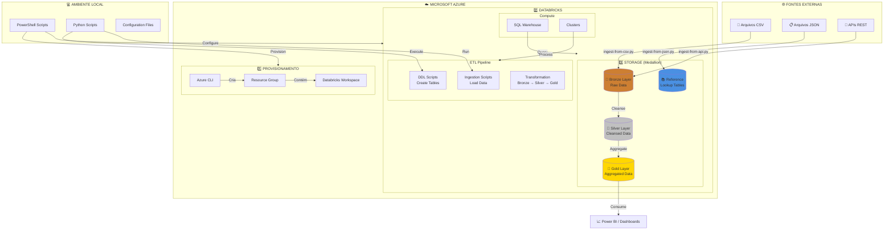
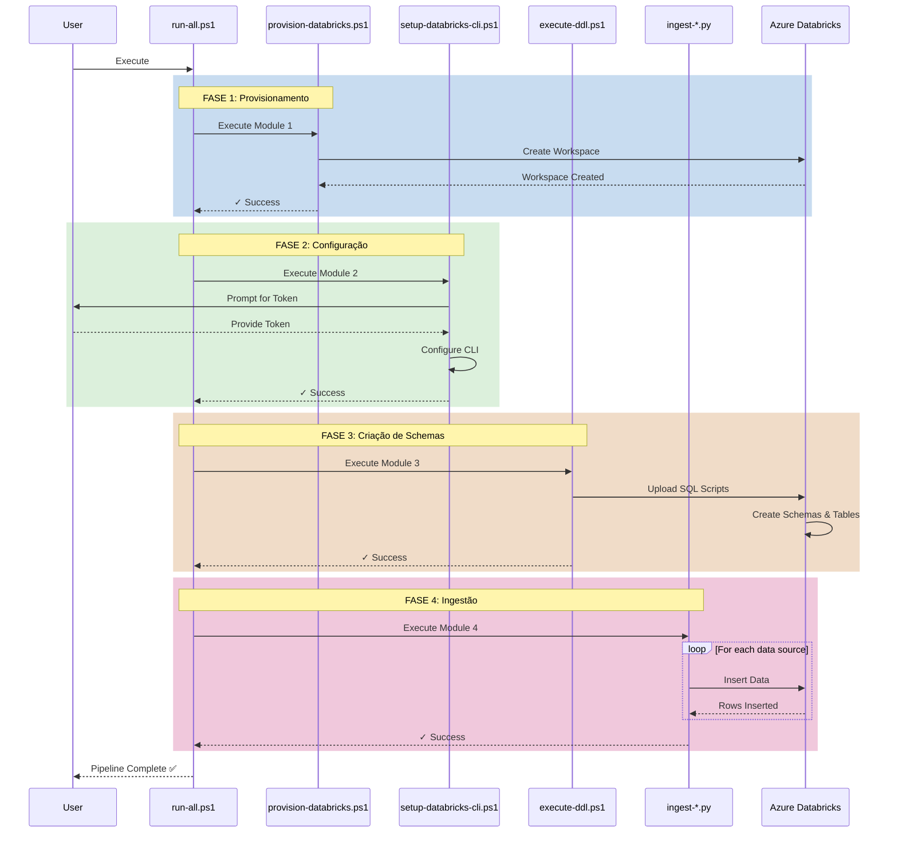
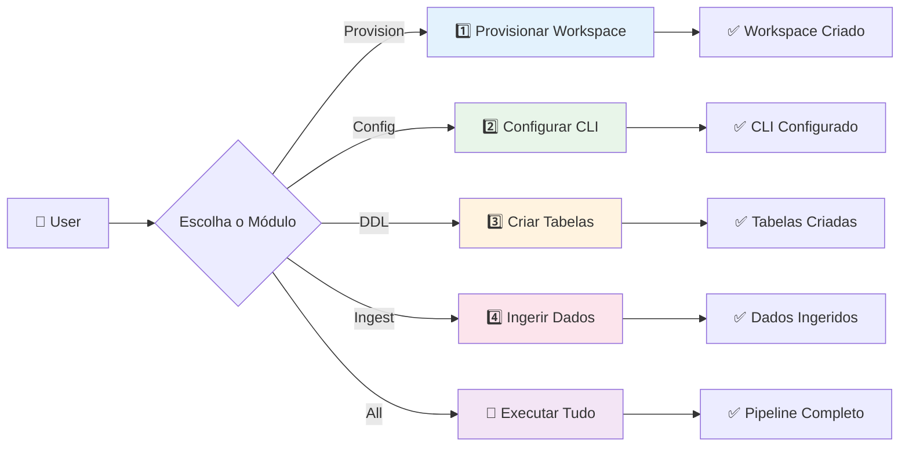
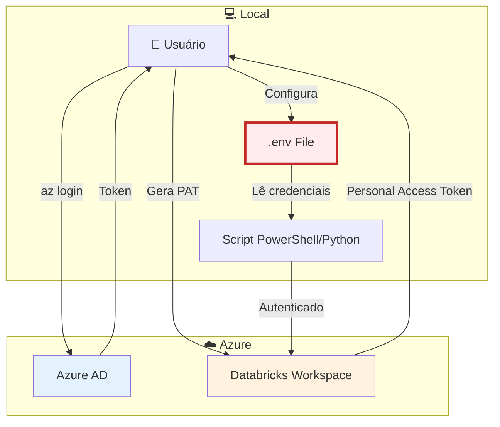
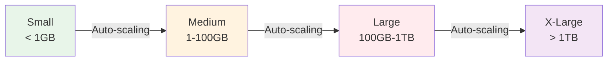
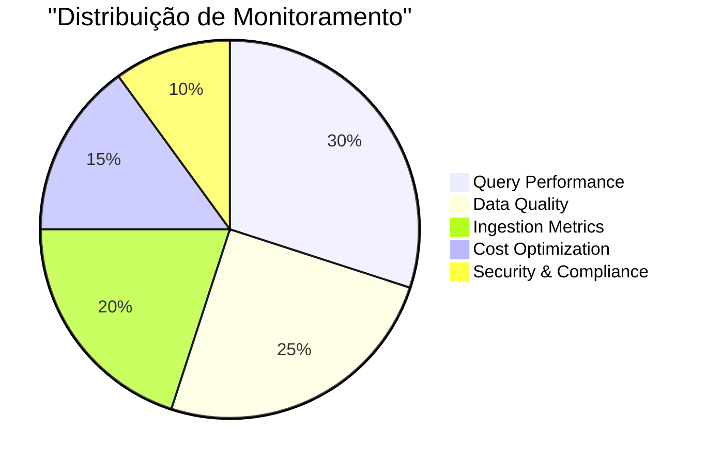

# 📊 Arquitetura da Solução - Azure Databricks Integration

## 🏗️ Visão Geral da Arquitetura



---

## 🔄 Fluxo de Execução

### Modo Completo (run-all.ps1)



### Modo Modular (run-modular.ps1)



---

## 📁 Estrutura de Diretórios

```
azure-databricks-integration/
│
├── 01-provision-azure/              # Módulo de Provisionamento
│   ├── config.template.json         # Configuração do workspace
│   ├── provision-databricks.ps1     # Script de criação
│   └── databricks-workspace-info.json  # Info do workspace (gerado)
│
├── 02-configure-databricks/         # Módulo de Configuração
│   └── setup-databricks-cli.ps1     # Configura autenticação
│
├── 03-database-setup/               # Módulo de DDL
│   ├── create-schemas.sql           # Cria Bronze, Silver, Gold, Reference
│   ├── create-tables.sql            # Cria todas as tabelas
│   └── execute-ddl.ps1              # Upload e execução
│
├── 04-data-ingestion/               # Módulo de Ingestão
│   ├── requirements.txt             # Dependências Python
│   ├── execute-sql-via-api.py       # Executa SQL via API
│   ├── ingest-from-csv.py           # Ingere CSVs
│   ├── ingest-from-json.py          # Ingere JSONs
│   └── ingest-from-api.py           # Ingere de APIs REST
│
├── 05-orchestration/                # Módulo de Orquestração
│   ├── run-all.ps1                  # 🚀 Pipeline completo
│   └── run-modular.ps1              # Execução modular
│
├── .env.example                     # Template de variáveis
├── .gitignore                       # Proteção de credenciais
├── README.md                        # Documentação completa
├── QUICKSTART.md                    # Guia rápido
└── ARCHITECTURE.md                  # Este arquivo
```

---

## 🔐 Segurança e Credenciais

### Fluxo de Autenticação



### ⚠️ Arquivos que NUNCA devem ser commitados

```
❌ .env                           # Credenciais reais
❌ .databrickscfg                 # Config do CLI
❌ databricks-workspace-info.json # Info do workspace
❌ *.token                        # Tokens de acesso
```

✅ **Use sempre:** `.env.example` como template (sem credenciais reais)

---

## 🎯 Camadas de Dados (Medallion Architecture)

### Bronze Layer 🥉
- **Objetivo:** Dados brutos (raw data)
- **Características:**
  - Cópia exata da fonte
  - Sem transformações
  - Metadados de ingestão adicionados
- **Exemplo:** `bronze.taxi_trips_raw`

### Silver Layer 🥈
- **Objetivo:** Dados limpos e validados
- **Características:**
  - Validações de qualidade aplicadas
  - Dados tipados corretamente
  - Campos calculados
- **Exemplo:** `silver.taxi_trips`

### Gold Layer 🥇
- **Objetivo:** Dados agregados para consumo
- **Características:**
  - Métricas de negócio
  - Agregações e resumos
  - Otimizado para BI
- **Exemplo:** `gold.daily_trips_summary`

### Reference Layer 📚
- **Objetivo:** Dados de referência
- **Características:**
  - Lookup tables
  - Dimensões
  - Master data
- **Exemplo:** `reference.payment_types`

---

## 🚀 Performance e Escalabilidade

### Estratégias de Otimização

| Aspecto | Estratégia | Implementação |
|---------|------------|---------------|
| **Ingestão** | Batch processing | Lotes de 1000 registros |
| **Storage** | Delta Lake | Todas as tabelas usam `USING delta` |
| **Compute** | SQL Warehouse | Execução serverless |
| **Particionamento** | Por data | `PARTITION BY (trip_date)` |
| **Z-Ordering** | Colunas frequentes | `OPTIMIZE ... ZORDER BY (pickup_location_id)` |

### Escalabilidade



---

## 📊 Monitoramento e Observabilidade

### Métricas Recomendadas



### Dashboards Sugeridos

1. **Pipeline Health**
   - Taxa de sucesso de ingestões
   - Latência de processamento
   - Erros por fonte

2. **Data Quality**
   - Registros validados vs. rejeitados
   - Percentual de nulls por coluna
   - Anomalias detectadas

3. **Cost Analysis**
   - DBU consumption por dia
   - Storage growth
   - Query costs

---

## 🔄 Integração com CI/CD

### GitHub Actions Example

```yaml
name: Databricks Pipeline

on:
  schedule:
    - cron: '0 2 * * *'  # Daily at 2 AM
  workflow_dispatch:

jobs:
  ingest:
    runs-on: ubuntu-latest
    steps:
      - uses: actions/checkout@v3
      
      - name: Setup Python
        uses: actions/setup-python@v4
        with:
          python-version: '3.11'
      
      - name: Install dependencies
        run: pip install -r 04-data-ingestion/requirements.txt
      
      - name: Ingest data
        env:
          DATABRICKS_HOST: ${{ secrets.DATABRICKS_HOST }}
          DATABRICKS_TOKEN: ${{ secrets.DATABRICKS_TOKEN }}
          DATABRICKS_HTTP_PATH: ${{ secrets.DATABRICKS_HTTP_PATH }}
        run: |
          python 04-data-ingestion/ingest-from-csv.py \
            --file data/latest.csv \
            --table bronze.taxi_trips_raw \
            --mode append
```

---

## 🎓 Próximos Passos

### Curto Prazo (1-2 semanas)
- [ ] Implementar transformações Silver → Gold
- [ ] Criar notebooks de análise exploratória
- [ ] Configurar alertas de Data Quality

### Médio Prazo (1-2 meses)
- [ ] Implementar Unity Catalog (governança)
- [ ] Criar dashboards Power BI
- [ ] Automatizar via Azure Data Factory

### Longo Prazo (3-6 meses)
- [ ] Implementar ML pipelines
- [ ] Streaming data com Delta Live Tables
- [ ] Multi-cloud deployment

---

*Powered by Avanade™ Core - Data Engineering Agents*
