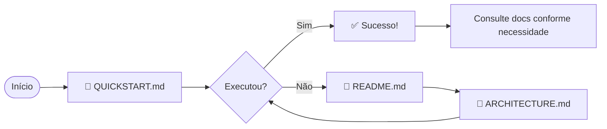
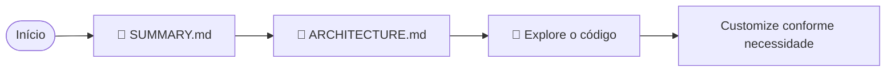

# 📚 Índice da Documentação - Azure Databricks Integration

Bem-vindo! Use este índice para navegar rapidamente pela documentação.

---

## 🚀 Começando

| Documento | Quando Usar | Tempo |
|-----------|-------------|-------|
| **[QUICK-TEST-COMMUNITY.md](QUICK-TEST-COMMUNITY.md)** | 🆓 Quer testar GRÁTIS no Community Edition | 10 min |
| **[QUICKSTART.md](QUICKSTART.md)** | Quer começar com Azure Databricks | 5 min |
| **[README.md](README.md)** | Primeira vez usando a solução | 15 min |
| **[COMMUNITY-EDITION.md](COMMUNITY-EDITION.md)** | Entender diferenças Azure vs Community | 10 min |
| **[SUMMARY.md](SUMMARY.md)** | Resumo executivo para gestores | 10 min |

---

## 📖 Documentação Técnica

### Por Tipo de Usuário

#### 👨‍💻 Para Data Engineers
1. **[QUICK-TEST-COMMUNITY.md](QUICK-TEST-COMMUNITY.md)** - Teste grátis em 10 min
2. **[README.md](README.md)** - Guia completo de uso
3. **[04-data-ingestion/](04-data-ingestion/)** - Scripts de ingestão
4. **[03-database-setup/](03-database-setup/)** - Scripts SQL

#### 🏗️ Para Arquitetos
1. **[ARCHITECTURE.md](ARCHITECTURE.md)** - Diagramas e arquitetura
2. **[SUMMARY.md](SUMMARY.md)** - Visão geral da solução

#### 👔 Para Gestores
1. **[SUMMARY.md](SUMMARY.md)** - Resumo executivo
2. **[QUICKSTART.md](QUICKSTART.md)** - Demonstração rápida

---

## 📁 Estrutura de Arquivos

```
azure-databricks-integration/
│
├── 📄 README.md                     ← Documentação completa
├── 📄 QUICKSTART.md                 ← Guia de início rápido
├── 📄 SUMMARY.md                    ← Resumo executivo
├── 📄 ARCHITECTURE.md               ← Diagramas e arquitetura
├── 📄 INDEX.md                      ← Este arquivo
│
├── 🔐 .env.example                  ← Template de credenciais
├── 🔐 .gitignore                    ← Proteção de credenciais
│
├── 📂 01-provision-azure/           ← Módulo 1: Provisionamento
│   ├── config.template.json         ← Configuração do workspace
│   ├── provision-databricks.ps1     ← Script de provisionamento
│   └── databricks-workspace-info.json (gerado após execução)
│
├── 📂 02-configure-databricks/      ← Módulo 2: Configuração
│   └── setup-databricks-cli.ps1     ← Configura CLI e autenticação
│
├── 📂 03-database-setup/            ← Módulo 3: DDL
│   ├── create-schemas.sql           ← Cria Bronze/Silver/Gold/Reference
│   ├── create-tables.sql            ← Cria todas as tabelas
│   └── execute-ddl.ps1              ← Upload e execução
│
├── 📂 04-data-ingestion/            ← Módulo 4: Ingestão
│   ├── requirements.txt             ← Dependências Python
│   ├── execute-sql-via-api.py       ← Executa SQL via API
│   ├── ingest-from-csv.py           ← Ingere arquivos CSV
│   ├── ingest-from-json.py          ← Ingere arquivos JSON
│   └── ingest-from-api.py           ← Ingere de APIs REST
│
└── 📂 05-orchestration/             ← Módulo 5: Orquestração
    ├── run-all.ps1                  ← 🚀 Executa pipeline completo
    └── run-modular.ps1              ← Executa módulos selecionados
```

---

## 🎯 Fluxo de Leitura Recomendado

### Para Usuários Novos



1. **[QUICKSTART.md](QUICKSTART.md)** - 5 minutos
2. Tente executar: `cd 05-orchestration && .\run-all.ps1`
3. Se encontrar problemas: **[README.md](README.md)**
4. Para entender melhor: **[ARCHITECTURE.md](ARCHITECTURE.md)**

### Para Usuários Experientes



1. **[SUMMARY.md](SUMMARY.md)** - Visão geral
2. **[ARCHITECTURE.md](ARCHITECTURE.md)** - Entenda a arquitetura
3. Explore os módulos que precisa
4. Customize conforme sua necessidade

---

## 📖 Documentação por Tópico

### Provisionamento
- **[01-provision-azure/provision-databricks.ps1](01-provision-azure/provision-databricks.ps1)**
- Como configurar: **[README.md#Provisionamento](README.md)**

### Autenticação
- **[02-configure-databricks/setup-databricks-cli.ps1](02-configure-databricks/setup-databricks-cli.ps1)**
- Credenciais: **[.env.example](.env.example)**

### Criação de Tabelas
- **[03-database-setup/create-schemas.sql](03-database-setup/create-schemas.sql)**
- **[03-database-setup/create-tables.sql](03-database-setup/create-tables.sql)**

### Ingestão de Dados
- CSV: **[04-data-ingestion/ingest-from-csv.py](04-data-ingestion/ingest-from-csv.py)**
- JSON: **[04-data-ingestion/ingest-from-json.py](04-data-ingestion/ingest-from-json.py)**
- API: **[04-data-ingestion/ingest-from-api.py](04-data-ingestion/ingest-from-api.py)**

### Orquestração
- Pipeline completo: **[05-orchestration/run-all.ps1](05-orchestration/run-all.ps1)**
- Modular: **[05-orchestration/run-modular.ps1](05-orchestration/run-modular.ps1)**

---

## 🔍 Busca Rápida

### "Como faço para..."

| Pergunta | Resposta |
|----------|----------|
| ...testar GRÁTIS? | [QUICK-TEST-COMMUNITY.md](QUICK-TEST-COMMUNITY.md) ⭐ |
| ...começar rapidamente? | [QUICKSTART.md](QUICKSTART.md) |
| ...usar Community Edition? | [COMMUNITY-EDITION.md](COMMUNITY-EDITION.md) |
| ...entender a arquitetura? | [ARCHITECTURE.md](ARCHITECTURE.md) |
| ...configurar credenciais? | [.env.example](.env.example) |
| ...provisionar o workspace? | [01-provision-azure/](01-provision-azure/) |
| ...ingerir dados de CSV? | [04-data-ingestion/ingest-from-csv-universal.py](04-data-ingestion/ingest-from-csv-universal.py) |
| ...executar tudo automaticamente? | [05-orchestration/run-all.ps1](05-orchestration/run-all.ps1) |
| ...ver exemplos de uso? | [README.md#Exemplos](README.md) |

### "Estou tendo problema com..."

| Problema | Solução |
|----------|---------|
| ...autenticação | [README.md#Gestão-de-Credenciais](README.md) |
| ...Azure CLI | [QUICKSTART.md#Troubleshooting](QUICKSTART.md) |
| ...Python dependencies | `pip install -r 04-data-ingestion/requirements.txt` |
| ...SQL Warehouse | [README.md#Configuração](README.md) |

---

## 📊 Diagramas

Todos os diagramas estão em: **[ARCHITECTURE.md](ARCHITECTURE.md)**

- Arquitetura Geral
- Fluxo de Execução
- Sequência de Módulos
- Estrutura de Dados (Medallion)
- Fluxo de Autenticação

---

## 🎓 Recursos Adicionais

### Documentação Externa

- **Azure Databricks**: https://learn.microsoft.com/azure/databricks/
- **Databricks SQL**: https://docs.databricks.com/sql/
- **Delta Lake**: https://delta.io/
- **Python Databricks SDK**: https://docs.databricks.com/dev-tools/python-sql-connector.html

### Tutoriais Relacionados

- **Medallion Architecture**: [README.md#Arquitetura-de-Dados](README.md)
- **Data Quality**: [03-database-setup/create-tables.sql](03-database-setup/create-tables.sql)
- **CI/CD**: [ARCHITECTURE.md#Integração-CI-CD](ARCHITECTURE.md)

---

## 🆘 Onde Obter Ajuda?

1. **Primeira parada**: [README.md](README.md) - Seção de Troubleshooting
2. **Problemas de autenticação**: [.env.example](.env.example)
3. **Entender erros**: Verifique os logs dos scripts
4. **Arquitetura**: [ARCHITECTURE.md](ARCHITECTURE.md)

---

## 📝 Checklist de Setup

Siga esta lista para garantir que tudo está configurado:

- [ ] Leu [QUICKSTART.md](QUICKSTART.md)
- [ ] Azure CLI instalado
- [ ] Python 3.9+ instalado
- [ ] Databricks CLI instalado
- [ ] Subscription ID disponível
- [ ] Executou `az login`
- [ ] Configurou [.env](.env.example)
- [ ] Executou `.\run-all.ps1`
- [ ] Verificou workspace no Azure Portal
- [ ] Testou ingestão de dados

---

## 🔄 Atualizações

| Versão | Data | Mudanças |
|--------|------|----------|
| 1.0 | 2026-02-04 | Release inicial completo |

---

*Use este índice como seu ponto de partida para navegar pela documentação.*  
*Sugestões de melhoria? Adicione ao README.md!*

---

**Próximo passo:** Comece com [QUICKSTART.md](QUICKSTART.md) 🚀
