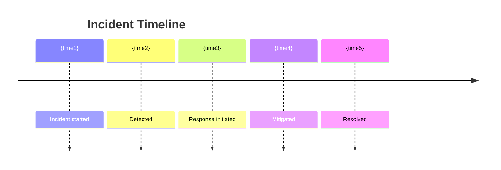

# Task: Incident Review & Preventive Actions

**Command:** `*incident-review`  
**Agent:** IterationImprovement (Kai)  
**Output:** `incident-review.md`

---

## Objective

Transform incidents into learning opportunities by conducting structured reviews, identifying root causes, and defining preventive actions to avoid recurrence.

---

## Prerequisites

- [ ] Incident details documented
- [ ] Incident timeline available
- [ ] Access to relevant logs and metrics
- [ ] Key participants available for review

---

## Steps

### Step 1: Gather Incident Information

Collect basic incident data:

```yaml
incident:
  id: "{INC-XXX}"
  title: "{brief description}"
  severity: "{P1|P2|P3|P4}"
  status: "{resolved|ongoing|review}"
  
  timeline:
    detected: "{timestamp}"
    acknowledged: "{timestamp}"
    mitigated: "{timestamp}"
    resolved: "{timestamp}"
    
  impact:
    affected_systems: ["{system1}", "{system2}"]
    affected_users: {number}
    duration: "{minutes/hours}"
    data_affected: "{description}"
    
  response:
    detected_by: "{monitoring|user|automated}"
    responders: ["{name1}", "{name2}"]
    communication: "{channels used}"
```

### Step 2: Build Timeline

Create detailed timeline:

| Time | Event | Actor | Notes |
|------|-------|-------|-------|
| {timestamp} | {event} | {who} | {details} |

### Step 3: Root Cause Analysis

Use 5 Whys or Fishbone analysis:

**5 Whys:**
1. Why did the incident occur? → {answer}
2. Why? → {answer}
3. Why? → {answer}
4. Why? → {answer}
5. Why? → {root cause}

### Step 4: Identify Contributing Factors

| Category | Factor | Contributed? | Notes |
|----------|--------|--------------|-------|
| **Process** | Missing validation | Yes/No | {details} |
| **Technology** | System limitation | Yes/No | {details} |
| **People** | Training gap | Yes/No | {details} |
| **External** | Third-party issue | Yes/No | {details} |

### Step 5: Define Preventive Actions

For each root cause/contributing factor:

```yaml
preventive_action:
  action_id: "{PA-XXX}"
  description: "{action description}"
  
  addresses:
    root_cause: "{root cause}"
    contributing_factor: "{factor}"
    
  implementation:
    owner: "{name}"
    deadline: "{date}"
    effort: "{hours/days}"
    priority: "{P1|P2|P3}"
    
  validation:
    how_to_verify: "{verification method}"
    success_criteria: "{criteria}"
```

### Step 6: Document Learnings

Capture organizational knowledge:
- What worked well
- What could be improved
- New knowledge gained
- Process changes needed

---

## Output Template

```markdown
# Incident Review Report

**Incident ID:** {INC-XXX}  
**Title:** {incident title}  
**Severity:** {P1/P2/P3/P4}  
**Review Date:** {date}  
**Author:** IterationImprovement  
**Status:** {Complete/In Progress}

---

## Executive Summary

| Attribute | Value |
|-----------|-------|
| **Incident Date** | {date} |
| **Duration** | {hours/minutes} |
| **Impact** | {brief impact description} |
| **Root Cause** | {one-line root cause} |
| **Actions** | {number} preventive actions defined |

---

## Incident Overview

### What Happened

{Clear description of what happened, written for someone who wasn't there}

### Impact

| Dimension | Impact |
|-----------|--------|
| **Systems Affected** | {list of systems} |
| **Users Affected** | {number/percentage} |
| **Data Impact** | {description} |
| **Duration** | {total duration} |
| **Business Impact** | {revenue/operations/reputation} |

### Severity Justification

**Severity: {P1/P2/P3/P4}**

{Explanation of why this severity level was assigned}

---

## Timeline

### Key Events



### Detailed Timeline

| Time | Event | Actor | Evidence |
|------|-------|-------|----------|
| {timestamp} | {First indication of issue} | {monitoring/user} | {log/alert} |
| {timestamp} | {Detection confirmed} | {name} | {action taken} |
| {timestamp} | {Response started} | {name} | {action taken} |
| {timestamp} | {Mitigation applied} | {name} | {action taken} |
| {timestamp} | {Verification complete} | {name} | {confirmation} |
| {timestamp} | {Incident resolved} | {name} | {closure} |

### Response Metrics

| Metric | Value | Target | Status |
|--------|-------|--------|--------|
| Time to Detect | {minutes} | {target} | ✅/❌ |
| Time to Respond | {minutes} | {target} | ✅/❌ |
| Time to Mitigate | {minutes} | {target} | ✅/❌ |
| Time to Resolve | {minutes} | {target} | ✅/❌ |

---

## Root Cause Analysis

### 5 Whys Analysis

| # | Question | Answer |
|---|----------|--------|
| 1 | Why did the incident occur? | {answer} |
| 2 | Why did that happen? | {answer} |
| 3 | Why did that happen? | {answer} |
| 4 | Why did that happen? | {answer} |
| 5 | Why did that happen? | **ROOT CAUSE: {root cause}** |

### Contributing Factors

```mermaid
fishbone
    title Incident Contributing Factors
    Process
        Missing validation
        No approval gate
    Technology
        Legacy system
        No redundancy
    People
        Training gap
        New team member
    External
        Third-party outage
        Network issue
```

| Factor | Category | Impact | Addressable? |
|--------|----------|--------|--------------|
| {factor 1} | Process | High/Med/Low | Yes/No |
| {factor 2} | Technology | High/Med/Low | Yes/No |
| {factor 3} | People | High/Med/Low | Yes/No |

### Root Cause Statement

{Clear, concise statement of the root cause}

---

## What Went Well

| # | Item | Why It Matters |
|---|------|----------------|
| 1 | {positive item} | {impact} |
| 2 | {positive item} | {impact} |
| 3 | {positive item} | {impact} |

## What Could Be Improved

| # | Item | Proposed Improvement |
|---|------|---------------------|
| 1 | {improvement area} | {suggested change} |
| 2 | {improvement area} | {suggested change} |
| 3 | {improvement area} | {suggested change} |

---

## Preventive Actions

### Action Summary

| # | Action | Owner | Deadline | Priority | Status |
|---|--------|-------|----------|----------|--------|
| PA-001 | {action} | {owner} | {date} | P1 | 🔄 In Progress |
| PA-002 | {action} | {owner} | {date} | P2 | ⏳ Not Started |
| PA-003 | {action} | {owner} | {date} | P3 | ⏳ Not Started |

### PA-001: {Action Title}

| Attribute | Value |
|-----------|-------|
| **Description** | {detailed description of action} |
| **Addresses** | {root cause/contributing factor} |
| **Owner** | {name} |
| **Deadline** | {date} |
| **Effort** | {hours/days} |
| **Priority** | {P1/P2/P3} |

**Implementation Steps:**
1. {Step 1}
2. {Step 2}
3. {Step 3}

**Success Criteria:**
- {Criterion 1}
- {Criterion 2}

**Verification Method:**
{How we will verify this action prevents recurrence}

---

### PA-002: {Action Title}

| Attribute | Value |
|-----------|-------|
| **Description** | {detailed description of action} |
| **Addresses** | {root cause/contributing factor} |
| **Owner** | {name} |
| **Deadline** | {date} |
| **Effort** | {hours/days} |
| **Priority** | {P1/P2/P3} |

**Implementation Steps:**
1. {Step 1}
2. {Step 2}

**Success Criteria:**
- {Criterion 1}

---

## Learnings & Knowledge Base

### New Knowledge

| # | Learning | Application |
|---|----------|-------------|
| 1 | {what we learned} | {how to apply it} |
| 2 | {what we learned} | {how to apply it} |

### Documentation Updates Needed

| Document | Update Required | Owner | Deadline |
|----------|-----------------|-------|----------|
| {runbook} | {update needed} | {owner} | {date} |
| {architecture doc} | {update needed} | {owner} | {date} |

### Training Recommendations

| Topic | Audience | Format | Priority |
|-------|----------|--------|----------|
| {topic} | {team/role} | {format} | High/Med/Low |

---

## Follow-Up Schedule

| Date | Activity | Participants |
|------|----------|--------------|
| {date} | PA-001 completion review | {names} |
| {date} | PA-002 completion review | {names} |
| {date} | Effectiveness review | {names} |
| {date} | Knowledge sharing session | {team} |

---

## Approval

| Role | Name | Signature | Date |
|------|------|-----------|------|
| Incident Owner | {name} | _________ | _____ |
| Tech Lead | {name} | _________ | _____ |
| Process Owner | {name} | _________ | _____ |

---

## Appendix

### Related Incidents

| Incident ID | Date | Similarity | Status |
|-------------|------|------------|--------|
| {INC-XXX} | {date} | {description} | Resolved |

### Reference Materials

- {Link to logs}
- {Link to monitoring dashboard}
- {Link to related documentation}
```

---

## Handoff

After completing incident review:
- **Track actions:** Add to improvement backlog → `*improvement-backlog`
- **Share learnings:** Run retrospective → `*retrospective`
- **Check status:** View progress → `@orchestrator *status`
