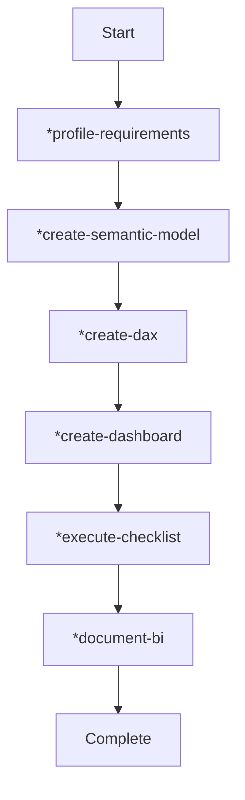
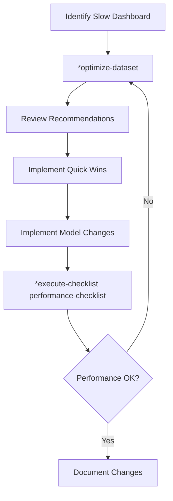
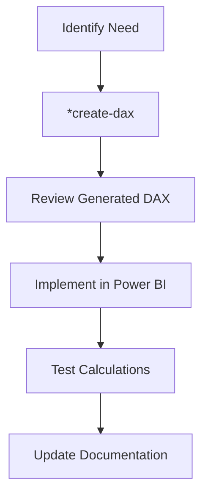

# 📘 InsightForge Agent - Complete Command Manual

**Agent ID:** `bi-developer`  
**Name:** InsightForge  
**Role:** Business Intelligence & Analytics Specialist  
**Version:** 1.0  
**Date:** January 2026

---

## 📑 Table of Contents

1. [Overview](#overview)
2. [Productivity Impact Analysis](#productivity-impact-analysis)
3. [Workflow Guides](#workflow-guides)
4. [Detailed Commands](#detailed-commands)
5. [Demo Scenarios](#demo-scenarios)
6. [Conclusions](#conclusions)

---

## 🎯 Overview

**InsightForge** is a specialized BI development agent that transforms data into actionable insights. It assists in designing dashboards, generating DAX measures, building semantic models, and optimizing Power BI solutions.

### Key Capabilities
- **Semantic Model Design**: Star schema, relationships, hierarchies
- **DAX Development**: Measures, time intelligence, complex calculations
- **Dashboard Creation**: Visual hierarchy, interactivity, mobile layouts
- **Performance Tuning**: Model optimization, query efficiency
- **Security Implementation**: Row-Level Security design and testing
- **Documentation**: Technical specs, user guides, data dictionaries

### Indicative Impacts
| Area | Impact |
|------|--------|
| Semantic Model Generation | 90%+ effort reduction |
| DAX Measure Development | 85-95% effort reduction |
| Dashboard Design | 80-90% effort reduction |
| Performance Tuning | 85-95% effort reduction |
| Documentation | 70-85% effort reduction |

---

## 📈 Productivity Impact Analysis

### Complete BI Project Comparison

**Traditional Approach (2-3 weeks):**
| Phase | Hours |
|-------|-------|
| Requirements gathering | 8 |
| Data modeling | 16 |
| DAX development | 20 |
| Dashboard design | 24 |
| Testing | 12 |
| Documentation | 8 |
| **Total** | **88 hours (11 days)** |

**With InsightForge Agent (2-3 days):**
| Phase | Hours |
|-------|-------|
| Requirements gathering | 1 |
| Data modeling | 2.5 |
| DAX development | 1.5 |
| Dashboard design | 3 |
| Testing | 2 |
| Documentation | 1 |
| **Total** | **11 hours (1.4 days)** |

**Overall Productivity Gain: 87.5%**

---

## 🔄 Workflow Guides

### Workflow 1: New Dashboard from Scratch



**Steps:**
1. **Gather Requirements**: `*profile-requirements`
   - Identify stakeholders and personas
   - Document key business questions
   - Define success criteria

2. **Design Data Model**: `*create-semantic-model`
   - Create star schema
   - Define relationships
   - Build hierarchies

3. **Develop Measures**: `*create-dax`
   - Base aggregations
   - Time intelligence
   - KPIs and comparisons

4. **Design Dashboard**: `*create-dashboard`
   - Visual hierarchy
   - Chart selection
   - Interactivity

5. **Validate**: `*execute-checklist bi-developer-checklist`
   - Model quality
   - Performance
   - Security

6. **Document**: `*document-bi`
   - Technical specs
   - User guide

---

### Workflow 2: Performance Optimization



---

### Workflow 3: Add New Measures to Existing Model



---

## 📋 Detailed Commands

### *create-semantic-model

**Purpose:** Design a complete Power BI semantic model following star schema principles.

**What It Produces:**
- Table definitions (facts and dimensions)
- Relationship specifications
- Hierarchy definitions
- Model diagram (text-based)
- Documentation

**Interactive Questions:**
1. What data sources will be included?
2. What business domain does this serve?
3. What are the key metrics/KPIs?
4. What is the grain of fact tables?
5. Who will use this model?

**Example Output:**
```
semantic-model/
├── model/
│   ├── tables/
│   │   ├── fact-sales.tmdl
│   │   ├── dim-date.tmdl
│   │   └── dim-customer.tmdl
│   └── relationships.tmdl
└── docs/
    ├── data-dictionary.md
    └── model-diagram.md
```

---

### *create-dax

**Purpose:** Generate optimized, well-documented DAX measures.

**What It Produces:**
- Formatted DAX code with comments
- Variable-based calculations
- Time intelligence measures
- Comparison and KPI measures
- Measure documentation

**Interactive Questions:**
1. What does this measure calculate?
2. What calculation type? (Sum, Average, Ratio, etc.)
3. What filters should apply?
4. What format? (Currency, %, Number)
5. Any comparisons needed? (YoY, vs Target)

**Example Output:**
```dax
// Measure: Sales YoY Growth %
// Purpose: Calculate year-over-year sales growth
// Author: InsightForge Agent
// Created: 2026-01-22

Sales YoY % = 
VAR _currentYear = [Total Sales]
VAR _previousYear = [Sales PY]
RETURN
    DIVIDE(
        _currentYear - _previousYear,
        _previousYear,
        BLANK()
    )
```

---

### *create-dashboard

**Purpose:** Design dashboard layouts with visual hierarchy and interactivity.

**What It Produces:**
- Wireframe specifications
- Visual configurations
- Slicer designs
- Interactivity matrix
- Mobile layout
- Color palette

**Interactive Questions:**
1. What decisions will this dashboard support?
2. Who is the target audience?
3. What are the top 5 questions it must answer?
4. What KPIs are critical?
5. Will it be used on mobile?

**Example Output:**
```
+------------------+------------------+------------------+
|    KPI Card      |    KPI Card      |    KPI Card      |
|    Revenue       |    Units         |    Margin %      |
+------------------+------------------+------------------+
|                                     |                  |
|    Revenue Trend Line Chart         |   Top Products   |
|                                     |   Bar Chart      |
+-------------------------------------+------------------+
|              Sales by Region Map                       |
+--------------------------------------------------------+
```

---

### *optimize-dataset

**Purpose:** Analyze and improve Power BI dataset performance.

**What It Produces:**
- Performance analysis report
- Quick wins (immediate fixes)
- Model improvement recommendations
- DAX optimization suggestions
- Before/after comparisons

**Analysis Areas:**
- Column cardinality
- Unused columns
- Data types
- Calculated columns vs measures
- Relationship efficiency
- DAX patterns

---

### *create-rls

**Purpose:** Design and implement Row-Level Security.

**What It Produces:**
- Security model design
- Role definitions with DAX
- Security table design (if needed)
- Testing scenarios
- Admin documentation

**Patterns Supported:**
- Static RLS (group-based)
- Dynamic RLS (user-based)
- Manager hierarchy
- Multi-tenant scenarios

---

## 🎮 Demo Scenarios

### Demo 1: Sales Analytics Dashboard

**Scenario:** Create a complete sales analytics solution for a retail company.

**Steps:**
1. Activate agent: `@bi-developer`
2. Run demo: `*demo`
3. Select: "Sales Analytics Dashboard"

**What You'll See:**
- Requirements document
- Star schema model
- 20+ DAX measures
- Dashboard wireframe
- Performance recommendations

### Demo 2: Executive KPI Scorecard

**Scenario:** Build an executive summary dashboard with KPIs.

**Key Features:**
- Card visuals with trends
- Traffic light indicators
- Drill-through to details
- Mobile-optimized layout

### Demo 3: Financial Reporting

**Scenario:** Create financial statements and budget analysis.

**Key Features:**
- P&L structure
- Variance analysis
- Time intelligence (YTD, QTD, MTD)
- Matrix with hierarchies

---

## 🎯 Best Practices Summary

### Data Modeling
✅ Use star schema  
✅ Create proper date table  
✅ Use business-friendly names  
✅ Document all columns  
❌ Avoid snowflaking  
❌ Avoid high cardinality text columns  

### DAX
✅ Use variables  
✅ Use DIVIDE() function  
✅ Comment complex logic  
✅ Organize in display folders  
❌ Avoid nested iterators  
❌ Avoid unnecessary CALCULATE  

### Dashboard Design
✅ Follow visual hierarchy  
✅ Use appropriate chart types  
✅ Limit visuals per page  
✅ Design for mobile  
❌ Avoid chart junk  
❌ Don't use pie charts for >7 categories  

---

## 📊 Conclusions

The InsightForge agent significantly accelerates BI development by:

1. **Automating Repetitive Tasks**: Model creation, DAX generation, documentation
2. **Enforcing Best Practices**: Built-in patterns and standards
3. **Reducing Errors**: Validated outputs and checklists
4. **Improving Consistency**: Templates and conventions
5. **Enabling Self-Service**: Clear guidance for all skill levels

**Expected ROI**: 10x productivity improvement for typical BI projects

---

## 🚀 Getting Started

1. Install the agent files in your workspace
2. Activate via chat mode: `@bi-developer`
3. Run `*help` to see commands
4. Try `*demo` for an interactive walkthrough
5. Start with `*profile-requirements` for new projects

**Happy Dashboarding! 📊**
