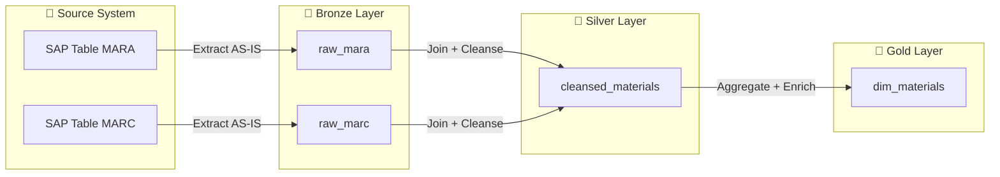

# 📚 Task: Generate Data Lineage Diagrams

## Command
`*generate-lineage`

## Objective
Create Mermaid diagrams mapping data lineage from source to target for all migrated tables. Include transformation steps at each layer (Bronze → Silver → Gold). Group diagrams by business domain for clarity.

---

## Prerequisites

- Artifacts available:
  - `discovery-scout → inventory.json, dependency-graph.json`
  - `logic-extractor → digital-twin.json, pseudocode/*.json`
  - `code-generator → generated-code/*.py`
  - `reconciliation → reconciliation-report.json`

---

## Steps

### 1. Source Analysis
- Parse `inventory.json` to enumerate all source tables and columns
- Parse `dependency-graph.json` to identify inter-table dependencies
- Group tables by business domain (e.g., Materials, Vendors, Plants)

### 2. Transformation Mapping
- Parse `digital-twin.json` to extract transformation logic per field
- Map transformations to Medallion Architecture layers:
  - **Source** → Raw extraction (as-is)
  - **Bronze** → Ingestion layer (type casting, dedup)
  - **Silver** → Cleansed layer (business rules, joins, lookups)
  - **Gold** → Curated layer (aggregations, business metrics)
- Annotate each transformation step with rule description

### 3. Diagram Generation
- Use `lineage-diagram-tmpl.md` template
- Generate one diagram per business domain
- Generate one master diagram showing cross-domain relationships
- Include:
  - Source system and table names
  - Transformation annotations at each layer
  - Target table and column names
  - Data quality checkpoints
  - Record count annotations

### 4. Diagram Validation
- Verify all source tables appear in at least one diagram
- Verify all transformations from `digital-twin.json` are represented
- Check Mermaid syntax validity
- Ensure diagrams render correctly

---

## Output

| File                                                        | Description                           |
|-------------------------------------------------------------|---------------------------------------|
| `projects/{project_name}/outputs/downstream/documentation/lineage-diagrams/lineage-overview.md`       | Master lineage overview diagram       |
| `projects/{project_name}/outputs/downstream/documentation/lineage-diagrams/lineage-{domain}.md`       | Per-domain lineage diagrams           |
| `projects/{project_name}/outputs/downstream/documentation/lineage-diagrams/lineage-cross-domain.md`   | Cross-domain relationship diagram     |
| `projects/{project_name}/outputs/downstream/documentation/lineage-diagrams/lineage-index.md`          | Index of all lineage diagrams         |

---

## Mermaid Diagram Conventions

---

## Quality Criteria

- [ ] All source tables represented in diagrams
- [ ] All transformation rules annotated
- [ ] Diagrams grouped by business domain
- [ ] Master overview diagram present
- [ ] Cross-domain relationships documented
- [ ] All Mermaid syntax valid
- [ ] Legend included in each diagram
- [ ] Both PT-BR and EN-US versions generated
