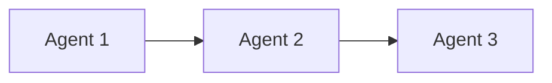
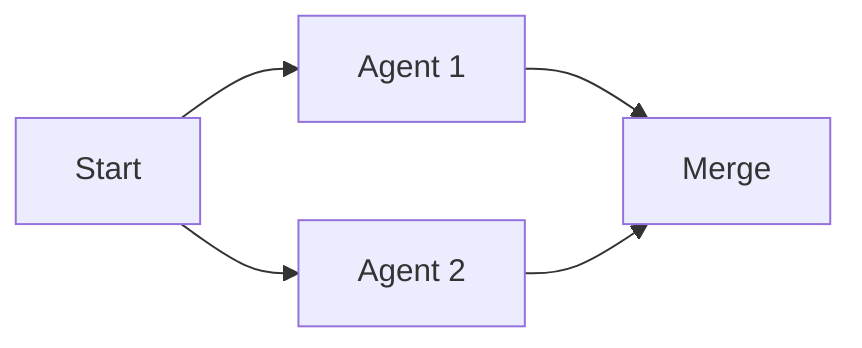
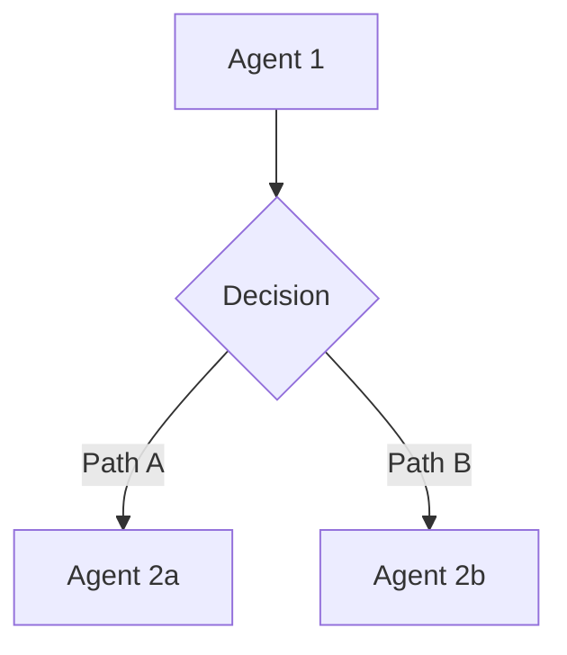
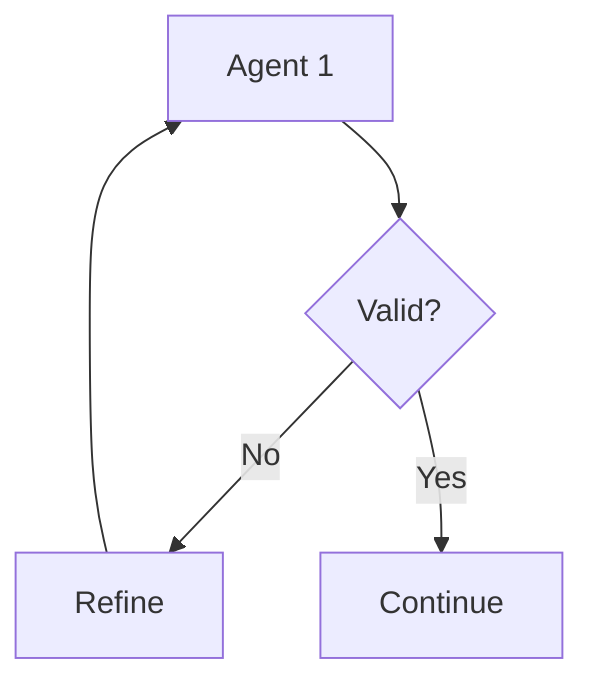

# Agent Design Best Practices

## Multi-Agent System Principles

### 1. Single Responsibility

Each agent should have one clear purpose:
- **Good**: "DataModeler creates data models"
- **Bad**: "DataAgent does modeling, ETL, and reporting"

### 2. Clear Contracts

Define explicit I/O for every agent:

```yaml
agent_contract:
  inputs:
    required:
      - artifact: "sttm.md"
        from_agent: "business-analyst"
    optional:
      - artifact: "context.md"
  outputs:
    - artifact: "data-model.md"
      to_agent: "data-engineer-exec"
```

### 3. Gates as Guardrails

Use gates to ensure quality between phases:

| Gate | Purpose | Validation |
|------|---------|------------|
| Gate 1 | Discovery → Design | Requirements complete |
| Gate 2 | Design → Implementation | Architecture approved |
| Gate 3 | Implementation → Production | Tests passing |

---

## Autonomy Design

### Risk-Based Autonomy

| Risk Level | Autonomy | Human Role | Example |
|------------|----------|------------|---------|
| High | Level 1-2 | Decides/Approves | Schema changes |
| Medium | Level 2-3 | Approves/Audits | Code generation |
| Low | Level 3-4 | Audits/Observes | Documentation |

### Autonomy Level Guidelines

**Level 1 - Assisted**
- Agent provides suggestions
- Human makes all decisions
- Use for: strategic decisions, critical changes

**Level 2 - Supervised**
- Agent executes drafts
- Human approves before commit
- Use for: code generation, model creation

**Level 3 - Monitored**
- Agent executes fully
- Human audits results
- Use for: data validation, testing

**Level 4 - Autonomous**
- Agent runs independently
- Human observes metrics
- Use for: logging, monitoring, metrics

---

## Contract Patterns

### Input Contract Template

```yaml
input:
  artifact: "{artifact_name}"
  from_agent: "{source_agent}"
  validation:
    - required: true
    - schema: "{schema_ref}"
    - freshness: "< 24 hours"
```

### Output Contract Template

```yaml
output:
  artifact: "{artifact_name}"
  to_agents: ["{target_agent_1}", "{target_agent_2}"]
  format: "markdown|yaml|json"
  quality:
    - completeness: 100%
    - validation: "schema_check"
```

### Error Handling Template

```yaml
error_handling:
  retry:
    count: 3
    delay: "exponential"
    max_delay: "5 minutes"
  fallback:
    type: "escalate|default|skip"
    target: "{fallback_agent_or_human}"
  notification:
    channel: "slack|email"
    recipients: ["{team}"]
```

---

## Orchestration Patterns

### Sequential Flow

Use when: strict order required, each step depends on previous

### Parallel Flow

Use when: independent tasks, speed optimization needed

### Conditional Flow

Use when: different paths based on results

### Loop Flow

Use when: iterative improvement needed

---

## Human-in-the-Loop Triggers

### When to Require Human Approval

1. **Confidence Below Threshold**
   - Agent uncertainty > 20%
   - Multiple valid options exist
   - Edge case detected

2. **Critical Decisions**
   - Schema changes
   - Production deployments
   - Security configurations

3. **Error Conditions**
   - Repeated failures
   - Unexpected data
   - Constraint violations

4. **Scheduled Checkpoints**
   - Gate transitions
   - Sprint boundaries
   - Milestone reviews

### Human Interaction Patterns

| Pattern | When | Example |
|---------|------|---------|
| Approval | Before action | Deploy to prod |
| Review | After action | Code review |
| Override | During execution | Stop process |
| Escalation | On error | System failure |

---

## Anti-Patterns to Avoid

### ❌ God Agent
One agent that does everything → Split into specialized agents

### ❌ Circular Dependencies
A → B → C → A → ... → Introduce orchestrator or redesign flow

### ❌ Missing Contracts
Implicit data passing → Always define explicit contracts

### ❌ No Error Handling
Happy path only → Define fallbacks and escalations

### ❌ Over-Autonomy
Full autonomy for critical tasks → Match autonomy to risk

### ❌ Under-Documentation
"Agent does stuff" → Document purpose, I/O, behavior clearly
