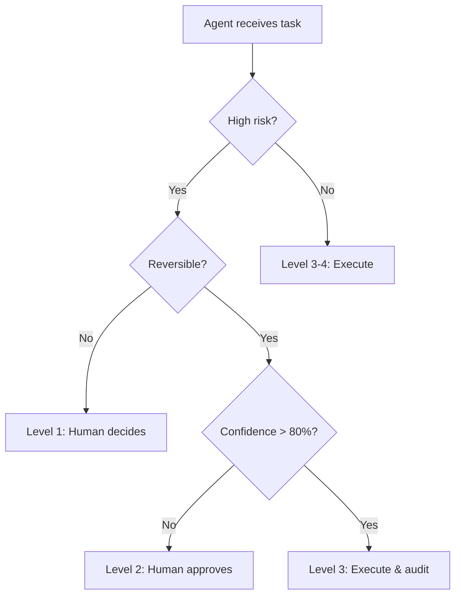
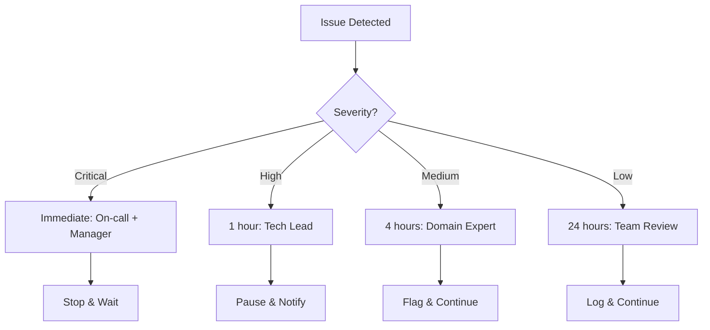

# Task: Define Autonomy Matrix

**Command:** `*autonomy-matrix`  
**Agent:** AgentDesigner (Nova)  
**Output:** `autonomy-matrix.md`

---

## Objective

Define the autonomy levels for each agent in the system, specifying when human intervention is required and establishing clear escalation paths.

---

## Prerequisites

- [ ] Agent blueprint defined
- [ ] Agent contracts documented
- [ ] Risk assessment completed
- [ ] Stakeholder expectations understood

---

## Steps

### Step 1: Define Autonomy Levels

Standard autonomy levels:

| Level | Name | Description | Human Role |
|-------|------|-------------|------------|
| **1** | Assisted | Agent suggests, human decides | Decision maker |
| **2** | Supervised | Agent acts, human approves | Approver |
| **3** | Monitored | Agent acts, human audits | Auditor |
| **4** | Autonomous | Agent acts independently | Observer |

### Step 2: Assess Risk Factors

For each action/decision, assess:

| Factor | Low Risk | Medium Risk | High Risk |
|--------|----------|-------------|-----------|
| **Reversibility** | Easy to undo | Moderate effort | Irreversible |
| **Impact** | Single record | Dataset/table | System-wide |
| **Confidence** | >95% certain | 80-95% certain | <80% certain |
| **Cost** | <$100 | $100-$10K | >$10K |
| **Compliance** | No regulations | Some rules | Critical |

### Step 3: Map Actions to Autonomy

For each agent, classify actions:

```yaml
agent_autonomy:
  agent_id: "{agent_name}"
  
  actions:
    - action: "{action description}"
      autonomy_level: 1-4
      risk_factors:
        reversibility: low|medium|high
        impact: low|medium|high
        confidence_required: {percentage}
      escalation:
        trigger: "{when to escalate}"
        to: "{role/person}"
```

### Step 4: Define Escalation Paths

| Trigger | From | To | Response Time |
|---------|------|----|--------------| 
| Confidence < 80% | Agent | Analyst | Immediate |
| Error rate > 5% | Agent | Engineer | 1 hour |
| Critical decision | Agent | Architect | Before action |
| Cost > threshold | Agent | Manager | Before action |

### Step 5: Create Decision Tree



---

## Output Template

```markdown
# Autonomy Matrix

**Project:** {project_name}  
**Date:** {date}  
**Author:** AgentDesigner  
**Version:** 1.0

---

## Executive Summary

This document defines the autonomy levels for each agent in the system, establishing clear boundaries for when agents can act independently versus when human intervention is required.

---

## Autonomy Level Definitions

| Level | Name | Agent Behavior | Human Role | Examples |
|-------|------|----------------|------------|----------|
| **1** | Assisted | Suggests options | Decides | PRD creation, architecture decisions |
| **2** | Supervised | Prepares action | Approves before execution | Code generation, schema changes |
| **3** | Monitored | Executes action | Reviews after execution | Validation, documentation |
| **4** | Autonomous | Full independence | Notified only | Logging, formatting, metrics |

---

## Risk Assessment Framework

### Risk Scoring

| Factor | Score 1 (Low) | Score 2 (Medium) | Score 3 (High) |
|--------|---------------|------------------|----------------|
| Reversibility | One-click undo | Effort to revert | Irreversible |
| Impact Scope | One record | One dataset | Multiple systems |
| Data Sensitivity | Public | Internal | Confidential/PII |
| Cost Implication | <$100 | $100-$10K | >$10K |
| Compliance Risk | None | Moderate | Critical |

### Autonomy Level Based on Risk

| Total Risk Score | Recommended Level |
|------------------|-------------------|
| 5-7 | Level 4 (Autonomous) |
| 8-10 | Level 3 (Monitored) |
| 11-13 | Level 2 (Supervised) |
| 14-15 | Level 1 (Assisted) |

---

## Agent Autonomy Matrix

### UPSTREAM Agents

#### Alex (DataStrategist)

| Action | Level | Risk | Rationale | Escalation |
|--------|-------|------|-----------|------------|
| Generate problem statement draft | 2 | Medium | Business-critical doc | Business owner approval |
| Suggest KPIs | 3 | Low | Advisory role | None |
| Create stakeholder map | 3 | Low | Documentation | None |
| Define success criteria | 2 | Medium | Impacts scope | Tech lead approval |

#### Mary (BusinessAnalyst)

| Action | Level | Risk | Rationale | Escalation |
|--------|-------|------|-----------|------------|
| Create STTM draft | 2 | Medium | Core mapping doc | Architect review |
| Define analytical questions | 3 | Low | Requirements gathering | None |
| Initial DQ requirements | 3 | Low | First pass | DataSteward review |

### MIDSTREAM Agents

#### Winston (DataArchitect)

| Action | Level | Risk | Rationale | Escalation |
|--------|-------|------|-----------|------------|
| Design architecture | 2 | High | System-wide impact | Tech lead approval |
| Select technology | 1 | High | Cost & commitment | Manager decision |
| Create ADRs | 2 | Medium | Decision records | Tech lead review |
| Data model design | 2 | Medium | Foundation doc | Team review |

#### Sofia (DataModeler)

| Action | Level | Risk | Rationale | Escalation |
|--------|-------|------|-----------|------------|
| Create logical model | 3 | Medium | Design artifact | Architect review |
| Define granularity | 3 | Medium | Technical decision | None |
| Metadata documentation | 4 | Low | Documentation | None |
| Data contracts | 2 | Medium | Interface definition | Consumer approval |

#### Nova (AgentDesigner)

| Action | Level | Risk | Rationale | Escalation |
|--------|-------|------|-----------|------------|
| Agent blueprint | 2 | Medium | System behavior | Architect approval |
| Guardrails definition | 2 | High | Safety controls | Tech lead approval |
| Orchestration flow | 3 | Medium | Process design | Team review |

#### Gaia (DataSteward)

| Action | Level | Risk | Rationale | Escalation |
|--------|-------|------|-----------|------------|
| DQ rules definition | 3 | Medium | Quality controls | Engineer review |
| Data classification | 2 | High | Compliance impact | Security approval |
| Governance framework | 2 | High | Policy document | Manager approval |

### DOWNSTREAM Agents

#### Diego (DataEngineerExec)

| Action | Level | Risk | Rationale | Escalation |
|--------|-------|------|-----------|------------|
| Generate DDL scripts | 3 | Medium | Schema creation | Architect review |
| Generate ETL scripts | 3 | Medium | Transformation logic | Code review |
| Execute in dev | 4 | Low | Dev environment | None |
| Execute in prod | 1 | High | Production impact | Deployment approval |
| Create unit tests | 4 | Low | Quality improvement | None |
| Schema modifications | 2 | High | Breaking changes | Architect approval |

#### Bianca (BiSemantic)

| Action | Level | Risk | Rationale | Escalation |
|--------|-------|------|-----------|------------|
| Design semantic model | 3 | Medium | BI foundation | Analyst review |
| Create DAX measures | 3 | Medium | Calculation logic | Business review |
| Dashboard specification | 3 | Low | Visual design | User feedback |
| RLS implementation | 2 | High | Security control | Security approval |
| Publish to production | 2 | Medium | User-facing | PO approval |

#### Kai (IterationImprovement)

| Action | Level | Risk | Rationale | Escalation |
|--------|-------|------|-----------|------------|
| Analyze metrics | 4 | Low | Read-only analysis | None |
| Create improvement backlog | 3 | Low | Suggestions | Team review |
| Facilitate retrospective | 3 | Low | Process facilitation | None |
| Implement cost optimization | 2 | Medium | Resource changes | Manager approval |

### CORE Agents

#### Orion (Orchestrator)

| Action | Level | Risk | Rationale | Escalation |
|--------|-------|------|-----------|------------|
| Route to agents | 4 | Low | Navigation | None |
| Gate validation | 3 | Medium | Quality check | On failure: Tech lead |
| Status reporting | 4 | Low | Information | None |
| Phase transition | 2 | Medium | Process milestone | Gate approval |

---

## Escalation Matrix

### Escalation Triggers

| Trigger | Condition | Escalate To | SLA |
|---------|-----------|-------------|-----|
| Low confidence | <80% certainty | Domain expert | Immediate |
| Validation failure | Gate not passing | Tech lead | 4 hours |
| Error threshold | >3 consecutive errors | Engineer | 1 hour |
| Cost decision | >$1,000 impact | Manager | Before action |
| Security concern | PII/compliance risk | Security team | Immediate |
| Production issue | Service impact | On-call | 15 minutes |

### Escalation Flow



---

## Confidence Thresholds

| Agent | Action Type | Min Confidence | Below Threshold Action |
|-------|-------------|----------------|----------------------|
| Diego | DDL Generation | 90% | Request architect review |
| Diego | ETL Logic | 85% | Request code review |
| Bianca | DAX Measures | 90% | Request business validation |
| Gaia | Classification | 95% | Request security review |
| All | Production deploy | 100% | Block until approved |

---

## Autonomy Override Rules

### Emergency Override

In case of emergency, the following can override autonomy levels:
- **System Admin**: Can force Level 1 for all agents
- **Security**: Can block any agent action
- **Compliance**: Can require human approval for any action

### Temporary Escalation

During certain conditions, autonomy levels automatically increase:
- **New deployment**: +1 level for 48 hours
- **Post-incident**: +1 level until review complete
- **Audit period**: +1 level for all compliance-related actions

---

## Monitoring & Audit

| Metric | Target | Alert Threshold |
|--------|--------|-----------------|
| Escalation rate | <5% | >10% |
| Override usage | <1% | >5% |
| Human approval time | <2 hours | >4 hours |
| Autonomy violations | 0 | Any |

---

## Review Schedule

| Review Type | Frequency | Participants |
|-------------|-----------|--------------|
| Autonomy metrics review | Weekly | Team |
| Level adjustment review | Monthly | Tech Lead + Manager |
| Full matrix review | Quarterly | All stakeholders |
```

---

## Handoff

After completing autonomy matrix:
- **Continue MIDSTREAM:** Create guardrails → `*guardrails`
- **Define contracts:** Create agent contracts → `*agent-contracts`
- **Check status:** View progress → `@orchestrator *status`
