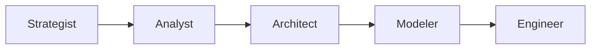

# Task: Create Agent Blueprint

**Command:** `*agent-blueprint` / `*AD`  
**Output:** `agent-blueprint.md`

---

## Objective

Create comprehensive blueprint defining all agents in the system, their responsibilities, capabilities, and behavior.

---

## Prerequisites

- [ ] Project context understood
- [ ] Architecture document available
- [ ] Workflow requirements identified
- [ ] Stakeholders mapped

---

## Steps

### Step 1: Identify Required Agents

Based on the project workflow, identify agents needed:

| Phase | Typical Agents |
|-------|---------------|
| UPSTREAM | Strategist, Analyst |
| MIDSTREAM | Architect, Modeler, Designer |
| DOWNSTREAM | Engineer, BI, Steward |
| CORE | Orchestrator |

### Step 2: Define Each Agent

For each agent, document:

```yaml
agent:
  id: "{agent-id}"
  name: "{PersonaName}"
  icon: "{emoji}"
  phase: "{UPSTREAM|MIDSTREAM|DOWNSTREAM|CORE}"
  
  persona:
    role: "{role description}"
    expertise:
      - "{skill 1}"
      - "{skill 2}"
    style: "{communication style}"
    
  responsibilities:
    primary:
      - "{responsibility 1}"
      - "{responsibility 2}"
    secondary:
      - "{responsibility 3}"
      
  capabilities:
    tools:
      - "{tool 1}"
      - "{tool 2}"
    commands:
      - name: "*{command}"
        description: "{what it does}"
        
  behavior:
    greeting: "{how agent greets}"
    error_handling: "{how agent handles errors}"
    escalation: "{when agent escalates}"
```

### Step 3: Map Agent Relationships

Create dependency map:



### Step 4: Define Activation Instructions

For each agent, specify:
- Trigger conditions
- Initial state
- Greeting behavior
- Available commands

### Step 5: Document the Blueprint

Create `agent-blueprint.md` with:
- Overview of agent system
- Individual agent definitions
- Relationship diagram
- Activation guide

---

## Output Template

```markdown
# Agent Blueprint

## Overview
[System overview and agent count]

## Agent Pipeline
[Mermaid diagram showing flow]

## Agents

### {Agent Name} ({Icon})
**Phase:** {phase}  
**Role:** {role}

#### Responsibilities
- {list}

#### Commands
| Command | Description |
|---------|-------------|
| *{cmd} | {desc} |

#### Upstream
- {agent}: {artifact}

#### Downstream
- {agent}: {artifact}

[Repeat for each agent]

## Activation Guide
[How to activate each agent]
```

---

## Validation

- [ ] All required phases covered
- [ ] All agents have clear responsibilities
- [ ] No gaps in the pipeline
- [ ] Commands documented
- [ ] Relationships mapped
