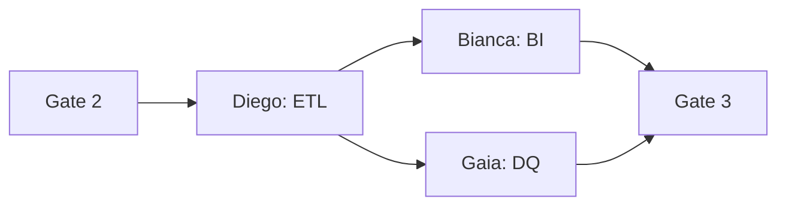

# Task: Create Orchestration Flow

**Command:** `*orchestration`  
**Output:** `orchestration-flow.md`

---

## Objective

Design the complete orchestration flow showing how agents collaborate, including execution sequence, decision points, and escalation paths.

---

## Prerequisites

- [ ] Agent blueprint complete
- [ ] Agent contracts defined
- [ ] Guardrails designed

---

## Steps

### Step 1: Map Execution Sequence

Identify the order of agent execution:

1. Start with UPSTREAM agents
2. Pass through gates
3. Continue to MIDSTREAM
4. Execute DOWNSTREAM
5. Complete with validation

### Step 2: Identify Parallel Paths

Find opportunities for parallel execution:



### Step 3: Define Decision Points

Document key decision points:

```yaml
decision_point:
  id: "{decision_id}"
  location: "after_{agent}"
  
  condition: "{what is being evaluated}"
  
  branches:
    - condition: "{if_condition}"
      path: "{agent_or_action}"
      
    - condition: "{else_condition}"
      path: "{alternative_path}"
      
  decision_maker: "{agent_or_human}"
  
  timeout:
    duration: "15 minutes"
    default_action: "{default_branch}"
```

### Step 4: Design Escalation Paths

Define how issues escalate:

```yaml
escalation:
  levels:
    - level: 1
      handler: "current_agent"
      timeout: "5 minutes"
      
    - level: 2
      handler: "orchestrator"
      timeout: "15 minutes"
      
    - level: 3
      handler: "human_operator"
      timeout: "none"
      
  criteria:
    - type: "repeated_failure"
      count: 3
      escalate_to: 2
      
    - type: "critical_error"
      escalate_to: 3
      
    - type: "timeout"
      escalate_to: 2
```

### Step 5: Create Flow Diagrams

Create Mermaid diagrams showing:
- Main flow
- Phase sub-flows
- Error flows
- Escalation flows

### Step 6: Document the Flow

Create orchestration-flow.md with:
- Executive summary
- Main flow diagram
- Detailed phase flows
- Gate definitions
- Decision points
- Escalation paths
- Monitoring metrics

---

## Output Structure

```markdown
# Orchestration Flow

## Executive Summary
[Overview of the flow]

## Main Flow
[Mermaid diagram]

## Phase Flows
### UPSTREAM
[Diagram and details]

### MIDSTREAM
[Diagram and details]

### DOWNSTREAM
[Diagram and details]

## Gates
[Gate definitions]

## Decision Points
[Decision documentation]

## Escalation
[Escalation paths]

## Monitoring
[Metrics and health checks]
```

---

## Validation

- [ ] All agents represented
- [ ] All paths covered
- [ ] Gates clearly defined
- [ ] Decision points documented
- [ ] Escalation paths complete
- [ ] Diagrams accurate
