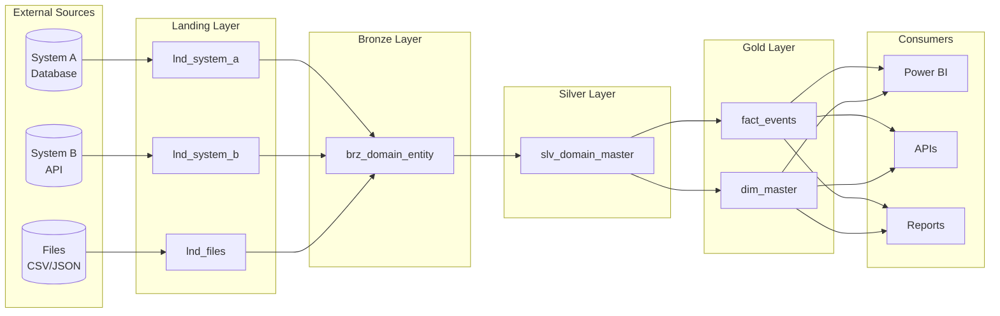
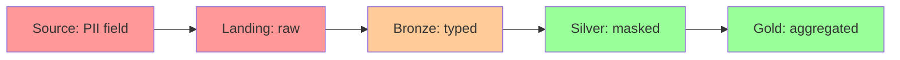

# Task: Document Data Lineage

**Command:** `*document-lineage`  
**Agent:** DataSteward (Gaia)  
**Output:** `data-lineage.md`

---

## Objective

Document comprehensive data lineage showing the flow of data from source systems through all transformation layers to consumption, enabling impact analysis and compliance tracking.

---

## Prerequisites

- [ ] Data model available
- [ ] Architecture document available
- [ ] STTM document available
- [ ] ETL logic documented (if available)

---

## Steps

### Step 1: Identify Lineage Scope

Define what to document:
- Source systems
- Landing layer tables
- Transformation layers (Bronze, Silver, Gold)
- Consumption points (BI, APIs, downstream systems)

### Step 2: Document Source-to-Target Flow

For each data element:

```yaml
lineage_element:
  target:
    table: "{target_table}"
    column: "{target_column}"
    layer: "{gold|silver|bronze}"
    
  sources:
    - source_table: "{source_table}"
      source_column: "{source_column}"
      layer: "{landing|bronze|silver}"
      relationship: "{direct|derived|aggregated}"
      
  transformation:
    type: "{direct_copy|type_cast|calculation|aggregation|lookup}"
    logic: "{transformation description or formula}"
    business_rule: "{rule name if applicable}"
    
  dependencies:
    - "{dependent_table.column}"
```

### Step 3: Create Lineage Diagrams

At multiple levels:
- **High-level**: System to system flow
- **Table-level**: Table to table relationships
- **Column-level**: For critical fields

### Step 4: Document Transformations

| Stage | Input | Transformation | Output |
|-------|-------|----------------|--------|
| Landing → Bronze | Raw data | Type casting, null handling | Cleansed data |
| Bronze → Silver | Cleansed | Business logic, validation | Conformed data |
| Silver → Gold | Conformed | Aggregation, enrichment | Analytical data |

### Step 5: Identify Critical Paths

Mark lineage paths for:
- Compliance-sensitive data (PII, financial)
- KPI calculations
- Regulatory reporting

---

## Output Template

```markdown
# Data Lineage Documentation

**Project:** {project_name}  
**Date:** {date}  
**Author:** DataSteward  
**Version:** 1.0

---

## Executive Summary

This document provides complete data lineage documentation from source systems through all transformation layers to consumption points.

---

## Lineage Overview



---

## Source Systems

| System | Type | Tables/Objects | Extraction Method | Frequency |
|--------|------|----------------|-------------------|-----------|
| {System A} | Database | {tables} | {CDC/Full} | {schedule} |
| {System B} | API | {endpoints} | {Pull} | {schedule} |
| {Files} | Files | {patterns} | {File drop} | {schedule} |

---

## Layer-by-Layer Lineage

### Landing Layer

| Landing Table | Source | Source Object | Extraction | Notes |
|---------------|--------|---------------|------------|-------|
| `lnd_{source}_{entity}` | {system} | {table/file} | {method} | {notes} |

### Bronze Layer

| Bronze Table | Landing Source | Transformations |
|--------------|----------------|-----------------|
| `brz_{domain}_{entity}` | `lnd_*` | Type casting, null handling, deduplication |

**Transformation Details:**

| Source Column | Target Column | Transformation | Rule |
|---------------|---------------|----------------|------|
| `{source.col}` | `{target.col}` | {transformation} | {business rule} |

### Silver Layer

| Silver Table | Bronze Source | Transformations |
|--------------|---------------|-----------------|
| `slv_{domain}_{entity}` | `brz_*` | Business validation, conformity, enrichment |

**Transformation Details:**

| Source Column | Target Column | Transformation | Rule |
|---------------|---------------|----------------|------|
| `{source.col}` | `{target.col}` | {transformation} | {business rule} |

### Gold Layer

#### Fact Tables

| Fact Table | Silver Sources | Aggregation | Grain |
|------------|----------------|-------------|-------|
| `fact_{subject}` | `slv_*` | {aggregation logic} | {grain description} |

**Column Lineage:**

| Column | Source | Transformation | Formula |
|--------|--------|----------------|---------|
| `{measure}` | `{source.col}` | SUM/COUNT/AVG | `{formula}` |
| `{fk}` | `{dim_table.pk}` | Lookup | `{join condition}` |

#### Dimension Tables

| Dim Table | Silver Source | SCD Type | Grain |
|-----------|---------------|----------|-------|
| `dim_{entity}` | `slv_*` | Type {1/2} | One row per {entity} |

**Column Lineage:**

| Column | Source | Transformation | Notes |
|--------|--------|----------------|-------|
| `{sk}` | Generated | Surrogate key | Auto-increment |
| `{nk}` | `{source.col}` | Natural key | Business identifier |
| `{attr}` | `{source.col}` | {transformation} | {notes} |

---

## Critical Path Lineage

### KPI: {KPI Name}

```mermaid
flowchart LR
    S1[source_system.table.column] --> L1[lnd_table.column]
    L1 --> B1[brz_table.column]
    B1 --> SV1[slv_table.column]
    SV1 --> G1[fact_table.measure]
    G1 --> K1((KPI: {name}))
```

**Transformation Chain:**

| Stage | Input | Output | Transformation |
|-------|-------|--------|----------------|
| Source → Landing | {raw value} | {raw value} | Direct copy |
| Landing → Bronze | {raw} | {typed} | Type cast to {type} |
| Bronze → Silver | {typed} | {validated} | Validate range, apply rule |
| Silver → Gold | {validated} | {aggregated} | SUM by {dimension} |

### Compliance-Sensitive: {Field Name}



**Protection applied at:** Silver layer (masking)  
**Audit trail:** Full logging enabled

---

## Impact Analysis

### Forward Impact (What does changing X affect?)

| Source Entity | Immediate Dependents | Downstream Impact |
|---------------|---------------------|-------------------|
| `{source_table}` | `{bronze_table}` | `{silver_tables}`, `{gold_tables}`, `{reports}` |

### Backward Lineage (Where does X come from?)

| Target Column | Immediate Source | Original Source |
|---------------|-----------------|-----------------|
| `fact_sales.total_amount` | `slv_sales.amount` | `source_system.invoices.total` |

---

## Data Quality Checkpoints

| Checkpoint | Layer | Rule | Action on Failure |
|------------|-------|------|-------------------|
| Not null | Landing | {column} IS NOT NULL | Quarantine |
| Valid range | Bronze | {column} BETWEEN x AND y | Flag |
| Referential | Silver | FK exists in dimension | Reject |
| Business rule | Gold | {rule description} | Alert |

---

## Lineage Metadata

### Update Frequency

| Layer | Refresh Frequency | Update Time |
|-------|-------------------|-------------|
| Landing | {frequency} | {time} |
| Bronze | {frequency} | {time} |
| Silver | {frequency} | {time} |
| Gold | {frequency} | {time} |

### Retention

| Layer | Retention Period | Archive Policy |
|-------|-----------------|----------------|
| Landing | {period} | {policy} |
| Bronze | {period} | {policy} |
| Silver | {period} | {policy} |
| Gold | {period} | {policy} |

---

## Lineage Tools & Access

| Purpose | Tool | Access |
|---------|------|--------|
| Visual lineage | {tool} | {link/access} |
| Column-level | {tool} | {link/access} |
| Impact analysis | {tool} | {link/access} |
| Audit logs | {tool} | {link/access} |
```

---

## Handoff

After completing data lineage documentation:
- **Continue MIDSTREAM:** Map compliance requirements → `*map-compliance`
- **Coordinate with Diego:** Align with ETL implementation → `@data-engineer-exec *create-lineage`
- **Check status:** View progress → `@orchestrator *status`
