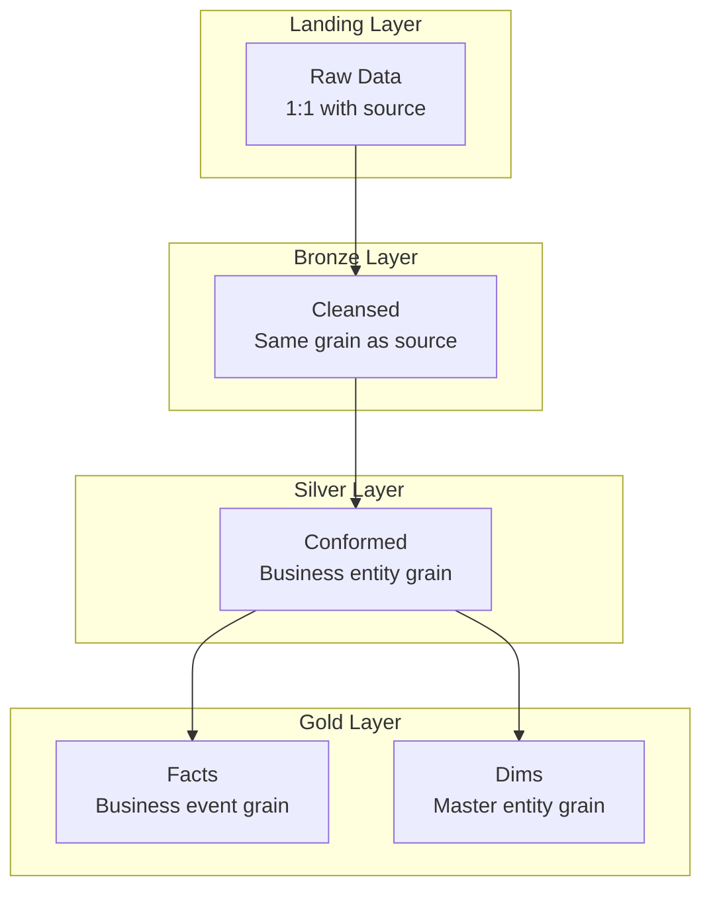

# Task: Define Granularity

**Command:** `*granularity`  
**Agent:** DataModeler (Sofia)  
**Output:** `granularity-spec.md`

---

## Objective

Define and document the granularity (grain) for each table in the data model, ensuring clear understanding of what one row represents at each layer.

---

## Prerequisites

- [ ] STTM document available
- [ ] Architecture layers defined
- [ ] Business requirements understood
- [ ] Analytical questions documented

---

## Steps

### Step 1: Understand Granularity Concept

**Granularity (Grain)** answers: "What does one row in this table represent?"

| Grain Type | Description | Example |
|------------|-------------|---------|
| **Transaction** | One business event | One sale, one trip |
| **Snapshot** | State at a point in time | Daily inventory |
| **Periodic** | Aggregated over period | Monthly revenue |
| **Factless** | Event occurrence | Student attendance |

### Step 2: Identify Tables by Layer

List all tables per layer:

| Layer | Tables |
|-------|--------|
| Landing | {raw tables from sources} |
| Bronze | {cleansed/typed tables} |
| Silver | {conformed entities} |
| Gold Facts | {business events} |
| Gold Dims | {master entities} |

### Step 3: Define Grain for Each Table

For each table, document:

```yaml
table_granularity:
  table_name: "{table_name}"
  layer: "{landing|bronze|silver|gold}"
  type: "{fact|dimension|bridge|aggregate}"
  
  grain:
    description: "One row represents {description}"
    example: "{concrete example of one row}"
    
  grain_components:
    - component: "{entity/attribute}"
      role: "What makes it unique"
    - component: "{entity/attribute}"
      role: "What makes it unique"
      
  primary_key:
    columns: ["{col1}", "{col2}"]
    type: "{natural|surrogate|composite}"
    
  expected_volume:
    daily_rows: {number}
    annual_rows: {number}
    growth_rate: "{percentage}/year"
```

### Step 4: Validate Against Requirements

Check grain supports:
- All analytical questions
- All KPIs
- All STTM mappings

### Step 5: Document Aggregation Rules

If grain differs between layers:

| Source Grain | Target Grain | Aggregation |
|--------------|--------------|-------------|
| Transaction | Daily | SUM, COUNT, AVG |
| Hourly | Daily | SUM, MAX, MIN |
| Daily | Monthly | SUM, AVG |

---

## Output Template

```markdown
# Granularity Specification

**Project:** {project_name}  
**Date:** {date}  
**Author:** DataModeler  
**Version:** 1.0

---

## Executive Summary

This document defines the granularity (grain) for all tables in the data model, ensuring consistency and clarity across all data layers.

---

## Granularity Overview



---

## Landing Layer Granularity

| Table | Grain Description | Example Row | Source |
|-------|-------------------|-------------|--------|
| `lnd_{source}_{entity}` | One row per {source row} | {example} | {source system} |

---

## Bronze Layer Granularity

| Table | Grain Description | Example Row | Processing |
|-------|-------------------|-------------|------------|
| `brz_{domain}_{entity}` | One row per {cleansed record} | {example} | Type casting, null handling |

---

## Silver Layer Granularity

| Table | Grain Description | Example Row | Business Logic |
|-------|-------------------|-------------|----------------|
| `slv_{domain}_{entity}` | One row per {business entity} | {example} | Deduplication, validation |

---

## Gold Layer - Fact Tables

### fact_{subject}

| Attribute | Value |
|-----------|-------|
| **Grain Description** | One row per {business event} |
| **Example** | {concrete example} |
| **Grain Components** | {list of what makes row unique} |
| **Primary Key** | {pk columns} |
| **Measures** | {list of measures} |
| **Foreign Keys** | {list of dimension FKs} |
| **Expected Volume** | {rows/day}, {growth rate} |

#### Grain Validation

| Analytical Question | Supported? | Notes |
|---------------------|------------|-------|
| {Question 1} | ✅ Yes | {how} |
| {Question 2} | ✅ Yes | {how} |

---

## Gold Layer - Dimension Tables

### dim_{entity}

| Attribute | Value |
|-----------|-------|
| **Grain Description** | One row per {master entity} |
| **Example** | One row per customer |
| **SCD Type** | Type 2 (history) / Type 1 (overwrite) |
| **Primary Key** | {surrogate key} |
| **Natural Key** | {business key} |
| **Expected Volume** | {total rows}, {change rate} |

---

## Aggregation Rules

When grain changes between layers:

| Source Table | Target Table | Aggregation Type | Rules |
|--------------|--------------|------------------|-------|
| `slv_transactions` | `fact_sales_daily` | Daily rollup | SUM(amount), COUNT(*) |
| `fact_sales_daily` | `fact_sales_monthly` | Monthly rollup | SUM(amount), AVG(amount) |

### Aggregation Functions by Measure

| Measure | Aggregation | Notes |
|---------|-------------|-------|
| `amount` | SUM | Additive |
| `quantity` | SUM | Additive |
| `unit_price` | AVG or LAST | Semi-additive |
| `customer_count` | COUNT DISTINCT | Non-additive |

---

## Grain Anti-Patterns to Avoid

| Anti-Pattern | Problem | Solution |
|--------------|---------|----------|
| Mixed grain | Confusing analysis | Separate tables |
| Unstated grain | Ambiguous data | Document clearly |
| Wrong grain | Can't answer questions | Redesign |
| Over-aggregated | Lost detail | Keep granular table |

---

## Validation Checklist

| Check | Status | Notes |
|-------|--------|-------|
| All tables have defined grain | ✅/❌ | |
| Grain supports all KPIs | ✅/❌ | |
| Grain supports all questions | ✅/❌ | |
| Grain consistent within layer | ✅/❌ | |
| Aggregation rules documented | ✅/❌ | |
| Volume estimates included | ✅/❌ | |
```

---

## Handoff

After completing granularity specification:
- **Continue MIDSTREAM:** Create metadata catalog → `*metadata`
- **Update data model:** Reflect grain in model → `*data-model`
- **Check status:** View progress → `@orchestrator *status`
