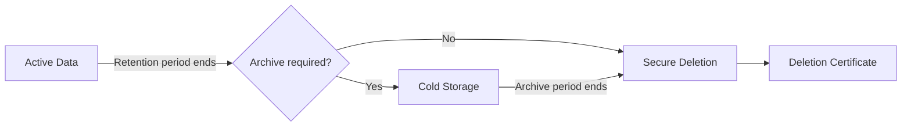
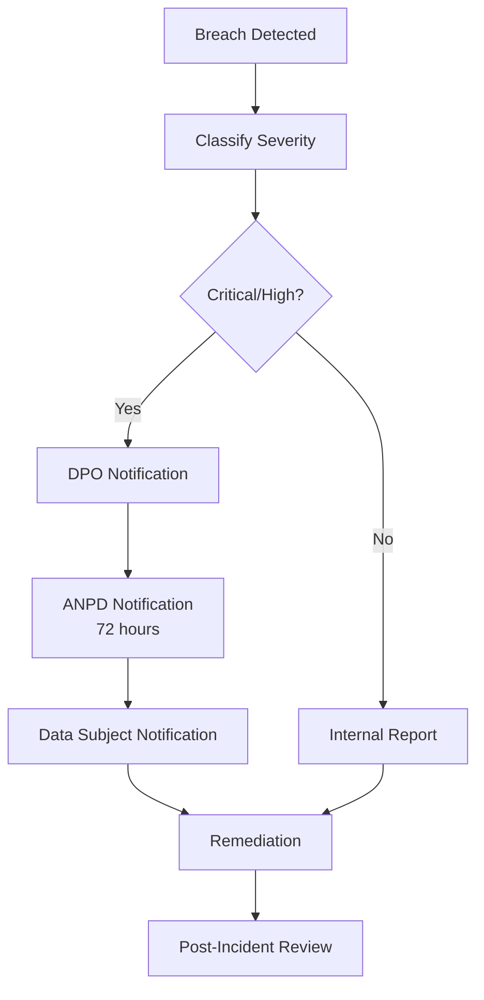

# Task: Map Compliance Requirements

**Command:** `*map-compliance`  
**Agent:** DataSteward (Gaia)  
**Output:** `compliance-mapping.md`

---

## Objective

Map regulatory and organizational compliance requirements to data entities, columns, and processes, ensuring all compliance obligations are properly addressed.

---

## Prerequisites

- [ ] Data model available
- [ ] Data classification completed
- [ ] Governance framework defined
- [ ] List of applicable regulations
- [ ] Organizational compliance policies

---

## Steps

### Step 1: Identify Applicable Regulations

Common data regulations:

| Regulation | Region | Focus | Applicability |
|------------|--------|-------|---------------|
| **LGPD** | Brazil | Personal data protection | Brazilian data subjects |
| **GDPR** | EU | Personal data protection | EU data subjects |
| **SOX** | US | Financial reporting | Public companies |
| **HIPAA** | US | Healthcare data | Health information |
| **PCI-DSS** | Global | Payment card data | Card processing |
| **CCPA** | California | Consumer privacy | CA residents |

### Step 2: Map Requirements to Data

For each regulation:

```yaml
compliance_mapping:
  regulation: "{regulation_name}"
  applicable: true|false
  
  data_requirements:
    - requirement_id: "{req_id}"
      description: "{requirement description}"
      affected_data:
        - table: "{table_name}"
          columns: ["{column1}", "{column2}"]
          data_type: "PII|Financial|Health|Payment"
      control_implemented: "{control description}"
      evidence: "{how compliance is demonstrated}"
```

### Step 3: Map Data Subject Rights

For LGPD/GDPR:

| Right | Description | Implementation | Process |
|-------|-------------|----------------|---------|
| Access | View their data | Data export API | Request workflow |
| Rectification | Correct data | Edit interface | Approval process |
| Erasure | Delete data | Deletion process | Retention rules check |
| Portability | Get data copy | Export format | Standard format |
| Objection | Opt-out processing | Consent management | Preference center |

### Step 4: Define Retention Requirements

| Data Category | Regulation | Retention Period | Action After |
|---------------|------------|------------------|--------------|
| Financial | SOX | 7 years | Archive |
| Personal | LGPD | Until purpose fulfilled | Delete |
| Health | HIPAA | 6 years | Secure deletion |
| Payment | PCI-DSS | 1 year | Secure deletion |

### Step 5: Document Controls

For each compliance requirement, document:
- Technical control (encryption, masking, access control)
- Process control (approval workflow, audit)
- Evidence collection (logs, reports)

---

## Output Template

```markdown
# Compliance Mapping Document

**Project:** {project_name}  
**Date:** {date}  
**Author:** DataSteward  
**Compliance Officer Review:** {pending/approved}  
**Version:** 1.0

---

## Executive Summary

This document maps regulatory and organizational compliance requirements to data entities within the data platform, documenting controls and evidence for each requirement.

---

## Applicable Regulations

| Regulation | Applicable | Reason | Key Requirements |
|------------|------------|--------|------------------|
| LGPD | ✅ Yes | Brazilian data subjects | Consent, access, deletion |
| GDPR | ❌ No | No EU data subjects | N/A |
| SOX | ✅ Yes | Financial reporting | Audit trail, accuracy |
| HIPAA | ❌ No | No health data | N/A |
| PCI-DSS | ❌ No | No card processing | N/A |

---

## LGPD Compliance Mapping

### Overview

| Requirement Area | Status | Coverage |
|------------------|--------|----------|
| Lawful Basis | ✅ Implemented | 100% |
| Data Subject Rights | ✅ Implemented | 100% |
| Data Protection | ✅ Implemented | 100% |
| Breach Notification | ✅ Defined | 100% |
| Record Keeping | ✅ Implemented | 100% |

### Data Subject Rights Implementation

| Right | Requirement | Implementation | Process Document |
|-------|-------------|----------------|------------------|
| **Access** | Provide copy of data | Export API + UI | `process/data-access.md` |
| **Rectification** | Allow correction | Edit workflow | `process/data-correction.md` |
| **Deletion** | Right to be forgotten | Deletion pipeline | `process/data-deletion.md` |
| **Portability** | Machine-readable export | JSON/CSV export | `process/data-export.md` |
| **Objection** | Opt-out of processing | Consent manager | `process/consent.md` |

### Personal Data Inventory

| Table | Column | Data Type | Legal Basis | Retention |
|-------|--------|-----------|-------------|-----------|
| `dim_customer` | `cpf` | CPF (ID) | Contract | Active + 5 years |
| `dim_customer` | `email` | Contact | Consent | Until revoked |
| `dim_customer` | `phone` | Contact | Consent | Until revoked |
| `dim_customer` | `address` | Address | Contract | Active + 5 years |

### Controls Implemented

| Control | Requirement | Implementation | Evidence |
|---------|-------------|----------------|----------|
| Encryption at rest | Data protection | AES-256, Key Vault | Config audit |
| Encryption in transit | Data protection | TLS 1.3 | Certificate |
| Access control | Minimize access | RBAC + RLS | Access logs |
| Consent tracking | Lawful basis | Consent database | Consent records |
| Audit logging | Accountability | Full audit trail | Log retention |

---

## SOX Compliance Mapping

### Overview

| Requirement Area | Status | Coverage |
|------------------|--------|----------|
| Internal Controls | ✅ Implemented | 100% |
| Audit Trail | ✅ Implemented | 100% |
| Data Integrity | ✅ Implemented | 100% |
| Access Controls | ✅ Implemented | 100% |

### Financial Data Controls

| Table | Requirement | Control | Evidence |
|-------|-------------|---------|----------|
| `fact_financials` | Integrity | Hash validation | Checksum logs |
| `fact_financials` | Audit trail | Full CDC | Change history |
| `fact_financials` | Access | RBAC restricted | Access logs |
| `fact_financials` | Retention | 7 years | Archive policy |

### Audit Requirements

| Area | Requirement | Implementation | Frequency |
|------|-------------|----------------|-----------|
| Access audit | Who accessed what | Query logging | Continuous |
| Change audit | What changed | CDC + history | Continuous |
| Process audit | How data moved | Pipeline logs | Continuous |
| Review audit | Periodic review | Audit reports | Quarterly |

---

## Data Retention Matrix

| Data Category | Regulation | Retention | Archive | Deletion |
|---------------|------------|-----------|---------|----------|
| Personal (general) | LGPD | Until purpose fulfilled | N/A | Secure delete |
| Personal (contract) | LGPD | Contract + 5 years | Cold storage | Secure delete |
| Financial | SOX | 7 years | Cold storage | Secure delete |
| Operational | Internal | 2 years | Archive | Standard delete |
| Logs | Internal | 90 days | N/A | Auto-delete |

### Retention Implementation



---

## Breach Notification Process

### Classification

| Severity | Criteria | Notification Timeline |
|----------|----------|----------------------|
| Critical | >1000 records OR sensitive data | 72 hours to ANPD |
| High | >100 records | 72 hours to ANPD |
| Medium | <100 records, no sensitive | Internal only |
| Low | No personal data | Log only |

### Notification Flow



---

## Compliance Evidence Inventory

| Requirement | Evidence Type | Location | Retention |
|-------------|---------------|----------|-----------|
| Consent records | Database records | `consent_db` | Indefinite |
| Access logs | Log files | Azure Monitor | 1 year |
| Change history | CDC tables | `audit_schema` | 7 years |
| Encryption proof | Configuration | Key Vault | Current |
| Training records | HR system | HRIS | 3 years |
| Policies | Documents | SharePoint | Current + history |

---

## Gap Analysis

| Requirement | Current State | Gap | Remediation | Priority |
|-------------|---------------|-----|-------------|----------|
| {Requirement 1} | {current} | {gap} | {action} | High/Med/Low |
| {Requirement 2} | {current} | None | N/A | - |

---

## Compliance Checklist

| # | Requirement | Status | Owner | Evidence |
|---|-------------|--------|-------|----------|
| 1 | Personal data inventory | ✅ | DataSteward | This document |
| 2 | Lawful basis documented | ✅ | Legal | Privacy policy |
| 3 | Encryption implemented | ✅ | Architect | Config audit |
| 4 | Access controls | ✅ | Architect | RBAC documentation |
| 5 | Consent mechanism | ✅ | Dev team | Consent database |
| 6 | Deletion process | ✅ | DataSteward | Process document |
| 7 | Breach process | ✅ | Security | Incident playbook |
| 8 | DPO appointed | ✅ | Legal | Appointment letter |
| 9 | Training completed | ✅ | HR | Training records |
| 10 | Audit schedule | ✅ | Compliance | Audit calendar |

---

## Review Schedule

| Review Type | Frequency | Responsible | Next Review |
|-------------|-----------|-------------|-------------|
| Compliance mapping | Quarterly | DataSteward | {date} |
| Gap assessment | Semi-annual | Compliance | {date} |
| Policy review | Annual | Legal | {date} |
| External audit | Annual | External firm | {date} |
```

---

## Handoff

After completing compliance mapping:
- **Continue MIDSTREAM:** Document lineage → `*document-lineage`
- **Coordinate with Architect:** Align security design → `@data-architect *security-design`
- **Check status:** View progress → `@orchestrator *status`
