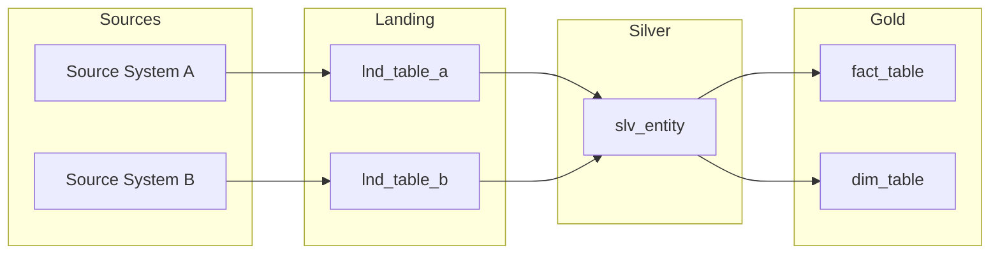
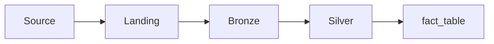
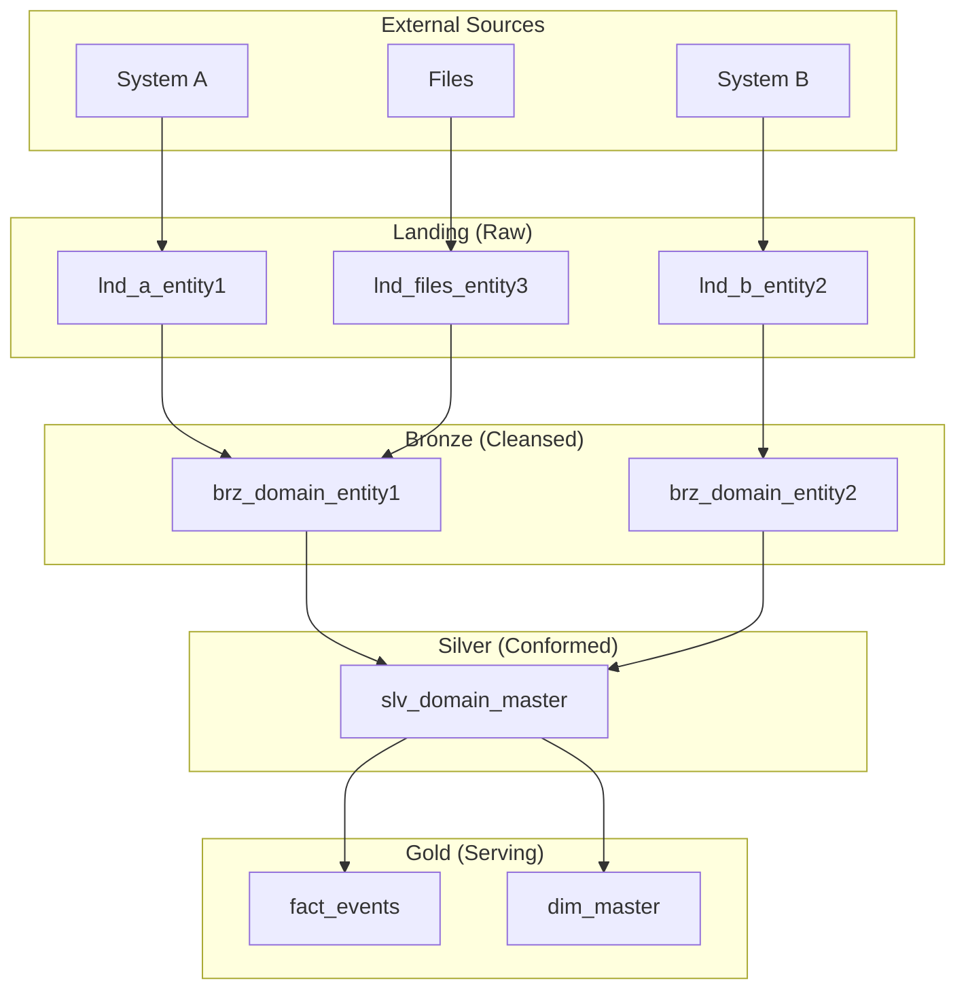

# Task: Create Metadata Catalog

**Command:** `*metadata`  
**Agent:** DataModeler (Sofia)  
**Output:** `metadata-catalog.md`

---

## Objective

Create a comprehensive metadata catalog documenting all data entities, their attributes, lineage, ownership, and SLAs.

---

## Prerequisites

- [ ] Data model defined
- [ ] Granularity specified
- [ ] Data contracts created
- [ ] Business glossary available (if exists)

---

## Steps

### Step 1: Define Metadata Categories

| Category | Purpose | Examples |
|----------|---------|----------|
| **Technical** | Schema information | Data types, nullable, constraints |
| **Business** | Meaning and context | Definitions, business rules |
| **Operational** | Runtime information | SLAs, refresh frequency |
| **Governance** | Ownership and compliance | Owner, classification, retention |
| **Lineage** | Data origin | Source systems, transformations |

### Step 2: Document Entity Metadata

For each table/entity:

```yaml
entity_metadata:
  name: "{table_name}"
  layer: "{landing|bronze|silver|gold}"
  domain: "{business domain}"
  
  business:
    description: "{what this table represents}"
    business_owner: "{name/team}"
    data_steward: "{name/team}"
    glossary_terms: ["{term1}", "{term2}"]
    
  technical:
    database: "{database_name}"
    schema: "{schema_name}"
    table_type: "{table|view|external}"
    storage_format: "{parquet|delta|csv}"
    partition_by: ["{column}"]
    cluster_by: ["{column}"]
    
  operational:
    refresh_frequency: "{real-time|hourly|daily|weekly}"
    refresh_time: "{HH:MM UTC}"
    sla_freshness: "{max delay allowed}"
    retention_period: "{days/months/years}"
    
  governance:
    classification: "{public|internal|confidential|restricted}"
    pii_columns: ["{column}"]
    compliance: ["{LGPD|GDPR|SOX}"]
    
  lineage:
    source_system: "{system name}"
    source_table: "{source table}"
    transformation: "{transformation description}"
    dependencies: ["{upstream table}"]
```

### Step 3: Document Column Metadata

For each column:

```yaml
column_metadata:
  - name: "{column_name}"
    data_type: "{type}"
    nullable: true|false
    primary_key: true|false
    foreign_key: "{referenced_table.column}"
    
    business:
      description: "{what this column means}"
      business_name: "{friendly name}"
      example_values: ["{example1}", "{example2}"]
      business_rules: ["{rule}"]
      
    quality:
      valid_values: ["{value1}", "{value2}"]
      valid_range: "{min}-{max}"
      valid_pattern: "{regex}"
      default_value: "{default}"
      
    governance:
      classification: "{classification}"
      pii: true|false
      masking_rule: "{masking approach}"
```

### Step 4: Document Data Lineage

Create lineage map:



### Step 5: Define SLAs

| Entity | Freshness SLA | Quality SLA | Availability |
|--------|---------------|-------------|--------------|
| `fact_sales` | T+2 hours | 99.5% | 99.9% |
| `dim_customer` | T+24 hours | 99.9% | 99.9% |

---

## Output Template

```markdown
# Metadata Catalog

**Project:** {project_name}  
**Date:** {date}  
**Author:** DataModeler  
**Version:** 1.0

---

## Catalog Overview

| Layer | Tables | Columns | Last Updated |
|-------|--------|---------|--------------|
| Landing | {count} | {count} | {date} |
| Bronze | {count} | {count} | {date} |
| Silver | {count} | {count} | {date} |
| Gold | {count} | {count} | {date} |

---

## Entity Catalog

### Gold Layer

#### fact_{subject}

| Attribute | Value |
|-----------|-------|
| **Description** | {business description} |
| **Business Owner** | {name} |
| **Data Steward** | {name} |
| **Database** | {database} |
| **Schema** | {schema} |
| **Refresh** | {frequency} at {time} |
| **SLA** | Freshness: {time}, Quality: {%} |
| **Classification** | {level} |

**Columns:**

| Column | Type | Nullable | Description | Classification |
|--------|------|----------|-------------|----------------|
| `{col1}` | INT | No | {description} | Internal |
| `{col2}` | VARCHAR | Yes | {description} | Confidential |
| `{col3}` | DECIMAL | No | {description} | Internal |

**Lineage:**



---

#### dim_{entity}

| Attribute | Value |
|-----------|-------|
| **Description** | {business description} |
| **Business Owner** | {name} |
| **Data Steward** | {name} |
| **SCD Type** | {Type 1/2} |
| **Classification** | {level} |

**Columns:**

| Column | Type | Nullable | Description | Classification |
|--------|------|----------|-------------|----------------|
| `{key}` | INT | No | Surrogate key | Internal |
| `{attr}` | VARCHAR | Yes | {description} | {classification} |

---

### Silver Layer

#### slv_{domain}_{entity}

| Attribute | Value |
|-----------|-------|
| **Description** | {description} |
| **Source** | {landing table} |
| **Transformation** | {description} |

**Columns:**

| Column | Type | Nullable | Source Column | Transformation |
|--------|------|----------|---------------|----------------|
| `{col}` | {type} | {y/n} | `{source.col}` | {transform} |

---

### Landing Layer

#### lnd_{source}_{entity}

| Attribute | Value |
|-----------|-------|
| **Source System** | {system} |
| **Source Object** | {table/file} |
| **Ingestion** | {method} |
| **Format** | {file format} |

---

## Data Lineage Map



---

## SLA Summary

| Entity | Freshness | Quality | Availability | Priority |
|--------|-----------|---------|--------------|----------|
| `fact_sales` | T+2h | 99.5% | 99.9% | P1 |
| `dim_customer` | T+24h | 99.9% | 99.9% | P1 |
| `dim_product` | T+24h | 99.9% | 99.9% | P2 |

---

## Ownership Matrix

| Domain | Business Owner | Data Steward | Technical Owner |
|--------|----------------|--------------|-----------------|
| Sales | {name} | {name} | {name} |
| Customer | {name} | {name} | {name} |
| Product | {name} | {name} | {name} |

---

## Glossary Mapping

| Business Term | Technical Entity | Definition |
|---------------|------------------|------------|
| {Term 1} | `fact_sales.amount` | {definition} |
| {Term 2} | `dim_customer.segment` | {definition} |

---

## Change Log

| Date | Change | Author | Version |
|------|--------|--------|---------|
| {date} | Initial catalog | {name} | 1.0 |
```

---

## Handoff

After completing metadata catalog:
- **Continue MIDSTREAM:** Create data contracts → `*data-contracts`
- **Coordinate with DataSteward:** Align governance → `@data-steward *create-governance`
- **Check status:** View progress → `@orchestrator *status`
