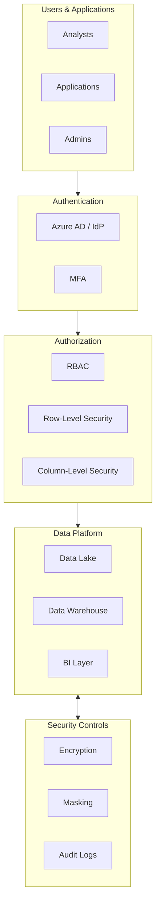

# Task: Design Security Architecture

**Command:** `*security-design`  
**Agent:** DataArchitect (Winston)  
**Output:** `security-design.md`

---

## Objective

Design comprehensive security architecture for the data platform, including access control, encryption, compliance mapping, and audit requirements.

---

## Prerequisites

- [ ] Architecture document available
- [ ] Tech stack defined
- [ ] Data classification completed (or in progress with DataSteward)
- [ ] Compliance requirements identified
- [ ] Organizational security policies available

---

## Steps

### Step 1: Identify Security Requirements

Gather requirements from:
- Compliance regulations (LGPD, GDPR, SOX, HIPAA)
- Organizational security policies
- Data classification (from DataSteward)
- Stakeholder security concerns

### Step 2: Design Access Control

Define access model:

| Layer | Access Pattern | Technology |
|-------|---------------|------------|
| **Data Lake** | RBAC + ACLs | Azure AD / IAM |
| **Warehouse** | Row-Level Security | Native RLS |
| **BI Layer** | Object-Level Security | Power BI RLS |
| **APIs** | Token-based | OAuth 2.0 |

### Step 3: Design Encryption Strategy

| State | Method | Key Management |
|-------|--------|----------------|
| **At Rest** | AES-256 | Azure Key Vault / KMS |
| **In Transit** | TLS 1.3 | Certificate management |
| **In Use** | Tokenization | For PII fields |

### Step 4: Map Data to Security Controls

Based on classification:

| Classification | Access | Encryption | Masking | Audit |
|----------------|--------|------------|---------|-------|
| **Public** | All authenticated | Standard | None | Basic |
| **Internal** | Role-based | Standard | None | Standard |
| **Confidential** | Need-to-know | Enhanced | Dynamic | Enhanced |
| **Restricted** | Explicit approval | Full | Always | Full |

### Step 5: Design Audit & Monitoring

Define audit requirements:
- What events to capture
- Retention period
- Alert thresholds
- Review frequency

### Step 6: Document Security Architecture

Create comprehensive security documentation.

---

## Output Template

```markdown
# Security Architecture Design

**Project:** {project_name}  
**Date:** {date}  
**Author:** DataArchitect  
**Security Review:** {pending/approved}  
**Version:** 1.0

---

## Executive Summary

{Overview of security architecture and key decisions}

---

## Compliance Requirements

| Regulation | Applicable | Key Requirements | Implementation |
|------------|------------|------------------|----------------|
| LGPD | Yes/No | {requirements} | {how addressed} |
| GDPR | Yes/No | {requirements} | {how addressed} |
| SOX | Yes/No | {requirements} | {how addressed} |
| HIPAA | Yes/No | {requirements} | {how addressed} |
| Internal Policy | Yes | {requirements} | {how addressed} |

---

## Security Architecture Overview



---

## Identity & Access Management

### Authentication

| Method | Use Case | Technology |
|--------|----------|------------|
| SSO | All users | Azure AD / Okta |
| MFA | Privileged access | Authenticator app |
| Service Principal | Automated processes | Managed Identity |
| API Keys | External systems | Rotated keys |

### Authorization Model

| Layer | Model | Implementation |
|-------|-------|----------------|
| Storage | RBAC + ACL | Azure AD groups |
| Database | Role-based | Database roles |
| BI | Object + Row-level | Power BI security |

### Role Definitions

| Role | Description | Data Access | Actions |
|------|-------------|-------------|---------|
| Data Admin | Full access | All | Create, Read, Update, Delete |
| Data Engineer | Pipeline access | Bronze, Silver | Read, Write |
| Analyst | Query access | Silver, Gold | Read |
| Viewer | Report access | Gold (filtered) | Read (restricted) |

---

## Encryption Strategy

### Encryption at Rest

| Data Store | Method | Key Type | Key Rotation |
|------------|--------|----------|--------------|
| Data Lake | AES-256 | Customer-managed | 90 days |
| Database | TDE | Platform-managed | Automatic |
| Backups | AES-256 | Customer-managed | 90 days |

### Encryption in Transit

| Connection | Protocol | Certificate |
|------------|----------|-------------|
| All external | TLS 1.3 | Org CA signed |
| Internal services | mTLS | Internal CA |
| Database | SSL enforced | Auto-provisioned |

### Key Management

| Aspect | Implementation |
|--------|----------------|
| Storage | Azure Key Vault / AWS KMS |
| Access | RBAC to vault |
| Rotation | Automated 90-day cycle |
| Backup | Geo-redundant |

---

## Data Protection

### Data Masking Rules

| Classification | Field Type | Masking Method | Example |
|----------------|------------|----------------|---------|
| Restricted | SSN | Full mask | XXX-XX-XXXX |
| Restricted | Credit Card | Partial | XXXX-XXXX-XXXX-1234 |
| Confidential | Email | Partial | j***@domain.com |
| Confidential | Phone | Partial | (XX) XXXXX-1234 |

### Row-Level Security

```sql
-- Example RLS policy
CREATE SECURITY POLICY DataAccessPolicy
ADD FILTER PREDICATE dbo.fn_DataAccess(region)
ON dbo.fact_sales
WITH (STATE = ON);
```

### Column-Level Security

| Table | Column | Sensitivity | Access Control |
|-------|--------|-------------|----------------|
| dim_customer | cpf | Restricted | Data Admins only |
| dim_customer | email | Confidential | Analysts + Admins |
| fact_sales | amount | Internal | All roles |

---

## Network Security

### Network Architecture

| Zone | Purpose | Access |
|------|---------|--------|
| Public | BI dashboards | Authenticated users |
| Private | Data platform | VPN/ExpressRoute |
| Isolated | Key Vault | Private endpoints |

### Firewall Rules

| Source | Destination | Port | Protocol | Action |
|--------|-------------|------|----------|--------|
| Corp VPN | Data Lake | 443 | HTTPS | Allow |
| ADF | Data Lake | 443 | HTTPS | Allow |
| Internet | Data Lake | * | * | Deny |

---

## Audit & Monitoring

### Audit Events

| Event Category | Examples | Retention |
|----------------|----------|-----------|
| Authentication | Login, logout, MFA | 90 days |
| Authorization | Permission changes | 1 year |
| Data Access | Queries, exports | 90 days |
| Admin Actions | Config changes | 2 years |
| Security Events | Failed logins, anomalies | 1 year |

### Monitoring & Alerting

| Metric | Threshold | Alert | Response |
|--------|-----------|-------|----------|
| Failed logins | 5 in 5 min | Critical | Lock account |
| Bulk export | >100K rows | Warning | Review |
| Off-hours access | Any | Info | Log |
| Permission change | Any | Warning | Review |

### Security Dashboards

| Dashboard | Audience | Refresh |
|-----------|----------|---------|
| Security Overview | Security team | Real-time |
| Access Audit | Compliance | Daily |
| Incident Tracker | Security ops | Real-time |

---

## Incident Response

### Security Incident Process

1. **Detection** → Automated alert or report
2. **Triage** → Assess severity and impact
3. **Containment** → Isolate affected systems
4. **Investigation** → Root cause analysis
5. **Remediation** → Fix vulnerability
6. **Recovery** → Restore normal operations
7. **Lessons Learned** → Update controls

### Severity Levels

| Level | Description | Response Time | Escalation |
|-------|-------------|---------------|------------|
| Critical | Data breach, ransomware | Immediate | CISO |
| High | Unauthorized access | 1 hour | Security Lead |
| Medium | Policy violation | 4 hours | Team Lead |
| Low | Minor misconfiguration | 24 hours | Analyst |

---

## Security Checklist

| Control | Status | Owner | Notes |
|---------|--------|-------|-------|
| MFA enabled | ✅/❌ | {owner} | {notes} |
| Encryption at rest | ✅/❌ | {owner} | {notes} |
| Encryption in transit | ✅/❌ | {owner} | {notes} |
| RBAC configured | ✅/❌ | {owner} | {notes} |
| RLS implemented | ✅/❌ | {owner} | {notes} |
| Audit logging | ✅/❌ | {owner} | {notes} |
| Backup & recovery | ✅/❌ | {owner} | {notes} |
| Penetration test | ✅/❌ | {owner} | {notes} |
```

---

## Handoff

After completing security design:
- **Coordinate with DataSteward:** Align classification → `@data-steward *classify-data`
- **Continue MIDSTREAM:** Document decisions → `*document-decisions`
- **Check status:** View progress → `@orchestrator *status`
