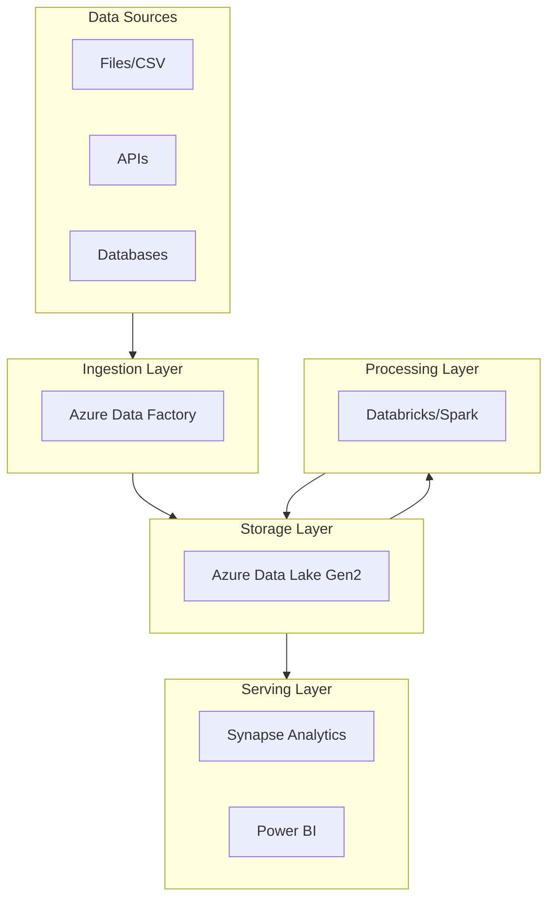
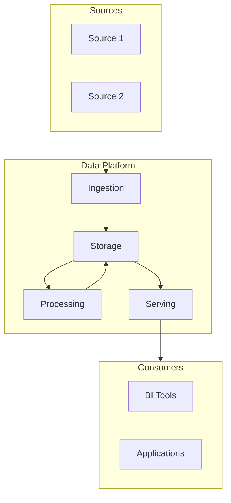

# Task: Document Tech Stack

**Command:** `*tech-stack`  
**Agent:** DataArchitect (Winston)  
**Output:** `tech-stack.md`

---

## Objective

Document and justify the technology stack selection for the data architecture, including alternatives considered and decision rationale.

---

## Prerequisites

- [ ] Architecture pattern defined
- [ ] Data requirements understood
- [ ] Non-functional requirements (NFRs) identified
- [ ] Budget constraints known
- [ ] Team skills assessed

---

## Steps

### Step 1: Identify Technology Categories

For data projects, evaluate technologies in these categories:

| Category | Purpose | Examples |
|----------|---------|----------|
| **Storage** | Data lake/warehouse | ADLS, S3, Synapse, Snowflake |
| **Compute** | Processing engine | Databricks, Spark, ADF |
| **Orchestration** | Pipeline management | ADF, Airflow, Prefect |
| **Data Quality** | Validation/testing | Great Expectations, dbt tests |
| **Catalog** | Metadata management | Unity Catalog, Purview, DataHub |
| **BI/Analytics** | Visualization | Power BI, Tableau, Looker |
| **Version Control** | Code management | Git, Azure DevOps, GitHub |

### Step 2: Define Selection Criteria

Evaluate technologies against criteria:

| Criterion | Weight | Description |
|-----------|--------|-------------|
| **Scalability** | High | Handles growth |
| **Cost** | High | TCO within budget |
| **Team Skills** | Medium | Learning curve |
| **Integration** | Medium | Works with existing tools |
| **Support** | Medium | Vendor/community support |
| **Security** | High | Meets compliance needs |
| **Performance** | High | Meets SLAs |

### Step 3: Evaluate Alternatives

For each category, compare options:

```yaml
storage_evaluation:
  options:
    - name: "Azure Data Lake Gen2"
      scalability: 5
      cost: 4
      team_skills: 4
      integration: 5
      support: 5
      security: 5
      performance: 4
      total_weighted: 4.5
      
    - name: "Snowflake"
      scalability: 5
      cost: 3
      team_skills: 3
      integration: 4
      support: 5
      security: 5
      performance: 5
      total_weighted: 4.2
      
  recommendation: "Azure Data Lake Gen2"
  rationale: "Better cost profile and team familiarity"
```

### Step 4: Document Final Stack

Create technology architecture view:



### Step 5: Document ADRs

For each major decision, create Architecture Decision Record:

| Field | Content |
|-------|---------|
| **Decision** | {What was decided} |
| **Context** | {Why decision was needed} |
| **Options** | {Alternatives considered} |
| **Rationale** | {Why this option was chosen} |
| **Consequences** | {What this means} |

---

## Output Template

```markdown
# Technology Stack Documentation

**Project:** {project_name}  
**Date:** {date}  
**Author:** DataArchitect  
**Version:** 1.0

---

## Executive Summary

{Brief overview of technology stack and key decisions}

---

## Technology Stack Overview



---

## Technology Selections

### Storage Layer

| Component | Technology | Version | Purpose |
|-----------|------------|---------|---------|
| Data Lake | {tech} | {version} | Raw and processed data |
| Data Warehouse | {tech} | {version} | Analytical queries |

**Justification:** {why these were chosen}

### Compute Layer

| Component | Technology | Version | Purpose |
|-----------|------------|---------|---------|
| Processing | {tech} | {version} | ETL/ELT |
| Analytics | {tech} | {version} | Ad-hoc queries |

**Justification:** {why these were chosen}

### Orchestration Layer

| Component | Technology | Version | Purpose |
|-----------|------------|---------|---------|
| Pipeline Orchestration | {tech} | {version} | Workflow management |
| Scheduling | {tech} | {version} | Job scheduling |

**Justification:** {why these were chosen}

### Data Quality Layer

| Component | Technology | Version | Purpose |
|-----------|------------|---------|---------|
| Validation | {tech} | {version} | Data quality checks |
| Testing | {tech} | {version} | Unit tests |

**Justification:** {why these were chosen}

### Visualization Layer

| Component | Technology | Version | Purpose |
|-----------|------------|---------|---------|
| BI Tool | {tech} | {version} | Dashboards, reports |
| Self-Service | {tech} | {version} | Ad-hoc analysis |

**Justification:** {why these were chosen}

---

## Selection Criteria & Scores

| Technology | Scalability | Cost | Skills | Integration | Security | Total |
|------------|-------------|------|--------|-------------|----------|-------|
| {Tech 1} | 5 | 4 | 4 | 5 | 5 | 4.6 |
| {Tech 2} | 4 | 5 | 5 | 4 | 4 | 4.4 |

---

## Alternatives Considered

### Storage Alternatives

| Option | Pros | Cons | Decision |
|--------|------|------|----------|
| {Option 1} | {pros} | {cons} | ✅ Selected |
| {Option 2} | {pros} | {cons} | ❌ Rejected |
| {Option 3} | {pros} | {cons} | ❌ Rejected |

### Compute Alternatives

| Option | Pros | Cons | Decision |
|--------|------|------|----------|
| {Option 1} | {pros} | {cons} | ✅ Selected |
| {Option 2} | {pros} | {cons} | ❌ Rejected |

---

## Architecture Decision Records

### ADR-001: Storage Technology

| Field | Content |
|-------|---------|
| **Status** | Approved |
| **Decision** | Use {technology} for data storage |
| **Context** | Need scalable, cost-effective storage for {X TB} of data |
| **Options** | 1. {Option A}, 2. {Option B}, 3. {Option C} |
| **Rationale** | {Why this was chosen} |
| **Consequences** | {What this means for the project} |

### ADR-002: Compute Technology

| Field | Content |
|-------|---------|
| **Status** | Approved |
| **Decision** | Use {technology} for data processing |
| **Context** | Need distributed processing for {workload description} |
| **Options** | 1. {Option A}, 2. {Option B} |
| **Rationale** | {Why this was chosen} |
| **Consequences** | {What this means for the project} |

---

## Cost Estimation

| Component | Monthly Cost | Annual Cost | Notes |
|-----------|--------------|-------------|-------|
| Storage | ${X} | ${Y} | Based on {TB} estimate |
| Compute | ${X} | ${Y} | Based on {hours} usage |
| Networking | ${X} | ${Y} | Data transfer estimates |
| Licenses | ${X} | ${Y} | Per-user licenses |
| **Total** | **${X}** | **${Y}** | |

---

## Skills & Training

| Technology | Team Proficiency | Training Needed | Timeline |
|------------|------------------|-----------------|----------|
| {Tech 1} | High | None | - |
| {Tech 2} | Medium | 2-day workshop | Week 1 |
| {Tech 3} | Low | Certification | Month 1 |

---

## Integration Points

| System | Integration Method | Frequency | Owner |
|--------|-------------------|-----------|-------|
| {System 1} | API | Real-time | {team} |
| {System 2} | File drop | Daily | {team} |
| {System 3} | Database link | Hourly | {team} |
```

---

## Handoff

After completing tech stack documentation:
- **Continue MIDSTREAM:** Design security → `*security-design`
- **Document decisions:** Create ADRs → `*document-decisions`
- **Check status:** View progress → `@orchestrator *status`
