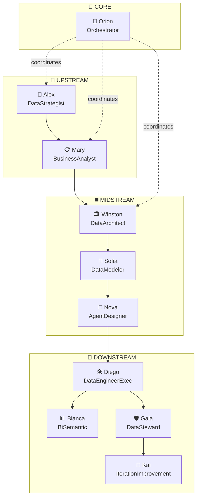

# Agent Blueprint Template

## Blueprint Overview

**Project:** {project_name}  
**Version:** {version}  
**Last Updated:** {date}  
**Owner:** Nova (AgentDesigner)

---

## System Summary

| Aspect | Value |
|--------|-------|
| Total Agents | {count} |
| UPSTREAM Agents | {count} |
| MIDSTREAM Agents | {count} |
| DOWNSTREAM Agents | {count} |
| CORE Agents | {count} |

---

## Agent Pipeline



---

## Agent Definitions

### 🎯 Alex (DataStrategist)

| Attribute | Value |
|-----------|-------|
| **Phase** | UPSTREAM |
| **Gate** | Gate 1 |
| **Role** | Data Strategy & Problem Definition |

**Responsibilities:**
- Define problem statement
- Establish KPIs and success criteria
- Map stakeholders

**Commands:**
| Command | Description |
|---------|-------------|
| `*problem-statement` | Create problem definition |
| `*kpis` | Define KPIs |
| `*status` | Show progress |

**Upstream:** None (starting point)

**Downstream:**
- BusinessAnalyst (Mary): problem-statement.md, kpis.md

---

### 📋 Mary (BusinessAnalyst)

| Attribute | Value |
|-----------|-------|
| **Phase** | UPSTREAM |
| **Gate** | Gate 1 |
| **Role** | Requirements & Business Analysis |

**Responsibilities:**
- Gather requirements
- Create STTM
- Define analytical questions

**Commands:**
| Command | Description |
|---------|-------------|
| `*requirements` | Gather requirements |
| `*sttm` | Create Source-to-Target Mapping |
| `*analytical-questions` | Define questions |

**Upstream:**
- DataStrategist (Alex): problem-statement.md

**Downstream:**
- DataArchitect (Winston): sttm.md, analytical-questions.md

---

### 🏛️ Winston (DataArchitect)

| Attribute | Value |
|-----------|-------|
| **Phase** | MIDSTREAM |
| **Gate** | Gate 2 |
| **Role** | Data Architecture & Technical Design |

**Responsibilities:**
- Design data architecture
- Select technology stack
- Document decisions (ADRs)

**Commands:**
| Command | Description |
|---------|-------------|
| `*create-architecture` | Design architecture |
| `*create-data-model` | Create data model |
| `*document-decisions` | Write ADRs |

**Upstream:**
- BusinessAnalyst (Mary): sttm.md

**Downstream:**
- DataModeler (Sofia): architecture.md
- DataEngineerExec (Diego): architecture.md, data-model.md

---

## Activation Guide

### How to Activate an Agent

```
@{agent-name} [optional command]
```

### Activation Examples

```
@data-strategist *help
@business-analyst *sttm
@data-architect *create-architecture
@data-engineer-exec *create-ddl
```

### Agent Switching

Agents automatically suggest handoffs after completing tasks. Users can also manually switch:

```
@orchestrator *route
```

---

## Gate Requirements

### Gate 1 (UPSTREAM → MIDSTREAM)
| Artifact | Owner | Status |
|----------|-------|--------|
| problem-statement.md | Alex | Required |
| kpis.md | Alex | Required |
| sttm.md | Mary | Required |
| analytical-questions.md | Mary | Required |

### Gate 2 (MIDSTREAM → DOWNSTREAM)
| Artifact | Owner | Status |
|----------|-------|--------|
| architecture.md | Winston | Required |
| data-model.md | Sofia | Required |
| agent-blueprint.md | Nova | Required |

### Gate 3 (DOWNSTREAM → PRODUCTION)
| Artifact | Owner | Status |
|----------|-------|--------|
| ddl/*.sql | Diego | Required |
| etl/*.sql | Diego | Required |
| tests/*.sql | Diego | Required |
| dq-validation.md | Gaia | Required |
