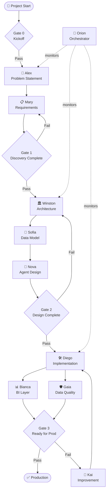
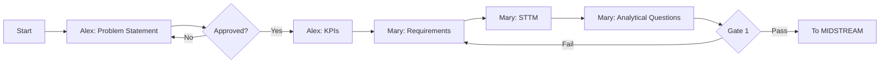
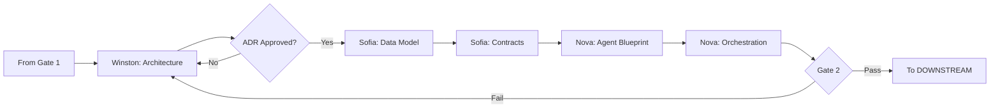
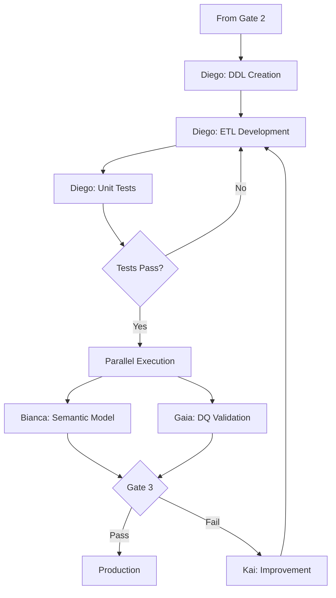
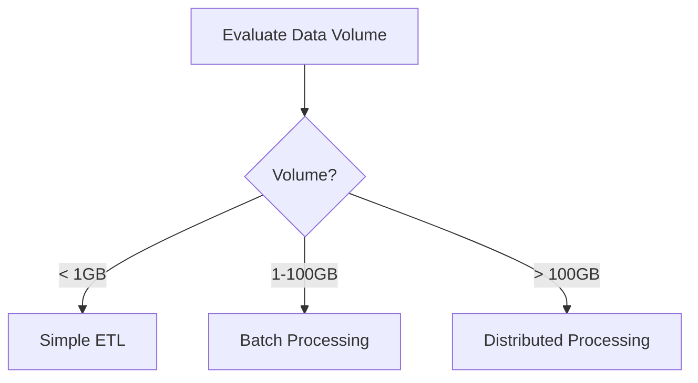
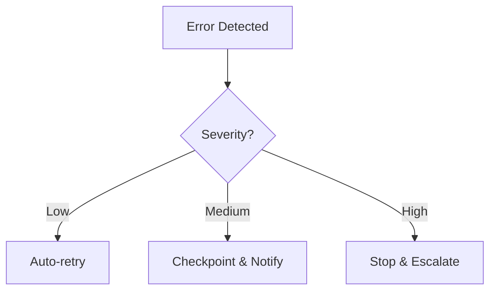
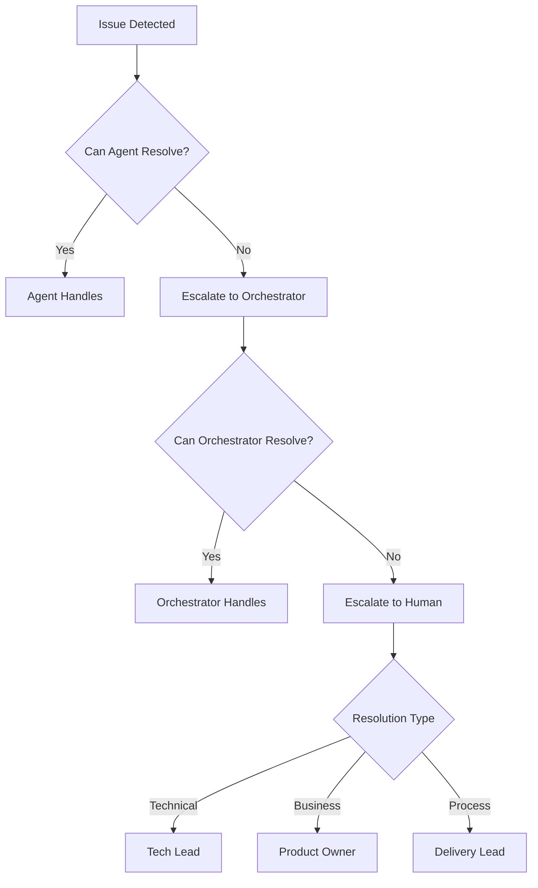

# Orchestration Flow Template

## Flow Overview

**Project:** {project_name}  
**Version:** {version}  
**Last Updated:** {date}  
**Owner:** Nova (AgentDesigner)

---

## Executive Summary

| Aspect | Value |
|--------|-------|
| Total Phases | 4 (UPSTREAM, MIDSTREAM, DOWNSTREAM, CORE) |
| Total Gates | 3 |
| Human Checkpoints | {count} |
| Estimated Duration | {time} |

---

## Main Orchestration Flow

---

## Detailed Phase Flows

### UPSTREAM Phase

**Checkpoints:**
| Step | Autonomy | Human Action |
|------|----------|--------------|
| Problem Statement | Level 2 | Review & Approve |
| KPIs | Level 2 | Review & Approve |
| Requirements | Level 2 | Validate |
| STTM | Level 3 | Audit |

---

### MIDSTREAM Phase

**Checkpoints:**
| Step | Autonomy | Human Action |
|------|----------|--------------|
| Architecture | Level 2 | Review ADRs |
| Data Model | Level 3 | Audit |
| Agent Blueprint | Level 2 | Approve |

---

### DOWNSTREAM Phase

---

## Gate Definitions

### Gate 0: Kickoff

| Criteria | Required | Validator |
|----------|----------|-----------|
| Project charter signed | Yes | PM |
| Resources allocated | Yes | Delivery Lead |
| Access granted | Yes | Admin |

### Gate 1: Discovery Complete

| Criteria | Required | Validator |
|----------|----------|-----------|
| problem-statement.md exists | Yes | Alex |
| kpis.md approved | Yes | Stakeholder |
| sttm.md complete | Yes | Mary |
| analytical-questions.md done | Yes | Mary |
| Checklist 100% | Yes | Orchestrator |

### Gate 2: Design Complete

| Criteria | Required | Validator |
|----------|----------|-----------|
| architecture.md approved | Yes | Winston |
| data-model.md complete | Yes | Sofia |
| agent-blueprint.md done | Yes | Nova |
| All ADRs documented | Yes | Winston |
| Checklist 100% | Yes | Orchestrator |

### Gate 3: Production Ready

| Criteria | Required | Validator |
|----------|----------|-----------|
| All tests passing | Yes | Diego |
| DQ validation > 95% | Yes | Gaia |
| Semantic model working | Yes | Bianca |
| Documentation complete | Yes | All |
| Security review done | Yes | Security |

---

## Decision Points

### Decision Point 1: Architecture Pattern

**Decision Maker:** Winston (DataArchitect)  
**Escalation:** Human Architect

### Decision Point 2: Error Recovery

**Decision Maker:** Orchestrator (Orion)  
**Escalation:** Delivery Lead

---

## Escalation Paths

---

## Monitoring & Metrics

### Key Metrics

| Metric | Target | Alert Threshold |
|--------|--------|-----------------|
| Gate Pass Rate | > 90% | < 75% |
| Average Cycle Time | < 2 weeks | > 3 weeks |
| Rework Rate | < 10% | > 20% |
| DQ Score | > 95% | < 90% |

### Health Checks

- [ ] All agents responsive
- [ ] No blocked artifacts
- [ ] Gates functioning
- [ ] Escalation paths clear
- [ ] Metrics collecting
