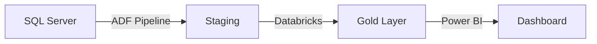

# InventoryScout: Best Practices Guide

**Agent:** InventoryScout (Scout 🔍)  
**Version:** 1.0.0  
**Last Updated:** 2026-02-12

---

## Table of Contents

1. [Security Best Practices](#security-best-practices)
2. [Performance Optimization](#performance-optimization)
3. [Quality Assurance](#quality-assurance)
4. [Visualization Guidelines](#visualization-guidelines)
5. [Common Pitfalls](#common-pitfalls)

---

## Security Best Practices

### 1. Credential Anonymization

❌ **Never do this:**
```markdown
Connection String: Server=prod-db.com;User=admin;Password=P@ssw0rd123;
```

✅ **Always do this:**
```markdown
Connection String: Server=<redacted>;User=<redacted>;Password=@{KeyVault.db-password}
```

### 2. Hard-coded Credentials Detection

Use regex patterns to detect:

```python
credentials_patterns = [
    r'password\s*=\s*[\'"][^\'"]+[\'"]',
    r'apiKey\s*=\s*[\'"][^\'"]+[\'"]',
    r'secret\s*=\s*[\'"][^\'"]+[\'"]',
    r'token\s*=\s*[\'"][^\'"]+[\'"]',
]
```

Flag but don't expose:
```markdown
⚠️ Hard-coded credential found in:
  - File: databricks/jobs/legacy_job.py
  - Line: 23
  - Type: API Key
  - Recommendation: Move to Azure Key Vault
```

### 3. PII Handling

Never include in outputs:
- Employee names (except owners/stakeholders)
- Email addresses
- Customer data
- Financial information
- Phone numbers

Replace with:
- `<PII_REDACTED>`
- `user_***`
- `email_***@domain.com`

---

## Performance Optimization

### 1. Repository Scanning

For large repositories (> 50k files):

✅ **Exclude build artifacts:**
```bash
*scan-repo /path/to/repo --exclude node_modules,dist,build,target,.git
```

✅ **Limit depth:**
```bash
*scan-repo /path/to/repo --max-depth 6
```

✅ **Scan subsystems separately:**
```bash
*scan-repo /path/to/repo/adf-pipelines
*scan-repo /path/to/repo/databricks
*scan-repo /path/to/repo/airflow
```

### 2. Configuration Parsing

- Parse files in batches (100 files at a time)
- Use streaming parsers for large XMLs (lxml)
- Cache parsed results
- Skip binary files

### 3. Dependency Mapping

For complex graphs (> 1000 nodes):

- Focus on critical paths
- Filter by technology (e.g., only ADF pipelines)
- Use subgraphs for different subsystems
- Export to Neo4j for analysis (better performance than networkx for large graphs)

---

## Quality Assurance

### 1. File Parsing Validation

Always validate syntax:

```python
# JSON
try:
    data = json.loads(content)
except JSONDecodeError as e:
    log_error(f"Invalid JSON: {file_path} - {e}")

# YAML
try:
    data = yaml.safe_load(content)
except YAMLError as e:
    log_error(f"Invalid YAML: {file_path} - {e}")

# XML
try:
    tree = ET.parse(file_path)
except ParseError as e:
    log_error(f"Invalid XML: {file_path} - {e}")
```

Keep parsing errors separate:
```markdown
## Parsing Errors (12 files)

| File | Error | Recommendation |
|------|-------|----------------|
| config.json | Trailing comma | Fix JSON syntax |
| dag.yaml | Indentation | Fix YAML indentation |
```

### 2. Dependency Graph Validation

Before generating output:

```python
# Check all edges reference valid nodes
for edge in edges:
    assert edge['source'] in node_ids
    assert edge['target'] in node_ids

# Check for orphaned nodes (unless intentional)
for node in nodes:
    has_edge = any(
        e['source'] == node['id'] or e['target'] == node['id']
        for e in edges
    )
    if not has_edge:
        log_warning(f"Orphaned node: {node['name']}")

# Detect circular dependencies in configs
cycles = detect_cycles(graph)
if cycles:
    log_warning(f"Circular dependencies found: {cycles}")
```

### 3. Completeness Checks

Verify all required sections exist:

```markdown
## Inventory Map Checklist

- [ ] Summary Statistics (file count, size, etc.)
- [ ] Files by Extension (table with percentages)
- [ ] Directory Structure (ASCII tree)
- [ ] Hot Spots identified
- [ ] Red Flags documented
- [ ] Technologies detected
- [ ] Parsing errors logged separately
```

---

## Visualization Guidelines

### 1. Mermaid Diagrams

Use Mermaid for inline diagrams in markdown:



Keep diagrams focused (< 20 nodes):
- One diagram per workflow
- Use subgraphs for grouping
- Color code by technology

### 2. Interactive HTML (PyVis)

For complex graphs:

```python
from pyvis.network import Network

net = Network(height='750px', width='100%', directed=True)

# Add nodes with colors by type
for node in nodes:
    color = get_color_by_type(node['type'])
    net.add_node(node['id'], label=node['name'], color=color)

# Add edges with labels
for edge in edges:
    net.add_edge(edge['source'], edge['target'], label=edge['type'])

net.show('knowledge-graph-vis.html')
```

Color scheme:
- **DataSource**: `#3498db` (blue)
- **Pipeline**: `#e74c3c` (red)
- **Dataset**: `#2ecc71` (green)
- **Transformation**: `#f39c12` (orange)
- **Schedule**: `#9b59b6` (purple)
- **Configuration**: `#95a5a6` (gray)

### 3. Neo4j Import

For large graphs (> 500 nodes):

```cypher
// Create indexes first
CREATE INDEX FOR (n:Pipeline) ON (n.id);
CREATE INDEX FOR (n:DataSource) ON (n.id);
CREATE INDEX FOR (n:Dataset) ON (n.id);

// Import nodes
LOAD CSV WITH HEADERS FROM 'file:///nodes.csv' AS row
CALL apoc.create.node([row.type], {id: row.id, name: row.name}) YIELD node
RETURN count(node);

// Import edges
LOAD CSV WITH HEADERS FROM 'file:///edges.csv' AS row
MATCH (source {id: row.source})
MATCH (target {id: row.target})
CALL apoc.create.relationship(source, row.type, {}, target) YIELD rel
RETURN count(rel);
```

---

## Common Pitfalls

### Pitfall 1: Exposing Credentials

❌ **Problem:**
```json
{
  "connection_string": "Server=prod.db;Password=ActualPassword123;"
}
```

✅ **Solution:**
```json
{
  "connection_string_ref": "@{KeyVault.prod-db-connection}",
  "connection_string_structure": "Server=<server>;Database=<db>;Auth=<type>"
}
```

### Pitfall 2: Ignoring Dead Code

❌ **Problem:** Only report active/referenced files

✅ **Solution:**
```markdown
## Unused Code (34 files)

| File | Reason | Recommendation |
|------|--------|----------------|
| old_pipeline.py | No imports | Archive or delete |
| backup_job.json | Marked inactive | Archive |
```

### Pitfall 3: Overloading Single Graph

❌ **Problem:** One massive graph with 5000 nodes

✅ **Solution:** Multiple focused graphs
- `graph_adf_pipelines.json` (ADF only)
- `graph_databricks_jobs.json` (Databricks only)
- `graph_critical_paths.json` (Top 50 critical components)

### Pitfall 4: Missing Context

❌ **Problem:**
```markdown
## Files by Extension
| Extension | Count |
|-----------|-------|
| .py | 342 |
```

✅ **Solution:**
```markdown
## Files by Extension
| Extension | Count | % | Purpose | Technologies |
|-----------|-------|---|---------|-------------|
| .py | 342 | 27.4% | Python scripts | Databricks, Airflow |
```

### Pitfall 5: No Encoding Handling

❌ **Problem:**
```python
with open(file_path, 'r') as f:
    content = f.read()  # May fail on non-UTF-8
```

✅ **Solution:**
```python
encodings = ['utf-8', 'latin-1', 'cp1252']
for encoding in encodings:
    try:
        with open(file_path, 'r', encoding=encoding) as f:
            content = f.read()
        break
    except UnicodeDecodeError:
        continue
else:
    log_error(f"Cannot decode: {file_path}")
```

---

## Checklists

### Pre-Scan Checklist

- [ ] Problem statement exists (from DataStrategist)
- [ ] Repository path validated
- [ ] Required permissions available
- [ ] Exclusion patterns defined
- [ ] Output folder created

### Post-Scan Checklist

- [ ] All files scanned successfully
- [ ] Parsing errors documented
- [ ] Credentials anonymized
- [ ] Red flags identified
- [ ] Statistics accurate
- [ ] Directory tree generated

### Pre-Export Checklist

- [ ] All required artifacts exist
- [ ] Graphs validated (no broken edges)
- [ ] Security review passed
- [ ] Quality checks passed
- [ ] Visualizations generated

### Handoff Checklist

- [ ] `inventory-map.md` complete
- [ ] `asset-catalog.md` complete
- [ ] Artifacts reviewed with stakeholders
- [ ] Ready for BusinessAnalyst (Mary)
- [ ] Ready for DataArchitect (Winston)

---

## Metrics & KPIs

Track these metrics:

| Metric | Target | Why |
|--------|--------|-----|
| **Scan Time** | < 5 min for repos < 10k files | Performance |
| **Parse Success Rate** | > 95% | Quality |
| **Credential Detection Rate** | 100% | Security |
| **Graph Completeness** | > 98% nodes connected | Quality |
| **Artifact Generation Time** | < 10 min total | Performance |

---

## Version History

| Version | Date | Changes |
|---------|------|---------|
| 1.0.0 | 2026-02-12 | Initial release |

---

**Agent:** InventoryScout (Scout 🔍)  
**Framework:** Avanade™ Core for Data Engineering
