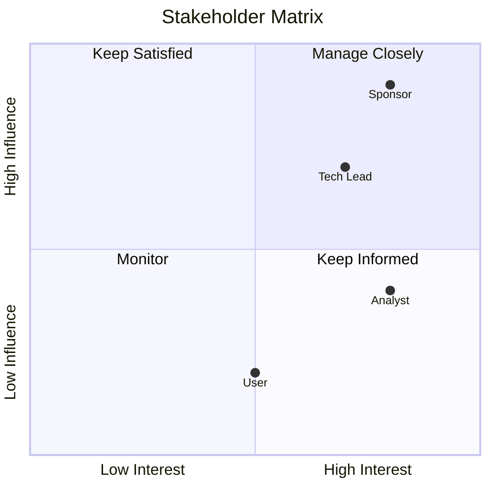

# Task: Map Stakeholders

**Command:** `*stakeholders`  
**Agent:** DataStrategist (Alex)  
**Output:** `stakeholders.md`

---

## Objective

Identify, map, and document all stakeholders for the data initiative, including their roles, interests, influence, and communication preferences.

---

## Prerequisites

- [ ] Problem statement defined (recommended)
- [ ] Project context understood
- [ ] Access to organizational structure

---

## Steps

### Step 1: Identify Stakeholders

Ask the user to list stakeholders by category:

| Category | Examples |
|----------|----------|
| **Sponsors** | Executive sponsors, budget owners |
| **Decision Makers** | Tech leads, architects, managers |
| **Contributors** | Analysts, developers, data stewards |
| **Consumers** | End users, report viewers, downstream systems |
| **Impacted** | Teams affected by changes |

### Step 2: Document Stakeholder Details

For each stakeholder, capture:

```yaml
stakeholder:
  name: "{name}"
  role: "{title/role}"
  category: "{sponsor|decision_maker|contributor|consumer|impacted}"
  department: "{department}"
  
  interest:
    level: "{high|medium|low}"
    description: "{what they care about}"
    
  influence:
    level: "{high|medium|low}"
    decisions: "{what they can decide}"
    
  communication:
    frequency: "{daily|weekly|bi-weekly|monthly|as-needed}"
    channel: "{email|meeting|dashboard|report}"
    format: "{executive_summary|detailed|technical}"
    
  expectations:
    - "{expectation 1}"
    - "{expectation 2}"
```

### Step 3: Create Stakeholder Matrix

Plot stakeholders on influence/interest matrix:

```
        HIGH INFLUENCE
              │
     Keep     │   Manage
    Satisfied │   Closely
              │
LOW INTEREST ─┼─ HIGH INTEREST
              │
     Monitor  │   Keep
     Only     │   Informed
              │
        LOW INFLUENCE
```

### Step 4: Define RACI Matrix

For key activities, define RACI:

| Activity | Sponsor | Tech Lead | Analyst | Developer |
|----------|---------|-----------|---------|-----------|
| Problem Definition | A | R | C | I |
| Architecture | I | A | C | R |
| Implementation | I | A | I | R |
| UAT | A | R | R | C |

**Legend:** R=Responsible, A=Accountable, C=Consulted, I=Informed

### Step 5: Plan Engagement

For each high-priority stakeholder:
- Communication schedule
- Key touchpoints
- Risk of disengagement
- Mitigation strategy

---

## Output Template

```markdown
# Stakeholder Map

**Project:** {project_name}  
**Date:** {date}  
**Author:** DataStrategist  
**Version:** 1.0

---

## Executive Summary

{Brief overview of stakeholder landscape}

---

## Stakeholder Register

### Sponsors

| Name | Role | Interest | Influence | Communication |
|------|------|----------|-----------|---------------|
| {name} | {role} | {high/med/low} | {high/med/low} | {weekly meeting} |

### Decision Makers

| Name | Role | Interest | Influence | Communication |
|------|------|----------|-----------|---------------|
| {name} | {role} | {high/med/low} | {high/med/low} | {bi-weekly sync} |

### Contributors

| Name | Role | Interest | Influence | Communication |
|------|------|----------|-----------|---------------|
| {name} | {role} | {high/med/low} | {high/med/low} | {daily standup} |

### Consumers

| Name | Role | Interest | Influence | Communication |
|------|------|----------|-----------|---------------|
| {name} | {role} | {high/med/low} | {high/med/low} | {dashboard} |

---

## Influence/Interest Matrix



---

## RACI Matrix

| Activity | Sponsor | Tech Lead | Analyst | Dev |
|----------|---------|-----------|---------|-----|
| Problem Definition | A | R | C | I |
| KPIs | A | C | R | I |
| Architecture | I | A | C | R |
| Implementation | I | A | I | R |
| Testing | I | A | R | R |
| Deployment | A | R | I | R |

---

## Communication Plan

| Stakeholder | Frequency | Channel | Content |
|-------------|-----------|---------|---------|
| {name} | {weekly} | {meeting} | {status update} |

---

## Risks & Mitigations

| Risk | Stakeholder | Impact | Mitigation |
|------|-------------|--------|------------|
| {risk} | {name} | {high/med/low} | {action} |
```

---

## Handoff

After completing stakeholder mapping:
- **Continue UPSTREAM:** Create KPIs → `*create-kpis`
- **Review context:** Check problem statement → `*define-problem`
- **Check status:** View progress → `@orchestrator *status`
