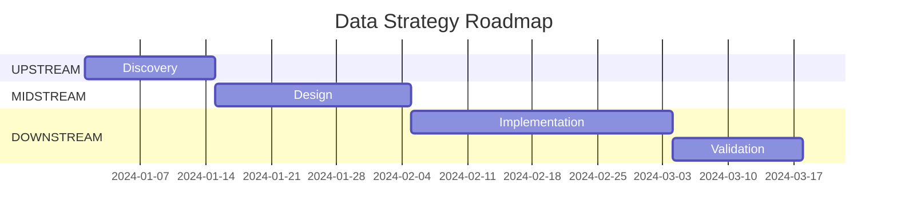

# Task: Generate Strategy Summary

**Command:** `*strategy-summary`  
**Agent:** DataStrategist (Alex)  
**Output:** `strategy-summary.md`

---

## Objective

Generate a comprehensive strategy summary document that consolidates all UPSTREAM strategy artifacts into an executive-ready overview.

---

## Prerequisites

- [ ] Problem statement completed
- [ ] KPIs defined
- [ ] Success criteria established
- [ ] Stakeholders mapped
- [ ] Value proposition created

---

## Steps

### Step 1: Gather Artifacts

Collect all strategy documents:
- `problem-statement.md`
- `kpis.md`
- `success-criteria.md`
- `stakeholders.md`
- `value-proposition.md`

### Step 2: Create Executive Summary

Synthesize key points:
1. **The Challenge:** 2-3 sentences on the problem
2. **The Solution:** 2-3 sentences on the approach
3. **The Value:** Key numbers and impact
4. **The Ask:** What's needed to proceed

### Step 3: Consolidate KPIs

Create unified KPI view:

| KPI | Baseline | Target | Owner | Timeline |
|-----|----------|--------|-------|----------|
| {KPI 1} | {current} | {goal} | {name} | {date} |

### Step 4: Summarize Risks

Top risks and mitigations:

| Risk | Probability | Impact | Mitigation |
|------|-------------|--------|------------|
| {Risk 1} | High/Med/Low | High/Med/Low | {action} |

### Step 5: Define Roadmap

High-level phases:



### Step 6: Prepare Gate 1 Checklist

Verify readiness for Gate 1:

| Artifact | Status | Notes |
|----------|--------|-------|
| Problem Statement | ✅/❌ | {notes} |
| KPIs | ✅/❌ | {notes} |
| Success Criteria | ✅/❌ | {notes} |
| Stakeholder Map | ✅/❌ | {notes} |
| Value Proposition | ✅/❌ | {notes} |

---

## Output Template

```markdown
# Data Strategy Summary

**Project:** {project_name}  
**Date:** {date}  
**Author:** DataStrategist  
**Status:** Ready for Gate 1 Review

---

## Executive Summary

### The Challenge
{2-3 sentences describing the business problem}

### Our Approach
{2-3 sentences on the proposed solution}

### Expected Value
- **ROI:** {X}%
- **Payback:** {Y} months
- **Annual Savings:** ${Z}

### Decision Required
{What approval/decision is needed}

---

## Strategic Context

### Problem Statement
{Concise problem summary}

### Business Objectives
1. {Objective 1}
2. {Objective 2}
3. {Objective 3}

### Scope
**In Scope:**
- {item 1}
- {item 2}

**Out of Scope:**
- {item 1}
- {item 2}

---

## Success Metrics

| KPI | Current | Target | Improvement | Timeline |
|-----|---------|--------|-------------|----------|
| {KPI 1} | {baseline} | {target} | {delta} | {date} |
| {KPI 2} | {baseline} | {target} | {delta} | {date} |
| {KPI 3} | {baseline} | {target} | {delta} | {date} |

---

## Stakeholder Summary

### Key Stakeholders
| Role | Name | Interest | Engagement |
|------|------|----------|------------|
| Sponsor | {name} | {interest} | {frequency} |
| Tech Lead | {name} | {interest} | {frequency} |
| Users | {group} | {interest} | {frequency} |

### RACI Summary
- **Accountable:** {name/role}
- **Responsible:** {names/roles}
- **Consulted:** {names/roles}
- **Informed:** {names/roles}

---

## Value Summary

### Quantified Benefits (3-Year)
| Category | Year 1 | Year 2 | Year 3 | Total |
|----------|--------|--------|--------|-------|
| Revenue | ${X} | ${Y} | ${Z} | ${Total} |
| Cost Savings | ${X} | ${Y} | ${Z} | ${Total} |
| **Total** | **${X}** | **${Y}** | **${Z}** | **${Total}** |

### Qualitative Benefits
- {Benefit 1}
- {Benefit 2}
- {Benefit 3}

---

## Risk Summary

| # | Risk | Probability | Impact | Mitigation |
|---|------|-------------|--------|------------|
| 1 | {Risk} | High | High | {Action} |
| 2 | {Risk} | Medium | High | {Action} |
| 3 | {Risk} | Low | Medium | {Action} |

---

## High-Level Roadmap

| Phase | Duration | Key Deliverables |
|-------|----------|------------------|
| UPSTREAM | {X weeks} | Problem, KPIs, STTM |
| MIDSTREAM | {Y weeks} | Architecture, Model, DQ Rules |
| DOWNSTREAM | {Z weeks} | DDL, ETL, Tests, Dashboards |

---

## Gate 1 Readiness

| Artifact | Status | Owner |
|----------|--------|-------|
| Problem Statement | ✅ Complete | DataStrategist |
| KPIs | ✅ Complete | DataStrategist |
| Success Criteria | ✅ Complete | DataStrategist |
| STTM | ⏳ In Progress | BusinessAnalyst |
| DQ Initial | ⏳ In Progress | BusinessAnalyst |

---

## Next Steps

1. **Immediate:** {action}
2. **This Week:** {action}
3. **Next Week:** {action}

---

## Approval

| Role | Name | Signature | Date |
|------|------|-----------|------|
| Sponsor | {name} | _________ | _____ |
| Tech Lead | {name} | _________ | _____ |
```

---

## Handoff

After completing strategy summary:
- **Validate Gate 1:** Check readiness → `@orchestrator *gate-1`
- **Continue to BusinessAnalyst:** Create STTM → `@business-analyst *create-sttm`
- **Review artifacts:** Check individual documents if needed
