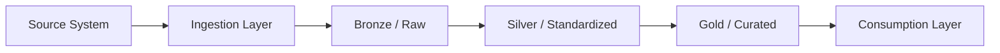

# Gate 2: Architecture

## Architecture Decision Summary

<!-- Diagram URL or embedded Mermaid block. -->

## Technology Stack

| Layer | Technology | Version | Justification |
| --- | --- | --- | --- |
| Orchestration | | | |
| Ingestion | | | |
| Storage | | | |
| Transformation | | | |
| Quality | | | |
| Serving | | | |

## Non-Functional Requirements

| NFR | Requirement | Design Response |
| --- | --- | --- |
| Scalability | | |
| Availability | | |
| Security | | |
| Recoverability | | |

## Integration Points

| System | Direction | Protocol | Auth |
| --- | --- | --- | --- |
| | | | |

## Approval

| Reviewer | Date | Status |
| --- | --- | --- |
| | | PENDING |
